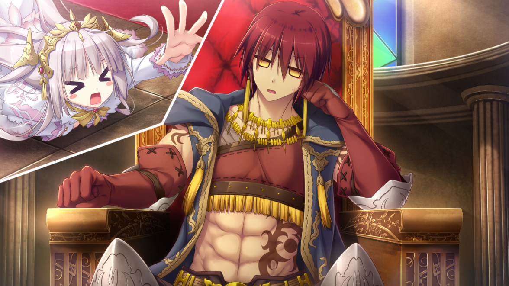

> 更新日志：
> 
> 2023年4月22日17:10:09，贴完贴吧的内容了，开始写点感想。
> 
> 2023年4月22日17:29:08，写完，准备上传。

> 最早发布于`战女神`吧。
>
> 草，玛德今天是打算迁完的，以为就还剩一篇了，结果补截图时发现，旧笔电上有封缄的图，但迁的帖子里没有，结果一看发现漏了，封缄才是倒数第二篇，，，，草，怎么就看漏了呢，算了不多说了，今晚还有一篇，到时候才是真正的最后一篇吧。
>
> 幸运的是，发觉时已经基本把贴吧截图和截图原图都补充完了，一篇篇检查时发现的，然后就立马迁了，而封面图这次也不卡我，直接在绯月上一找就找到了，而且去官网一看，其实就是官网提供的，不算高清，但就这样吧，再找估计也是不会很高清了。所以很快这贴就迁完了说实在的。
>
> 封缄是我大学时期就完了，被贴吧帖子买卖母女图的内容吸引玩了，本来我是懒得玩这种的，而且还不算纯爱，但结果是，我还是没事没得玩上那对母女，封缄的故事其实挺黑暗的，世界观下，伦理道德基本就是让人嗤笑的，我记得很多女的就没几个处女的，而且很多都是窑子里或者就是送到窑子去了，那对母女好像也是这样的结局，总之，也不算什么值得推荐的游戏吧，不过就是画风还不错的，画的挺好的，游戏性的话，我不太记得了，但好像还可以，总之我算是通关了。
>
> 这算是我最早的接触的半纯爱的游戏吧，后面是夏娃年代记，然后是天结，我基本就玩过这三部了这类型的，说实在挺花精力的，我记得我大学时玩还是明着玩的，因为黄色情节都是可以遇见的，但是舍友还问我玩的什么游戏，总之，还行吧，游戏我还压缩保存了，台式里，包括存档。想玩的话，大概还是可以二周目的，但大概率不会有了。
>
> 我记得我之前说过天结2出了，但是我确实没玩，我最近晚上回来确实有些无聊没事做，但是没迁完，加上有时候很吵，就没心思推，就算了，五一回来后应该就把坑填完先把。
>
> 就这样吧，我去蹭公司的晚饭，剩下的写内容，晚上回来迁最后一篇再说啊，就酱纸。

### 2019-04-26 22:06 啊终于把 封緘之都打通一周目了

最早的存档是2/27的，然后今天通一周目，一共存了286个存档，是真的多，当初我还担忧存档文位够不够，但没想到有899个存档位，然后我就放心存了，当然也不是随便存，然后断断续续玩了59差不多60个小时，真是挺久的了，玩单机我还真没玩过这么久的，当初是在贴吧首页看帖看到是否买那对母女的图片才入坑的，然而，我一周目通关了都没开这个支线，因为我一直没开那两男的招募，直到7章的时候卡了任务找下攻略，要胖男爵才能触发这任务的才找那两男的聊了进了招募厅，想着这样行了吧，就一次没招募过，然后也觉得没希望了，就不管一周目通了。。。二周目也会有吧？难道又要重来？雅咩蝶！

玩的时候就开始卡了猫哪里和后面卡了浴池任务那里，除了这部分找下攻略开之外倒也没哪里需要攻略了，我本来想坚持不看的，但是在没啥玩这类游戏的经验，想想就看了，想着玩了这部差不多就懂了e社游戏的套路，以后一周目就不会看攻略了，啥？一周目不看，那二周目呢？二周目当然看了

游戏性方面我是觉得挺好的吧，反正也没玩过其他类的这种，跑图做任务，就是这种，不过可能是我没太多接触这类吧，我是觉得地图的一些机关和过度做的挺好的，看着挺有意思的。剧情方面我觉得中规中矩吧，并没有太多亮点，各个人物的设定还是挺鲜明的，都很有各自的特色，就是随着剧情推进可能有些地方让人有点难接受吧，什么地方？玩了的都知道，没玩的玩了也都知道

这游戏我个人最喜欢的是尤娜奇，然后是芙露蕾蒂，这部分喜欢包括人物设定，剧情故事和配音，我觉得我是比较喜欢芙露蕾蒂的配音的，结合设定听起来真的喜欢，想一直听着

唠了这么多也没啥实际性的东西，就是没啥实际性的东西，来唠叨唠叨而已。总之，感谢汉化组的爆肝汉化，一周目通了，准备二周目，二周目看攻略收齐下全内容，然后等下天结的汉化，最后放下杰哥的帅气照，完了。

### 2019-04-26 22:24

哦瞎唠叨都忘了，建议刚玩的开了竞技场后，就刷竞技场那币来买符来战斗就行，真的简单暴力，最起码一周目只要有一套装备，技能都不用升什么，堆满符和那些buff瓶，战斗全靠这两都行了，最后打那个谁，都是靠符硬生生一次就怼过去了，真的简单暴力

