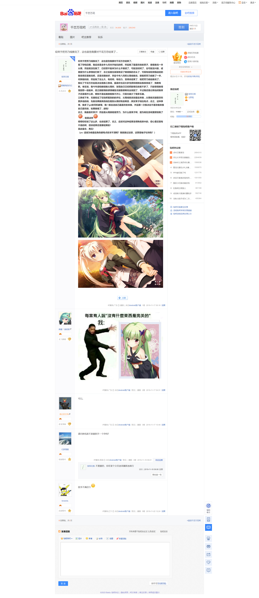

> 更新日志：
>
> 2023年4月15日21:03:45，贴完贴吧的内容了，开始写点感想。
>
> 2023年4月15日21:52:52，预览调整完，准备上传。

> 最早发布于`千恋＊万花`吧。
>
> 我总是念做千花万恋，但是看到贴吧名才发现，是千恋万花，我记得以前我也知道过，然后忘了，就又念做千花万恋了，就当是这样吧。
>
> 又是时隔一周多了，本来收拾上周迁完的，结果上周突然在b站看到了一位up主讲wpf的教程很不错，然后讲的很细致，很多我胃口，然后又讲了很多MVVM的内容，让刚把BKTrans辛苦增加了datagrid的拖拽和排序功能的我很是佩服，收获了不少知识，然后就上瘾了，准备基于MVVM重新设计下BKTrans，让以后维护容易些，上周末就沉迷于他的教程，看了两天，然后工作日又是学习MVVM，终于大致确定了BKTrans的重构方案，就不急了，然后今天就迁了，本来也不想迁的，想干脆重构？有些心痒，但还是算了，迁完再说吧，反正也不急，然后我发现我写的BKTrans还真的上不了什么台面，别人基于wpf可以实现更多牛逼的内容，我的还是洒洒水，后面重构完，应该就会发布1.0版本，然后录个视频？后话。
>
> 忘记说了，就是看了帖子，才发现，迁馆碟时，是不是漏了点相关的帖子，就是那个我说第一次共同线都没进的，想这类的推的中间的帖子我好像没迁，有点在意，我看后面补贴吧截图的时候补下吧。
>
> 然后哦，我应该没说过，就是我之前不是说了我疫情买的那袋米放在公司么，想给阿姨来着，然后应该是上个月那天，我就送给阿姨了，就那天我吃完饭上去，刚好阿姨在茶水间，我想在择日不如撞日，就直接从桌柜里拿出来给她了，说不想浪费，阿姨也没不怎么推脱，感谢下就收下了，按个阿姨年纪挺大的了，平时经常见得到，之前有过一段时间没见到，后面又回来了，挺好。
>
> 然后，我还有些忘了的，好像，算了，想起再说吧。
>
> 然后千花万恋算是我最早推的几部了，看我自己的写的，18年就推了？估计在家里开始啊，然后，也没什么然后了，就像我说的，各种事情，推的并不顺利，我发现，柚子社的gal，我好像都推的不顺利，无论是千花万恋还是馆碟，我都没好好推完，明明都是很好的gal，结果我都没能好好推完，很遗憾。
>
> 茉子我是真的喜欢，现在我还有些印象，她可以说是很戳我的xp了，而那位我名字都没记得的，真的只能说抱歉，听说那位的线其实才算是完美的，算是解决了各个问题，不过我记得好像是配音我不太喜欢，我真的不知道为什么要模仿外国人呢说话的那个语调，尤其是日语这样说很难听我觉得，pcr里面有一位也是这样，我听的难受。
>
> 其他么，就是图我也没找过，看的出来我是截了图的，而且应该是在台式上，但是没有，我也很奇怪，11月多，那时候我已经装好台式了，然后在玩了，而且文件目录什么的应该也规划好了，按理说有保存的才对，但没有，我直接截图然后复制粘贴的？这操作我都不知道行不行，哦，会不会是手机上的，我得看看，，，，，，没有，估计也不是，那我就不清楚怎么没图的了，就这样吧，未解之谜。
>
> 最后，还真的没啥好说的了，那时候我刚出来工作，而且刚过试用期吧，挣的钱也基本没有，每个月换了白天给了家里，基本都是月光，唯一让我值得欣慰的就是公租房和租了台式，哦，那时候我的身体也很差，尿黄，痔疮爆发，发烧快死，头发掉的很多，都是那时候发生了，然后体检报告也到了，我拿到后就直接看了，尿酸过高，还有前列腺偏小和有钙化斑，我特地查了钙化斑，说是前列腺炎好了后容易形成的？但我也不知道我什么时候得过，或者说，我前列腺好像从我初中开始，经常有问题吧，尿尿很久没有非常舒畅过了，也经常吃药，所以我真的不知道我什么时候有过，什么时候好了，然后现在也可能有，也可能恶化，总之，这块是不会放过我的吧。以前体检没检查过这块，这次我也是看到体检B超里有这项时还有点奇怪以前有过么？结果一查就出问题了，哈哈。果然，这个还是会伴随的我的一生啊，还是逃不过，就是我明明都在高中时绝望了。
>
> 其他的话，今天LOL春季赛决赛，很普通，没啥看头，轻松3比0结束了，然后狗雨开始玩dark and darker，3d的，我没啥兴趣，还早就开始迁了，否则我还真的懒了。
>
> 青鸟社团的新作竟然汉化了，真快啊，明明其他gal都没这么积极，这作不知道为什么这么快，我记得是去年才出的吧，神速了，然后有推的欲望了，赶紧迁完，然后推gal吧。
>
> 说到这个，机场路最近搞得很堵，大半夜工地机器也在工作，嘎吱嘎吱的，现在这时候也听得到，白天外面吵得城中村还经常装修？总之最近工地声音特别多，真的烦，然后我想组个itx台式，但发现显卡真的太贵了，舍不得，为什么主要是笔记本容量不够，还有风扇声音太大了，运行个炎孕都疯狂转，真的太影响了，我在考虑先扩大磁盘容量吧，刚好五一回家青个灰换个硅脂啥的，否则顶不住广州的夏天。
>
> 此外好像没啥了，就到这吧，五一回家我会整理这边不用的东西带回去，袋子都买好了，之后如果想搬走轻松些，然后现在房租真的不便宜，主要是广州过年回来人太多了，我之前那个回迁房好像都涨价了？反正亏了5500押金很心疼，心疼虽然心疼，但却不怎么后悔，哈哈，谁爱住谁住吧，反正我也不行坑人，就是心疼钱，有这钱我都能组台式了，心疼。
>
> 好了，就到这吧，就酱纸。
>
> 哦对了，预览了才想起来，封面图我找了一阵，绯月看似很多帖子，但基本都是水贴，最后才找到比较好的，我还以为柚子厨很给力，结果又掉出乎意料了，就这样了，准备发布了。

哎终于把芳乃线推完了，这也宣告我要对千花万恋结束了。

看了存档日期，我应该是去年七月末开始玩的吧，然后推了最喜欢的的茉子，接着推完一半从雨，然后就没在推了，已经想不起来为什么不继续了，可能没时间了，也可能没兴致，或者因为什么事情给打断了，总之后面也渐渐地没了继续推的念头了，可是有些轻微强迫症的我觉得还是推完吧，还是完整的好，然后今年八月把从雨线推完，接着把芳乃线推了一半，何其相似的，然后拖了这么久，有时间，有动力，觉得该结束了，就把芳乃线给推完了。

我玩了千花万恋后就决定直推三条线，最喜欢也没太多性质和精神去推其他线了，抱歉抱歉。老实说，我今年读档继续推从雨时，发现自己已经把剧情忘的差不多了，只能慢慢推慢慢回想一些起来，但之前剧情的感情铺垫无疑是很难完全找回了，不过我还是记得当时推茉子还是很开心的，嘛倒不是后面接着推不开心，只是无疑少了很多乐趣。

三条线下来，无疑验证了在贴吧看到的的评论，从雨线就该放最后来推…从雨线无疑是悲伤更多些的线，先推完再推其他线在看到从雨时有些难受…其实茉子线也有点…总之，这种事情，推多了gal的司机都懂，我一般会选自己最喜欢的来推，并且第一次推决定不看攻略来推自己喜欢的，如果推错了…读档！

总之，我最喜欢茉子！然后是从雨接着是芳乃，为什么是茉子啊，因为她在游戏里撩到我了，就是这样

唠唠叨叨说了这么多，也该结束了，总之，应该对这种结束变得熟练麻木的，但心里还是有不舍的啊，但该结束还是要结束的！

至此留念，再见！

（ps: 话说为啥最后角色都有点欲求不满呢？我就推过这部，这算是柚子社特色？）

