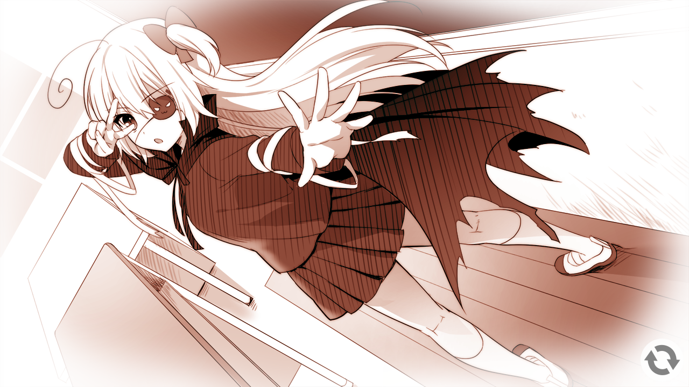

> 更新日志：
> 
> 2023年3月2日00:10:34，贴完贴吧的内容了，开始写点感想。
> 
> 2023年3月2日00:47:02，写完，准备上传。

> 最早发布于`颜艺社`吧。
>
> 嗯，今天是周三，哦现在是周四了，今晚下班回来比较早，又没啥想做的，就像前面说的那样，做了些准备，然后现在洗完澡就过来迁了，封面也是在绯月找了一阵，然后上2dfans搜日文名才发现竟然有fd，而且终点上去年有了汉化了，真的没想到。
>
> 我推这作的时候，也是那个寒假吧，哈哈，也不算寒假，其实就第一次离职后的那段时间，就21年元旦后回公司就提的离职，然后二月一号走人，然后在岗顶租房住了快两个星期，然后也是不要两千块押金，回家了，为什么还住那么久，一个是因为我要收拾所有东西寄回家，然后就是收租日好像就是月中吧，就想差不多住完剩余租期这样，然后那个退房时我记得拍了视频，防止出问题，然后我就回家了，回家过年，然后我记得三月初来的岗顶，哦不对，他妈记混了，我没退房，这段退房经历应该是7月份第二次离职时的，那时候真的把所有东西都搬回家，想回家养老的，虽然自己也清楚勉强还完所有债的自己根本不可能就从此呆在家里，但还是很想啊。然后三月来到岗顶，就开始找工作了，在那个租房里面试，思考自己的未来，然后就找到了第二家公司，我很清楚，第二家公司是四月一号入职，刚好是愚人节，然后，三个月试用期，刚好人家创业公司七月份调整组织结构，我提前三天二十八号提的离职，六月三十一号走的，就这样结束了第二段工作经历。接着就是长达三个多月在家修养，然后九月份底找到这家，十月份过完国庆，就又来了广州，在这家干到现在。
>
> 最后的寒假，就先这样称呼吧，我看了，提出离职后，到回家过完年这段时间，我推了好多gal，是的，也是一段推gal的爆发期，后面的很多gal基本都是这段时间内推完的，毕竟有时间，但我没想到，在那个吵闹的城中村里，我竟然还推了这么多gal，或者是因为其实不怎么吵？好像还真的不怎么吵，因为我住的好像是7楼还是几楼了，然后还是顶楼，楼上没人住的，夏天贼热，我也是那段时间有的湿疹还有整个人感觉都累得不行。但，晚上除了电机还有楼下的送快递车来车往，也没怎么觉得吵，这倒是让我惊讶的，玛德，还是回迁房那种在你脑袋上走路的动静恶心坏我了可能。
>
> 总之，在那个寒假，在租房里还是家里，都推了好几部gal，但在租房里的基本都是那种，搞黄色比较多点的吧，就是卖肉多点的，然后有深意的，我就没推了，像是苍彼，我就是回家才推的，后续我接着迁的时候就知道了。
>
> 借恋的话，我还是有些印象的，就是我现在看这帖子，竟然一个老师的截图都没有，很奇怪啊，我记得我第一个推的就是老师，但好像只截了早期学生时代老师的图？哎？有点奇怪啊，按理说，我一般都是截些不漏点又漂亮的图放上去的，这就有点怪了。也不清楚当时我是怎么想的了。这次的图也是态势里拷贝出来的，原图了。
>
> fd的话，我在考虑要不要推了，椿和绘未的也在fd里了，而且是两个fd，分割放的，如果这两个在一个fd里就好了。然后我发现，我忘了我推gal都推到哪些了，我记得白恋要推，但是在台式里，草猫四也是在台式里，然后新笔电现在就makelove fd要推吧，还有勇者大战魔物娘因为扭伤腰后就没动过了，不好久坐了，然后还有就是炎孕四也是在推的，这个倒是无所谓，想退的时候快进下就行，主要是炎孕四新画师画的是在不怎么好看，就live2d还是在线的。然后就是要推的gal了。
>
> 要推的gal，之前我都是按galgame吧每年的年度评选里调自己喜欢的推的，我记得我应该时把21年评选的已经选好了，下载完了，放在移动硬盘里了，就等着推就行。话说，今年的评选也快出来了吧，但是去年印象里没什么比较出名的gal吧，樱之刻？好想是21年的了，也不知道今年还办不办了，毕竟那批人都年纪不少了，但galgame吧现在还是挺活跃的，相比下轻小说吧真的没啥活跃度了。
>
> 好像也没啥说的了，就到这吧。2023年3月2日00:46:55

推完借恋的椿线和绘未线了

老实说，真的不亏被说成颜艺社啊，刚开始玩我真的被各种无厘头搞的笑出声，这是来搞笑的么？荤段子真的是毫不避违的就随便说啊。

我就推了椿和绘未的。椿的话就像幸所说，好球区啊，而且之间情话说了这么多不进就感觉不太好，所以第一次走的就是椿线了。而没选八纯选了绘未是因为八纯让我有那么点反感吧，在没知道幸和绘未是假情侣之前就频频过线地诱惑好朋友的男友，虽然搞笑啊，但我也觉得这样并不好，尽管后面告白白学现场，知道了八纯那么做的原因，但我还是没法消除那点反感，无语的是，即使选了绘未，八纯也真的像她自己所说一直纠缠的没放弃，苦笑。绘未的话，一开始就没啥感觉，不过后面认真努力工作和不做作，乐天派，该感谢的时候就感谢，真的让人很有好感的，而且感觉一起会很快乐啊，所以尽管有点纠结有点胃疼，但是真的需要给个了断的，所以还是点了存折（笑），好吧，真的是名场面啊，我本来以为会是在共通的某个地方给出来的，比如两个都出钱要干嘛什么的，但没想到会是这样出现，真的让我觉得有点无语。

我中间无意看到了攻略，竟然真的有be，而且还有桃子线和咲希线？这是我所不能理解的，竟然两个都不选，去泡其他两个妹子，我是没想到的，建议八纯和绘未一起黑化。至于那对姐妹，抱歉。（别抱歉啊喂）

好了没了，就说这些，还是推的很快乐的，溜。

