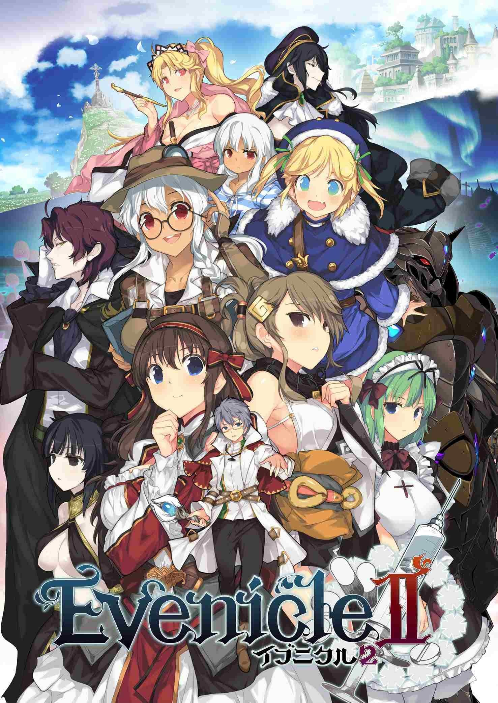
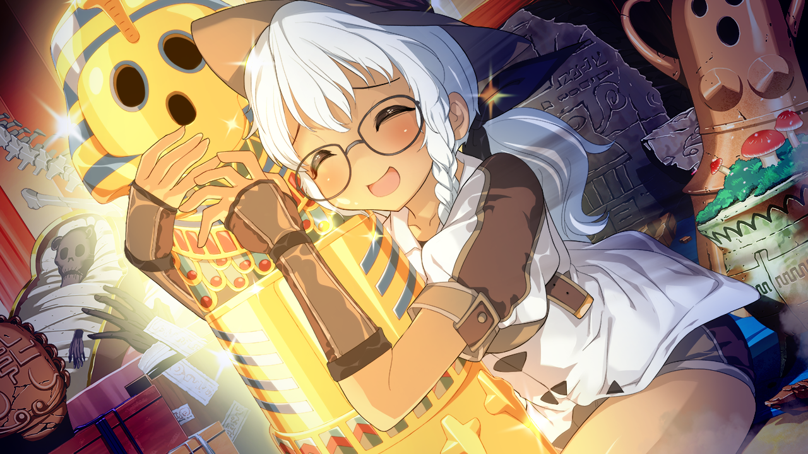
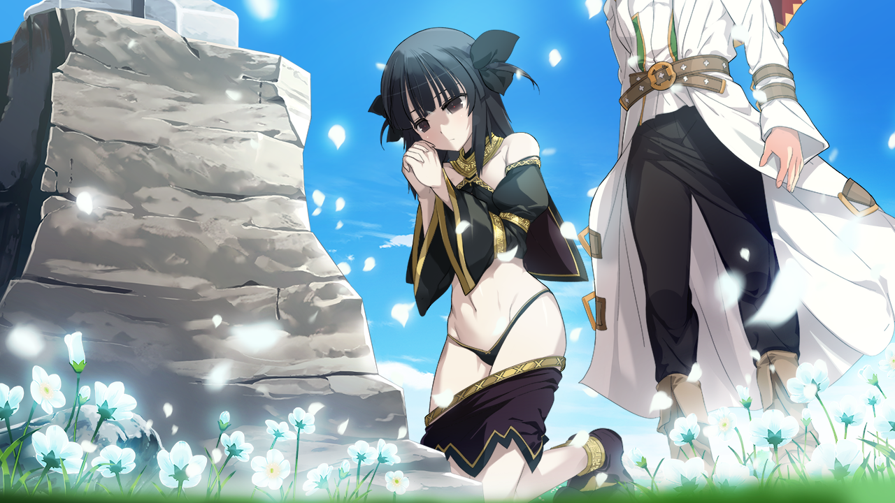
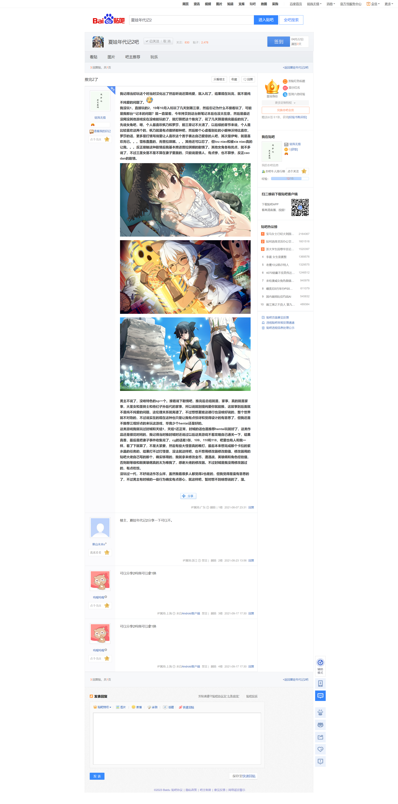

> 更新日志：
>
> 2023年4月22日16:38:59，补充原贴贴吧截图。

> 最早发布于`夏娃年代记2`吧。坚持着迁吧，舒适的环境确实容易让人懒散。也还不算是特别舒适，不过这环境其实算是很不错了，虽然达不到自己的理想租房环境，偶尔的震楼声音或者楼上的动静都让我很不耐烦，但也隐约明白，我估计很难再有当初推`青鸟`时的那个安静的夜晚了，真的怀念啊。 
> `夏娃年代记2`确实是我为数不多的推的这类大型rpg的galgame了，或者不算galgame？但，异世界冒险加收后宫，梦想啊，我也想这么活一回，主要是能和漂亮妹子一起冒险真的太棒了！ 
> 看日期差不多快一年了。

**推完2了**

我记得当初玩这个时当时汉化出了然后听说还算纯爱，就入坑了，结果现在玩完，就不是纯不纯爱的问题了。

我没玩1，直接玩的2，19年10月入坑玩了几天到第三章，然后忘记为什么不接着玩了，可能是我那台**记本的问题？就一直留着，今年拷贝到这台新笔记本后也没太在意，然后是最近没网没其他游戏实在没啥能玩的了，就打算把这个推完了，花了几天算是填完最后的坑了。

先说女角吧，嗯，个人最喜欢枫乃和罗莎，前三章记不太清了，以后续的章节来说，个人是比较喜欢这两个的，枫乃就是有点傲娇那种吧，然后那个心虚看别处的小眼神沃特比喜欢，罗莎的话，更多是打情骂俏里让人喜欢这个善于表达自己爱意的人吧，其次是伊甸，就是喜欢而已。。。雪栋蠢蠢的，而普拉琪娜。。。其他还可以忍了，但lou niao和被xia niao真的让我。。。反正接触这种剧情后我基本跨进普拉琪娜的剧情了。其他女角各有优点，就不多说了，不过三圣女是不是不算在妻子里面的，只能说是情人，有点惨，也不算惨，反正cao dan的剧情。

男主不说了，没啥特色的sp一个。接着说下剧情吧，推完后总结就是，家事，真的就是家事，大圣女和圣骑士和他们子孙后代的家事，所以说就别提纯爱你就能推，这故事到后面就不是纯不纯爱的问题，这伦理关系就离谱了，不过想想夏娃这德行也没啥好说的，整个世界就不对劲的，不过说实在的现在这种也只是让我有点惊讶和觉得设计的有意思了，但我还是不推荐三观好点的来玩这游戏，毕竟少个hentai还是好的。

这类游戏我就玩过封缄和天结1，天结1还正常，封缄的话也是推荐hentai玩就好了，这类作品还是很花时间的，我记得当时推封缄时还说过以后这类游戏不看攻略自己通关一下，结果真香，最后是把妻子事件收集完了，cg的话差3张，109，110和118，吧里也有人和我一样，看了下就算了，不是太紧要，然后有些大怪兽真的难打，最后本来想完成那个卡拉的紫水晶的任务的，结果打不过打怪兽，没法就这样吧，也不想用修改器修改数值，修改器用的贴吧大佬自己写的那个，确实够用的，我就拿来修改金币，遭遇战，英雄病和角色经验值，否则刷等级和刷英雄病真的太为难我了，感谢大佬的修改器。不过封缄是我没用修改器过的，有点吃惊。

没玩过一代，不好说这作怎么样，虽然我看很多人都觉得2也差的，但我觉得是蛮有意思的了，不过男主有时候的一些行为确实有点恶心，就这样吧，暂时想不到啥想说的了，溜。

