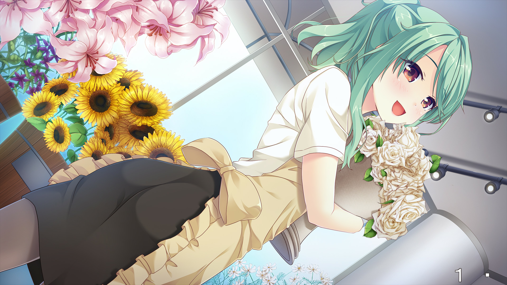

> 更新日志：
>
> 2023年4月22日16:46:35，补充原贴贴吧原图。

> 最早发布于`smee`吧。现在换了新的租房了，然后才有时间重新整理下，也顺便把帖子内容迁移到这里，后续应该会陆陆续续把很多文章都迁移到这里。然后FD确实还没开始推，我估计会在推完`trinoline`后才会推FD，治愈下。

**这狗粮真的管饱啊**

呀~真是又甜又搞笑。

开始就自然的进到了咲线，看到表白时才意识到这就进线了，意想不到，真的说了好多恋爱的一些…嗯，经验之谈？还有很多让人发笑的地方，打情骂俏什么的真的好啊，最后咲线结束的挺好的，没有过多进入到咲的家庭里，讲清楚以后两人的发展就顺利过度到结尾了，挺好的。

然后进了玲菜线，嗯我个人是不太喜欢玲菜这种类型的吧，刚接触时就会觉得麻烦的要命，应付不了也受不了。还有这条线h笑话好多，麻烦的女生也好多，感觉就是劝别谈恋爱一样(笑)，然后，最后收尾依然很自然，挺好的，就是男主最后就不能励志点有点事业么？反而玲菜典型女强人，家庭事业都圆满。

接着进了亚子线，我一般是不推妹线的，但难得这么有意思，想推完，所以想了下就提前推吧，自己摸索来看，妹线算是拒绝其她，兜底的了，就以感情线来说，比上面的好多了，没那么多无厘头，而且说是te也可以吧？毕竟设定上可以说是真爱了。印象中最深刻的还是某空，但是是看的动画，游戏没推。虽然感觉对不起亚子，但我还是想推下其他线，早知道留最后了…

随后是不可思议线，咳，是真白线，有趣的灵魂万中无一，真白可是真的让人好喜欢，调皮有趣的话语真的是百听不厌(但有时候是不是会有破音？)，超喜欢这种有意思的对话，一整个少有前面几条线的h笑话，都在表达真白是多么的可爱有趣，嗯来电了，让我都有冲动找个这样的女朋友了，哈哈一时一时。还有，那个撞穿墙壁是真的搞啊，然后还贴海报留空，每次真白隔着说话真的让我笑了好久。最后男主一家都没出场，反过来前面都没有的，真白的父母出场了，最后也是幸福的结局，可喜可贺，可喜可贺。

最后是可怜，有意就在最后的了，理由正脸是比较戳，而且在贴吧看到过好多次了。可怜，前面是真的可怜，哈哈，算是被男主捡回去还行，男主也难得这么强硬吧，然后后面就全程撒狗粮了，真的全是狗粮，其他线可能还有点空白，这基本都在撒狗粮，而且可怜是真的可爱，有点傻气，有点弱气，真的让人很想欺负她。可怜真的很可爱，哈哈，只能这样说了。不过开始搬家还是让我有点舍不得，前面都在这住着，但就走了，不过新住所更好，而且有可怜这么个女朋友，搬，肯定搬。想要这么个女朋友同居啊！

结尾再说点？好像也啥说了，最后各线都是幸福的在一起了，祝福加羡慕。上面的我基本是推一条线就写一段的，否则我觉得我没法推完后都还记得这些，我的记性越来越差了，我不知道自己还能坚持这样下去多久，但还记得时候能记下来吧。然后恋爱喜剧赛高！尽管快成魔法师了，但越来越觉得有个人能陪伴你是真的太好了。哦对了，fd我准备以后再推，想换个更好的住所后再推吧，溜。

