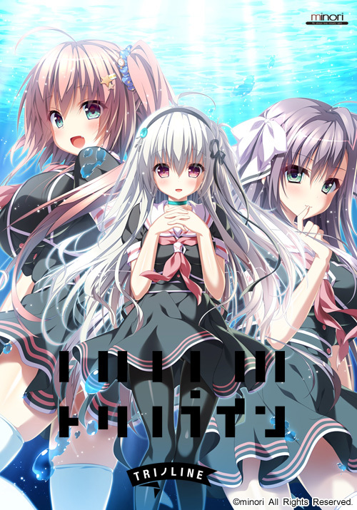
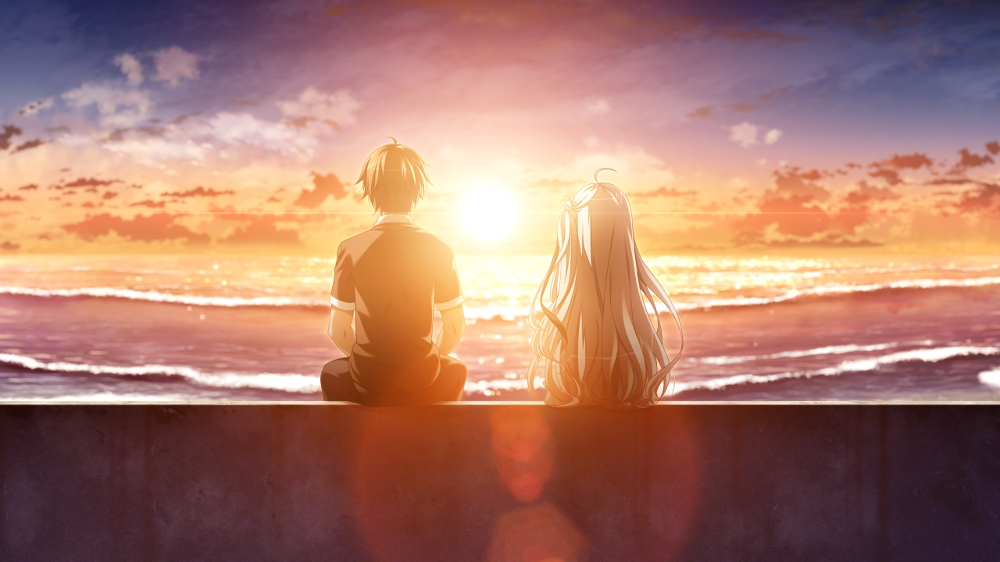
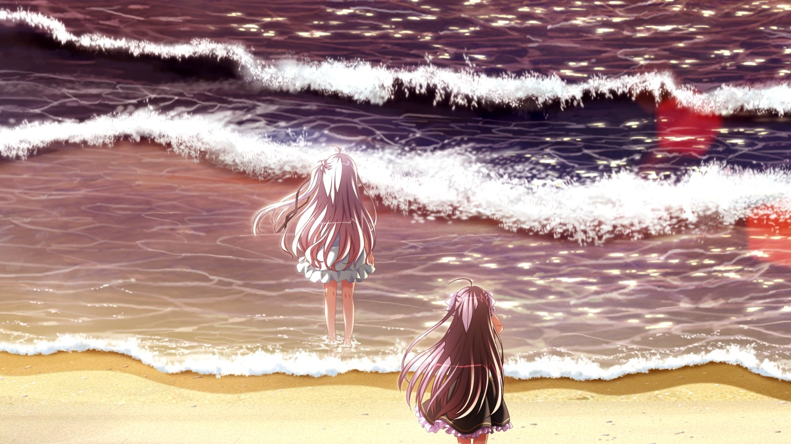
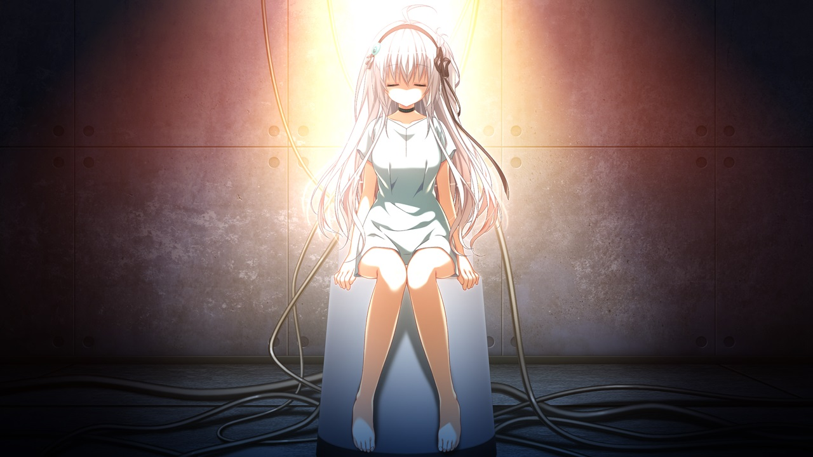

> 更新日志：
> 
> 2025年1月11日12:37:01，从贴吧迁移完内容，开始写些记录。 
> 这是我从bkmemory迁移blog到bkgalmgr后的正式的第一篇文章，真的是时隔了太久了，这都是25年了，上一篇还是23年写的了，这一年说实在的，变化还是挺多的，换了房子，换了办公地点，完成了bkgalmgr，写了梦游记，身体也变得更差了，不过说实在的确实也过得充实了很多。 
> trinoline是我推得比较遗憾的一作，因为那时候各种事情打扰，没有好好的推完，fd后面我有下载了，但是也没有推，就放在bkgalmgr里。然后我看了下记录，才发现这时候我就觉得有中二的要素了，而不是在我后面推前奏诗时才觉得，我都忘了，记性真的变差了很多。 
> 好了就到这里吧，也没啥要说的，今天还有很多要迁的。2025年1月11日12:48:09

## 写点碎碎念

昨晚推完了，但是时隔太久，真的记不得太多了，就贴下之前推的时候写的的一些碎碎念吧。

===+++===+++

　　这说实在的，机器人，妹妹，梦想，停滞不前，这几个要素一起，真的让我不怎么想推了，而且推了之后才发现，我记得这作的剧情好像…但作为有点强迫症的人，还是不想中途放弃了，看看后面究竟怎么样吧。

　　自己想不到，不代表别人做不到。

　　核心问题，对死去的人好么？对活着的人好么？对机器人好么？

　　这样的理由独居？

　　baiyin的剧情发展就这样？有点一般，有点俗。

　　直到后面baiyin有自己想法，两人投海这段，才觉得有意义了起来。

　　op响起。

夕梨你错付了。

　　舜失忆作为舜活着是不是和baiyin一样呢。

先进了夕梨线，说实话以共通线来说，我确实最喜欢夕梨，而且动态姿势过场动作幅度很大，制作组看来也是喜欢夕梨的啊。但也说实在的，夕梨骗舜说自己是女朋友时，我真的升起反感，不知道是对这种事反感还是这种剧情反感，不过后面的处理还算好吧，包括xili这里也算处理的好，舜没那么废柴。然后说下几个有意思的点。一个就是夕梨吃xili的醋，哈哈，这个确实有吃醋吧，三次元的吃二次元的醋？笑。不过代替所产生的机器人真的能给人幸福么？baiyin的又一个映射了。第二个点是舜与夕梨对于治疗的分歧了，双方说的都对其实，最后看谁说服谁，我不觉得哪方有错，但我的话可能更偏向夕梨，因为现实真的不像故事这么美好顺利，实际上所要承受的要痛苦多了，这个就不多谈了，看个人。第三个关于失忆。
　　

　　如果、我拥有灵魂的话——

　　真希望、它是鸟儿的形状呀。

　　baiyin线。这次换舜短命了么…这说实在的，有点…这就像为了做成一件事，结果太过于急躁结果不仅放弃还害了自己一样。但又不能这么简单就这样概括。说实在的，推完了，但我发现没什么好说的，我放弃了想说点实际的什么了，上一个让我觉得难过的同样的白色身影，还是…努力想了想，记起了这个名字，艾拉。不得不说，两人还很像，但又不像，自从那以后，我对于这类的就挺敏感的了，没想到过了这么久又撞了进来。感情这事，真的复杂。

　　沙罗线。我以为baiyin后就结束了，因为看不到其他选项了，结果想看cg发现没通过，去看攻略，还有沙罗。希望能有个好点的结局。

　　你也知道这样独居有很多值得吐槽的地方啊。

　　不听话的机器人。

baiyin…所以还是牺牲品么

所以baiyin线的最后是真特丽诺了么？

舜就不能联系下他老爸给点建议？

削去真特丽诺啥的，有点中二哈哈。

===+++===+++

前晚或者说是昨天凌晨推完了，但我也不知道还说啥，因为隔了太久了，快一年了，我看我以前写的都不太懂什么意思了，而前几天接着推基本就是推个结局，内容都不算多，推了个寂寞，我服了。

刚看上次的存档时间是22年5月9号，然后我接着推的时间是23年5月9号，真的是太凑巧了，真的我没故意那天接着推，但是就刚好一年

截图时，想着自己之前写的东西，看着cg还是能想起些啥的。但不多。

嘛直接写点总结吧，沙罗线最后，虽然接着推，差不多只推了最后和shaluo对线的结局，最后和shaluo的对话，我觉得挺尬的，如果说白音线让我觉得还不错的话，那么最后对shaluo说的这些，感觉就有点强行了点，不过最后算是he，白音也回来了，还行。

话说，沙罗线，算不算是接在白音线后面的，那这样，舜该怎么处理两人关系？要知道，我截图时，找些能放出来的图可辛苦了。看了吧里才发现，有fd，后面我看要不要推吧，有点想看怎么处理白音和沙罗两人关系的。

时隔一年啊，这一年，其实发生很多事情，个人的观念也改了不少，我不太清楚，如果我现在才推这作的话，是不是已经没啥感触了，不会有哪些碎碎念，但幸运的是，我当时还是边推边写的，因为我记性越来越差了，怕自己忘了所以边推边写点。嗯就酱纸吧。

