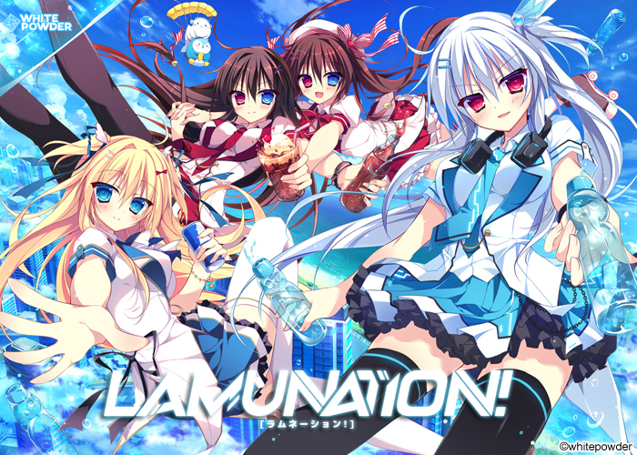
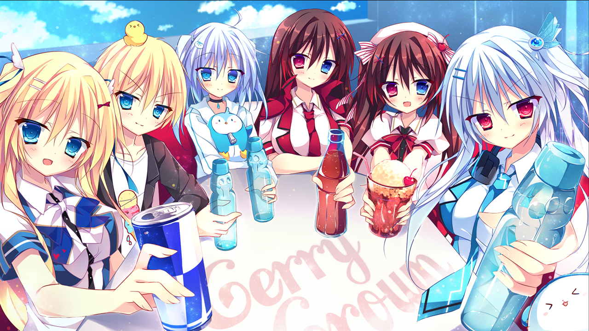
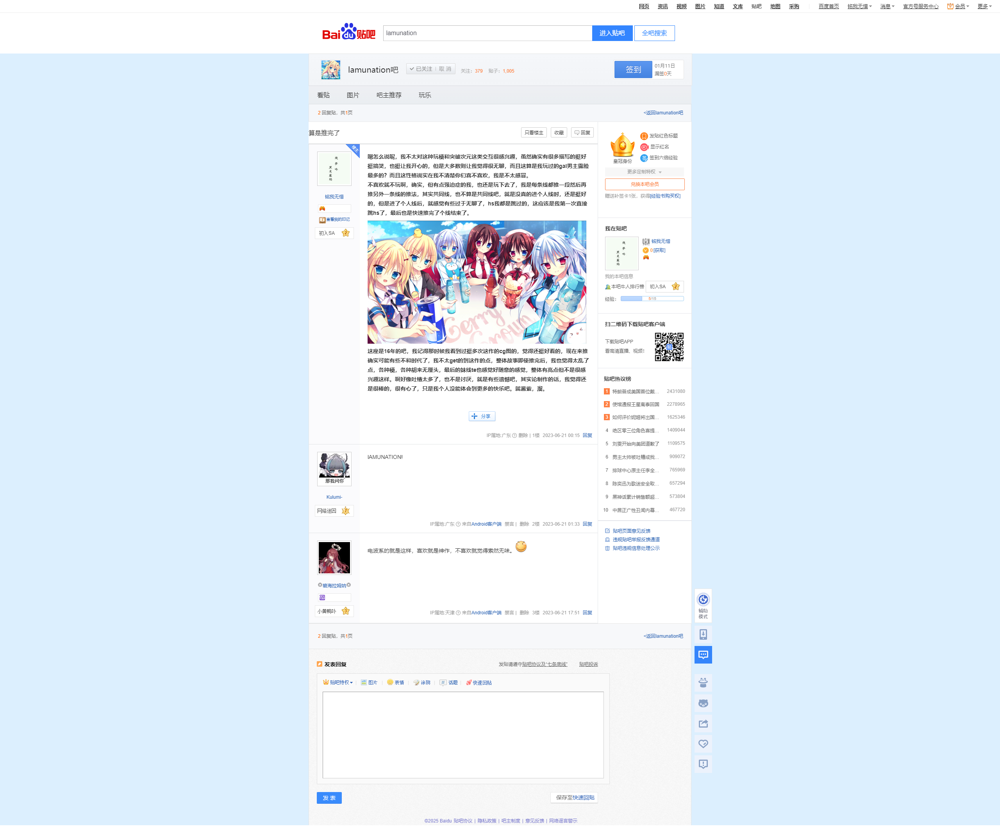

> 更新日志：
>
> 2025年1月11日13:05:43，迁移完了。这作到现在，我的印象还是那句Lamunation！还有觉得剧情有些莫名其妙的，就像我帖子里说的，我依然没法太能接受，不过奇怪的是，我依然好好推完了，是有些魔力的。 
> 哦差点忘了，上篇说推爱之钥3的，结果推了这作，下篇才是爱之钥3。2025年1月11日13:10:06

## 算是推完了

嗯怎么说呢，我不太对这种玩梗和突破次元这类交互很感兴趣，虽然确实有很多描写的挺好挺搞笑，也挺让我开心的，但是大多数则让我觉得很无聊，而且这算是我玩过的gal男主露脸最多的？而且这性格说实在我不清楚你们喜不喜欢，我是不太感冒。

不喜欢就不玩啊，确实，但有点强迫症的我，也还是玩下去了，我是每条线都推一段然后再推另外一条线的推法，其实共同线，也不算是共同线吧，就是没真的进个人线时，还是挺好的，但是进了个人线后，就感觉有些过于无聊了，hs我都是跳过的，这应该是我第一次直接跳hs了，最后也是快速推完了个线结束了。

这座是16年的吧，我记得那时候我看到过挺多次这作的cg图的，觉得还挺好看的，现在来推确实可能有些不和时代了，我不太get的到这作的点，整体故事即使推完后，我也觉得太乱了点，各种梗，各种胡来无厘头，最后的妹线te也感觉好随意的感觉，整体有亮点但不是很感兴趣这样。啊好像吐槽太多了，也不是讨厌，就是有些遗憾吧，其实论制作的话，我觉得还是很棒的，很有心了，只是我个人没能体会到更多的快乐吧。就酱紫，溜。

