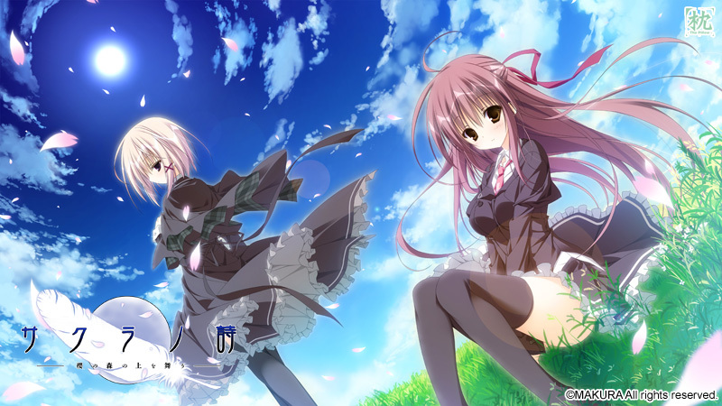
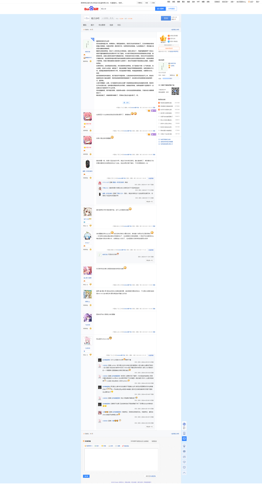

> 更新日志：
>
> 2025年1月11日13:52:47，迁移完。我没推完，那之后我有继续推其他的线，但是没推完，我都忘了我推到哪里了，樱之刻都出了，后面好像还有樱之响，大概后面是在没啥能推了的后，我可能就接着把系列推完吧。现在印象比较深刻的还是男主他爸那最后的挥笔签名和坎坷的爱情，说实在的，这类被强奸还是让人心痛的，对美好的破坏永远是道心伤，让人印象深刻，而且好像续作里也有类似的，这也是让我不太想推的原因。 
> 等啥时候吧，啥时候我再继续把他们的故事读完，到时候再另开一篇文章记录。

嗯想想还是先写点吧

因为知道有樱之刻，和算错hs，刚把禀线推完，我还以为这作就结束了，以为其他线内容会是樱之刻里的，结果来吧里一看发现不对，没想到还有其他线，hs也看错位了，想来樱之诗还是完整的故事的吧。

嗯我先进的真琴线，然后个人其实有点兴致缺缺，但耐心推完了，不娶何撩呢是吧？然后认真按不娶何撩的想法尝试两次终于进了禀线，长长的共同线没有快进选项真的有点折磨，但是我发现，这能让我回忆很多共通线的内容，毕竟也是分成几天推的，有些记不住或者初见不懂的内容，包括真琴和禀来夏目家吃饭的那次真琴和圭的对话看的莫名其妙，但你如果通了真琴线，你就大概知道他们说的是什么意思了，我也不知道是不是故意这么做的，但确实有用处。

论喜欢的话，应该是禀然后是蓝，所以我是推完真琴线，进了禀线后今晚一口气推完的，怎么说呢，没有什么拖沓，铺垫够了，最后就揭露了直哉不再画画的的原因，说是流畅也不太对，就是挺清楚的把故事讲好了吧，而且禀真的可爱呐，和直哉真的般配，也都是hentai，哈哈

就目前的体验来说的话，我只能说不坏挺好的，让我说有多优秀其实我也说不上来，推这作就感觉没多少紧迫感吧，虽然有时候推着推着就熬夜了，但也是在轻松的看他们的故事而已，挺好的。

让我不舒服的一点是，托马斯的存在意义在哪？目前两条线来看有没有他都无所谓，虽然存在不会没意义的，但希望后面能发挥点作用吧，真真的厌烦他，真琴说的那个悲愿我可一点没看出托马斯发挥了什么作用。

然后遗憾的是，看不懂日语啊，我觉得hs时的一些对话也是很有意思的，只能快进大概看看就过了。

最后就没啥了，准备看看攻略推了，否则自己乱试太磨兴致了，拜。

