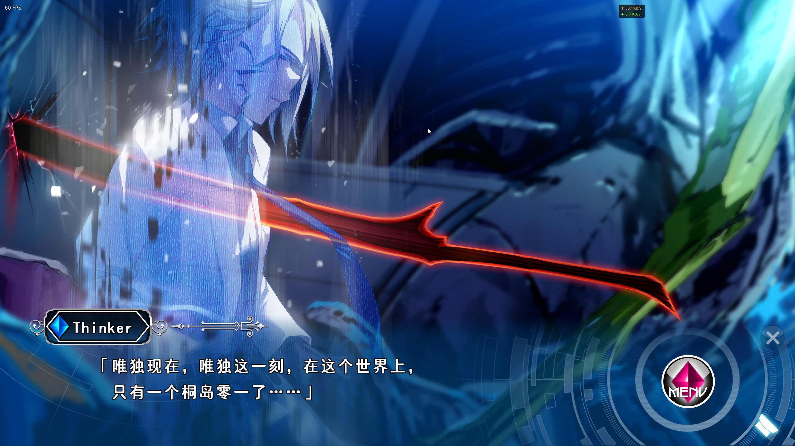
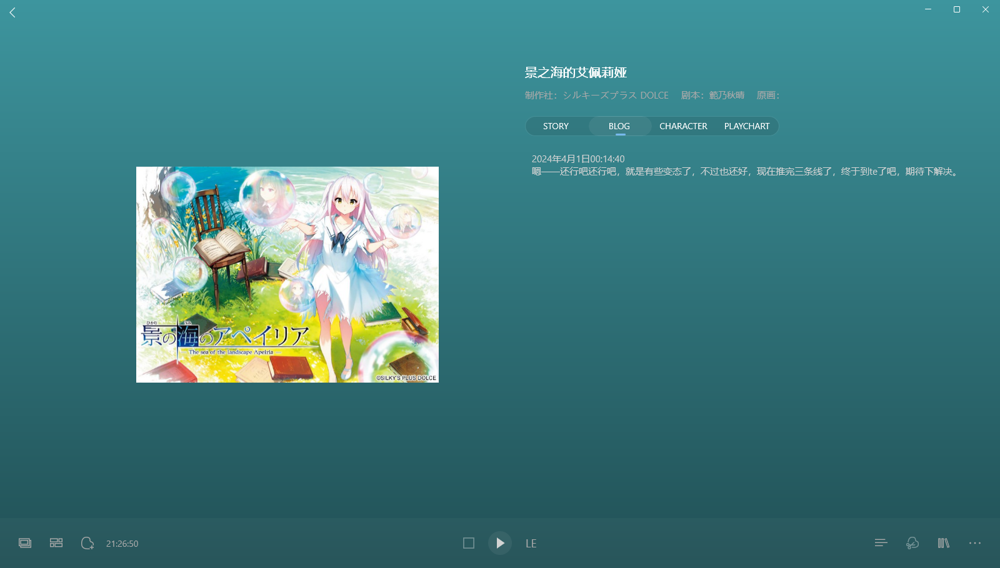
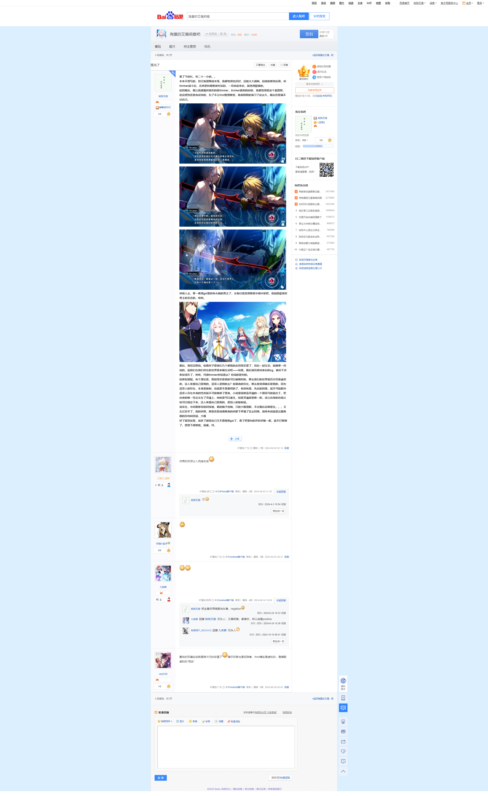

> 更新日志：
>
> 2025年1月11日14:11:28，迁移完。 
> thinker，我又想你了。 
> 这作是我用bkgalmgr记录的完整的一作，完整时长，我现在看是21小时26分，扣除当时的一些bug，应该是大约21小时，上篇樱之诗是23年最后，接着就是终点无了，开始写bkgalmgr，然后就是这作景之海了，，，不对，看了bkgalmgr的创建日期，其实第一个添加的时候柚子社的rj，然后后面还有很多其他小作品，这作其实是有完整记录游戏时长的一作，前面的推完的都还没这个功能，想起来了，我实在推恋爱定位3的时候加的记录时长，并且那时候还没有记录游玩时间段的功能，是有时长统计，后面再看看是那作开始有时间段的统计得了。 
> 景之海真的算是神作，各种意义上的，，，，刚看了下，异想魅惑竟然也只这制作社做的，看来不算是一个制作社的风格了，也就是说，海面就没这类的作品了，有点遗憾。 
> 放心吧，thinker，我还记得你，即使之前忘了你的名字，我也找了回来，我会记得你的。

## 推完了

看了下时长，快二十一小时。。

本来不想写的，到艾佩理雅线末尾，我都觉得也还好，没啥太大感触，但真的推到后面，和thinker战斗后，尤其是和观察者对话时，一切串起来后，就觉得挺棒的。

但到最后，最让我感慨和喜欢的是thinker，thinker讽刺的时候，我都觉得是这个套路啊，但没想到还是有反转的，为了不让first管理察觉，真真假假的演习了这么久，最后还是骗不过自己。

 

 

其他人么，零一难得gal里的有头脑的男主了，女角们我觉得算是中规中矩吧，我倒是挺喜欢男主的变态的，哈哈。

最后，虽然没明说，但看样子是他们几个都真的去到现实里了，然后一起生活，就像零一所说的，祝他们在他们所在的世界里幸福生活吧——结果，最后演员表结束后的cg，确实干涉条纹消失了，哈哈，玛德thinker你知道么？你说的是对的。

但谁知道呢，有个理论是，假如现实是真的可以被模拟的，那么我们的世界就百分百是虚拟的，没人希望自己是假的，沼泽人是假的么？如果真的存在，那么我觉得确实是假的，因为沼泽人的存在，本身是复制，也就是不是最初的了，有因有果，先后的因果，就不可能解决沼泽人存在本身的性质就不可能替换了原身，小说里很推崇灵魂的一个原因可能就在于，把自身的唯一性定义在了灵魂上，肉体是可以重生，但是灵魂却是唯一的，这让自身的自我认知可以稳定下来，没人希望自己是假的，是别人的复制品。

说实在，中间看推导时间穿越，看的脑子迷糊，只能大概理解，不过最后总算是在。。。又忘记名字了，真的快啊，算是还是说观察者的讲解下弄懂了怎么回事，简单来说就是云服务器的存档和回滚，大概

好了就到这里，说多了感觉自己又不愿意推gal了，看了吧里fd的评价好像一般，就不打算推了，想想下部推啥，就酱，拜。

