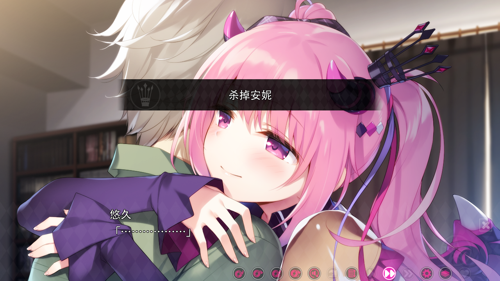
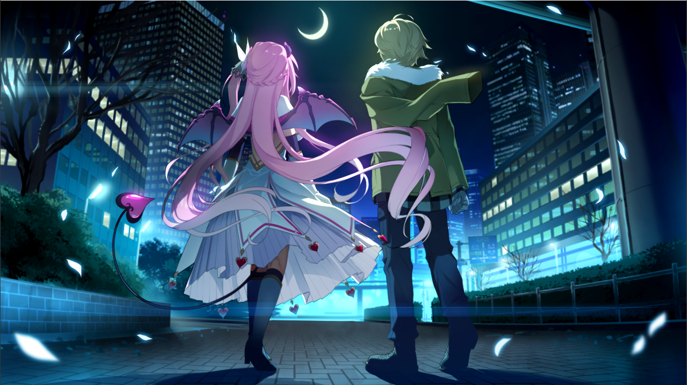
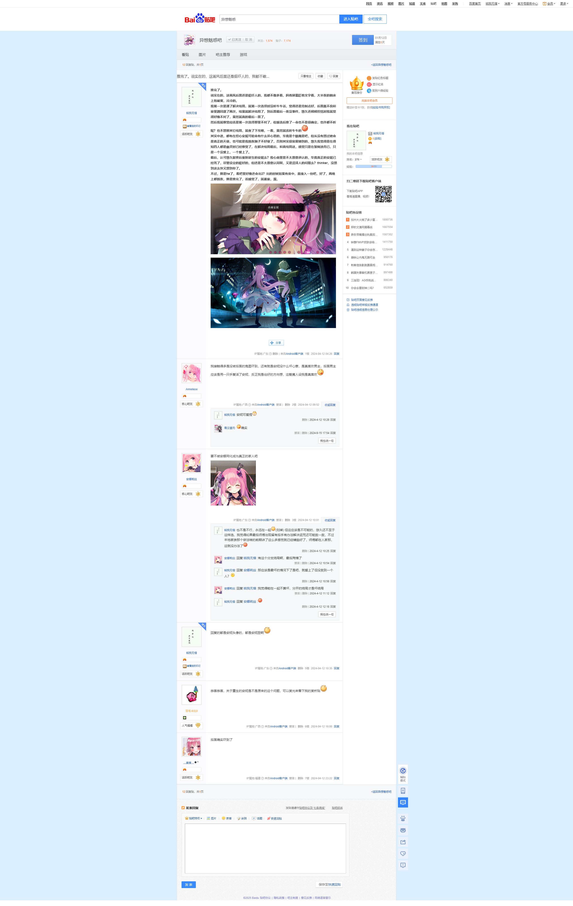

> 更新日志：
>
> 2025年1月12日11:03:57，迁移完。我以为，异想魅惑是23年推的，但没想到竟然是24年，而且第二作我才刚推的，就刚好是贴吧发的24年最后一帖，而这篇是今天迁移的第一篇，还挺前后呼应的。 
> 以第二作来说，已经解答了安妮还是那个安妮，主要是灵魂上还是唯一的，也算是个官方回应吧，其他就没啥了。

推完了。

说实在的，这画风后面还是挺吓人的，我都不敢多看，斜着屏幕盯着文字看，大半夜的躺床上抱被窝，冷冷的。

我第一次是通了解决结局，就第一次选择时没听牛牛话，觉得还是克制点好，后面救不良和家里蹲回退了两次，结果就解决结局了，到后面最后一夜没事件，悠久还频频担忧时我就觉得好像不对了，果然就真的最后一面了。

然后我就察觉应该是第一次选择那里不对了，但重选后推了一会也不是很确定，也许都不听呢？也不想推其它结局，就查了下攻略，一看，果然就该听牛牛的

其实中途，都有在担心安妮可能会有什么坏心思的，毕竟是个魅魔是吧，但从没有想过她会是真正的天使，也可能是我熬夜脑子不好使了，否则其实很容易猜到的，悠久我觉得是在得知四人都是幽灵时已经察觉了，在解决结局最后，和真结局这，感觉只是在装糊涂而已，只是一个没爱上，一个爱上了。

最后，认可悠久献祭后重新诞生的安妮么？我心底里是不太愿意承认的，毕竟真正的安妮已经死了，尽管设定的挺好的，但还是不太愿意认同啊，又是沼泽人的问题么？thinker，没想到这么快又想到你了。

不过，算是he了，看吧里好像还会出2？出的时候如果有官中，直接入一份吧，好了，两晚上都熬夜，算是推完了，该睡觉了，就酱紫，溜。

 

 

