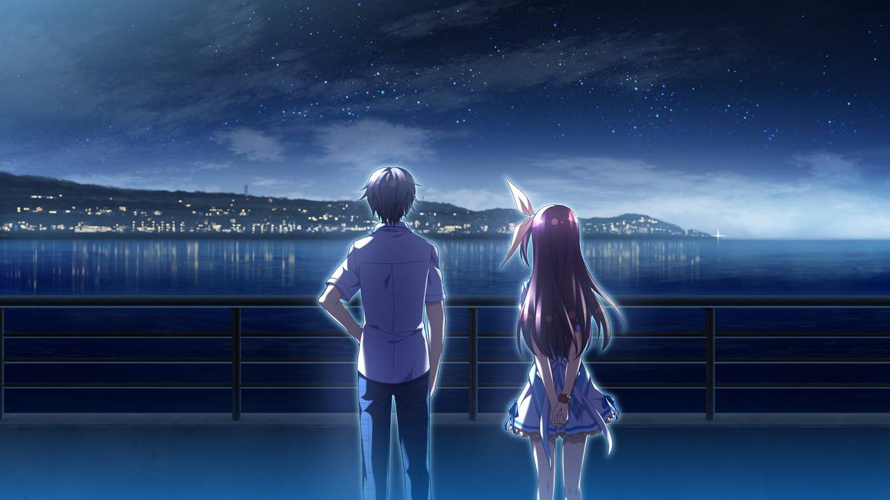
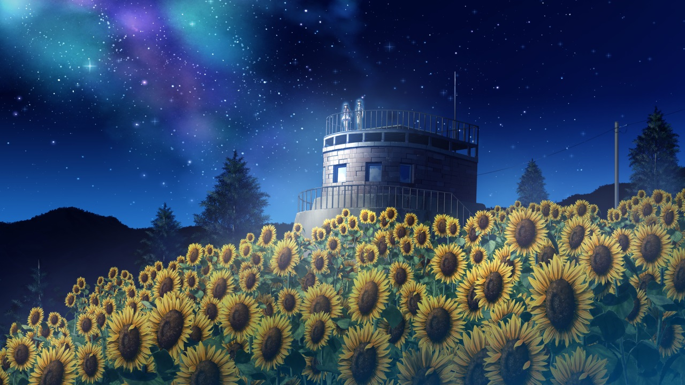

> 更新日志：
>
> 2025年1月12日11:28:14，迁移完。前奏诗啊，永远还真的经常在gal吧看到，说是坏女人，但确实也挺多人爱的。这作也是在bkgalmgr上记录了，然后在贴吧里发帖的，还可以看到bkgalmgr里的记录，我也贴出来了。不过估计也就是这种正经的我会贴出来，那些拔作的我估计就发下截图就好了，主要是写的太放纵了，不好放出来。 
> 然后现在我也不怎么在bkgalmgr上实时写了，更多是边推边在2dfan上写评论了，然后推完在迁移会blog。 
> 遥说的这句`「能够创造出故事的人，和只能接受故事沉浸在梦中的人，能一样吗！？」`到现在，我也有点恍然，我觉得这句话值得加到梦游记的标语里，希望每个人都能看到。

### 2024年4月17日02:39:49

推完遥线了，共通线就开波大的，然后今晚就把遥线推完了，刚推完没想到没ed直接就自动失忆回退到了真响线了，还想看下ed来的，好吧，推就推吧，不过今晚就到这了，还是挺有意思的，就让我看看最后的永远会是什么样吧。

### 2024年4月21日00:33:02

推完真响线了，我是不太感冒这类线的，或者说这类角色吧，推的感觉一般，最有意思的就是最后永远被拒绝破防，笑出声，哈哈，最后那段男主说的有点味道，还行吧，重要的还是自己得改变，最后也类似的没ed直接回头进线了，还来了波记忆穿越，好了这次就是永远线了，不知道还当不当坏女人了。

### 2024-04-21 05:32

推完了

嗯——好吧，这还是我第一次推到这类算是多女角，但又算是单线的gal了，就只有一次选择，你要不遥，要不真响，然后线结束，直接自动借助故事设定自己帮你回退然后进另外一人，接着就是最后的永远，可以认为就单线…连角色ed都没有。

我先选了遥的，然后是真响，相比于最后的永远线，其实我更喜欢遥线，或者说，我更喜欢这类的女角吧，这类自我能改变和成长的，故事也写得很好，最后用第三部小说把遥找回来了，我觉得设计的挺燃的。然后真响这类的我就不是很感冒，不是不喜欢，或者说不能爱不上，所以真响线我推的挺快的，最后就是最麻烦的这类的——永远…

你说爱不爱吧，那应该是爱的，但有点重，说实在的，每次看到终去找永远，我都有点苦笑，终的性格真的不算讨喜，我唯一觉得高光的都是两条线最后拒绝永远的时候，尤其真响线最后海边拒绝，永远哭了破防我笑出声，突然觉得这条线有意思了，哈哈哈哈哈哈哈

好了好了，说实在的，前面共通线本来挺好的，结果最后整了这么一出，我突然明白姬野家都是坏女人为什么来了，不过当时永远离开，我的想法也是见面终直接抱上去就好了，结果没有，然后永远一说，我才明白终这小子也是个患者，还好意思写小说出版，你知不知道，舔…算了，你有大房子还独居，父母还不管，这什么条件？我好羡慕。

永远线前面部分我觉得挺无聊的，没啥东西，或者说没看到破防啊，我还以为能看到终继承记忆后能主动点，结果还是不行，还得是永远酱够重捏，直接求婚，我当时乐呵的想不会吧不会吧，结果真的直接说结婚了可还行，后面看到那张结婚登记表，想着常在群里看到发癫图，笑出声，哈哈，结婚后就还有点乐趣吧，有很多日常互动就好了，最后心壁心会消失这个说实在的，我觉得有点过于中二…但想想，当年的自己好像也有过这类的时期，故事里这样，基于要表达的内容，也还可以吧，最后就是美好的幸福结局捏，可喜可贺可喜可贺。

我就推了四个晚上吧，共同，遥线，真响一部分，然后今晚剩下的全部，总共十三个小时左右，本来今太晚想明天再推，但感觉到还是推完算了。这作我推的时候觉得画风熟悉，一查，哦，是tri的制作社，难怪风格觉得眼熟，记得前些年已经倒闭了的，往下一看，嗯！？还是eden的？哭了。

现在推gal，感觉不到太多有意思的内容，或者说这类稍微讲人生啊情感啊的这种，感受不到太多新鲜东西，不会有太多感触了，不能体会到更多的一些新想法，也就写不出什么东西来，毕竟都没怎么思考，现在年龄大了，看过见过经历过的多了，就会影响到自己的体验，如果是以前，我想想，那大概永远更像自己，终也有部分，15年啊，那时候确实还是挺多这类人的，想想也快十年前了，老了老了。

就这样吧，写了好久，天都亮了，看吧里也提到了有fd，结果叫前奏曲，好像没下载，差点就错过了，就这样，溜。

### 2024-04-21 05:37

能一样么！？嗯！？

### 2024-04-22 00:15

fd推完了，序曲真的就一个hd，而且还对不上主线，然后tri里的fd就挺好的，没想到tri还出了这么一个fs啊，不过我对tri观感挺一般的，虽然推完了的，记得当时环境下推的断断续续，体验挺差的，现在也不会说推fd，苦笑。

好了，结束了，祝你们永远的幸福，不会有终点，拜。

### 2024年4月21日23:06:05

好短！就一个hs，就没了，去tri的fd看看。

