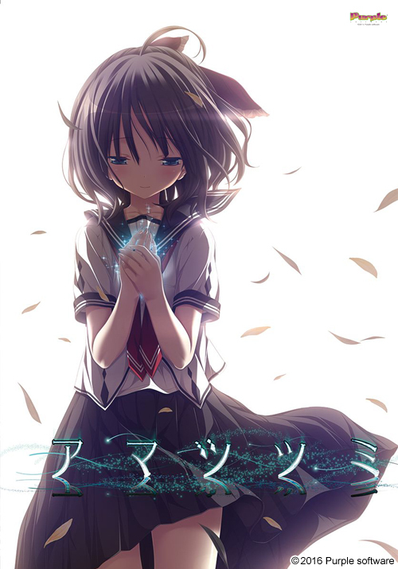
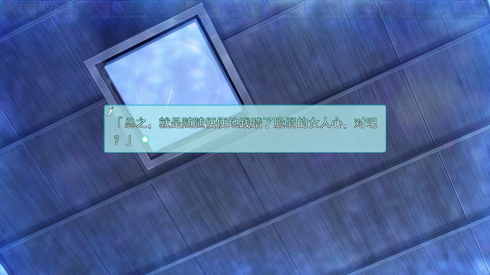
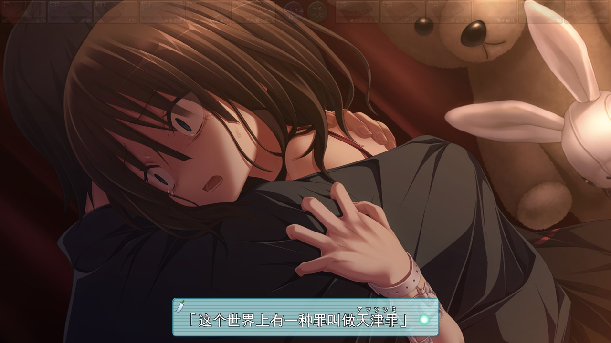
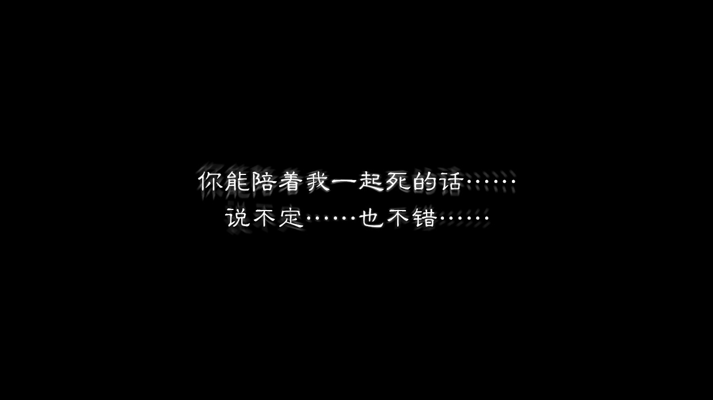
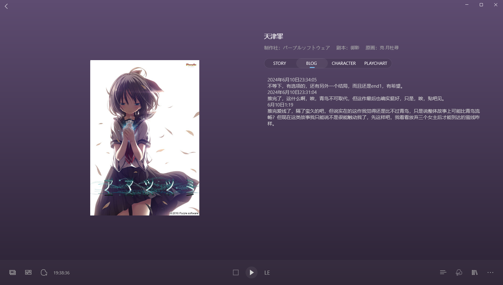
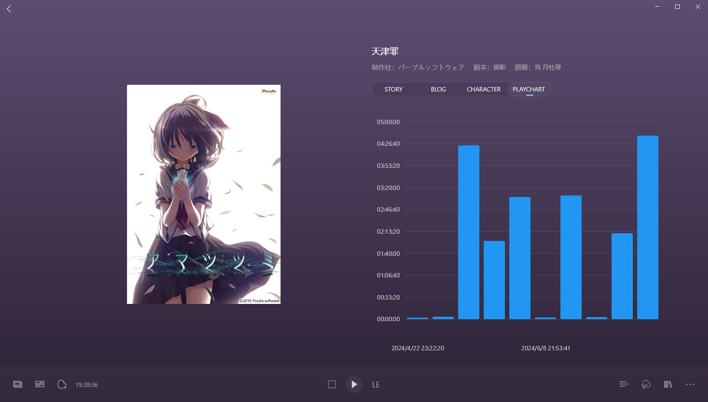

> 更新日志：
>
> 2025年1月12日12:06:27，迁移完。到现在，青鸟在我心里的地位还是高于天津罪的，但我觉得，加入当时我先遇到的天津罪，那可能真的就反过来了，而且很可惜的是，天津罪我并没有连贯的推完，中间我不记得因为什么隔了两个月了，但是想来这两个月，我也是在更新bkgalmgr的，把时间段和截图功能加上，只是这时候的截图功能还不会自动保存一份到图片文件夹，然后我看了下在前奏诗时就已经有了游玩时间段功能了，只是看样子只记录后后面一段，想来是边推的时候才加的，然后天津罪算是完整的记录了。 
> 其实如果真的考究这些功能添加，是不如直接看git提交记录的，但是我享受这种回忆的感觉，变迁移gal，变回忆那时候的一些事情，不过很多其实也都忘了。 
> 这么久了，我依然有些可惜，但是没得重来，人生来可惜的事情多了，等今天签完gal，我会重新在梦游记里写点日记，许久没写过了，该写写了。

### 6月10日1:19

推完爱线了，隔了蛮久的吧，但说实在的这作我觉得还是比不过青鸟，只是说整体故事上可能比青鸟流畅？但现在这类故事我只能说不是很能触动我了，先这样吧，我看看放弃三个女主后才能到达的萤线咋样。

### 2024年6月10日23:31:04

推完了，这什么啊，唉，青鸟不可取代，但这作最后也确实挺好，只是，唉，贴吧见。

### 2024年6月10日23:34:05

不等下，有选项的，还有另外一个结局，而且还是end1，有希望。

## 推完了

这作说实在的，我先推了心和响子，都觉得算是ok，还不错的感觉，但觉得好像也没评价那么高？然后隔了一个多月，这两天放假，心有空余有兴趣了才继续推，之前的都有点忘了，接着把爱线推完，也觉得爱线算是最好的选择了吧？

然后很好奇放弃了三人后，萤线究竟怎么样呢？

看我贴这么多图就知道怎么样了吧，苦笑。

我不知道该说些什么好，我是很久之前推了青鸟的，我总会和青鸟做下对比，或者说期待能给我比青鸟更好的感动，但显然是不可能的，青鸟给我的不可复制，我很遗憾，即使当时推得是天津罪，我觉得也达不到青鸟给我的体验，不，如果是那时候，这作对生命的渴望，可能会给我另外一种感动了。

我不该对比这两作。

end1时，我很难过，觉得不该如此，而且op还剧透了，可恶，然后想到中间有选项，果然还有end2。

这作好像后面没有后日谈吧，我还期待后面的日常的，其实我挺喜欢“病娇”萤的，虽然前面描述的挺邪恶的，但是展开后我就挺喜欢的，萤都归一后，好像就没病娇了，我有点遗憾其实，虽然记忆应该都统合了。

当然，萤本身也很可爱，而且我觉得最后这块和...诚（重新读了下存档才记起名字，好普通的名字，不像是律，我就一直记得），两人描写的恋爱日常真的比其他人多了不少吧？萤确实很可爱啦。

其他三人不好意思写不了什么，能想起一些故事，但没啥好讲的其实，我想我应该推完一作才到一作的，否者像这样穿插的推，感觉体验不太好，但有时候确实推得太累了，感觉还是一些恋爱喜剧比较是我了，时钟那座好像就是，准备推推，好了就到这吧，也不知道这么多图能不能顺利发出去。

