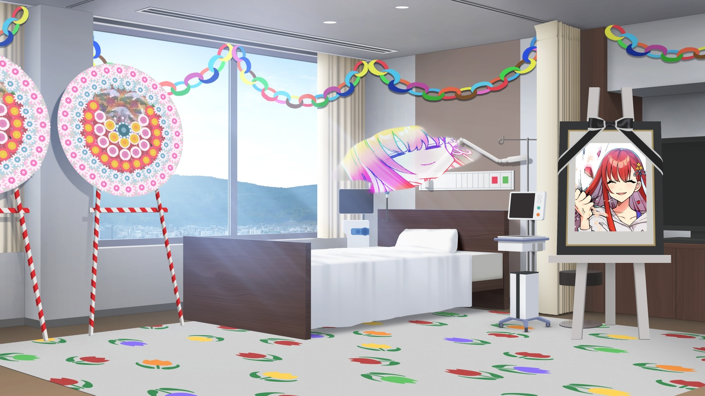
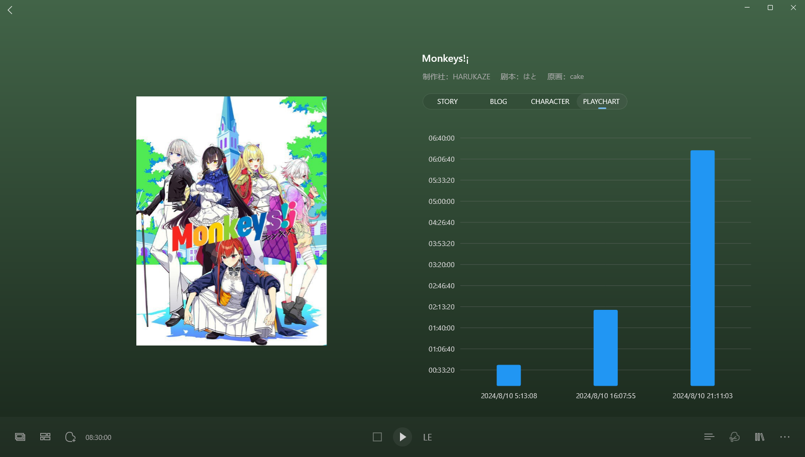

> 更新日志：
>
> 2025年1月12日13:03:32，迁移完。这作其实挺离谱的，我后面增加回顾页面时，发现有天时长特别高，有8个小时，一看才发现是这作，，，对了下，发现回顾里9个小时，应该是我那时候暂停还没加计时，导致暂停也计入时长了，总的游玩时间应该是8小时。 
> 不过这样也挺离谱的，看了下游玩时间段，我记起来了，就10号凌晨下载后入库玩了会，接着那天下午开始，一连7个小时推完了，看来确实挺有意思的，就是这类的确实不太记得啥印象深刻的剧情，也展开不了啥。 
> 刚看了官网，看着是没有下作了，和野良猫一个制作社的，已经三年了吧，不知道还活着没有，然后忘记说了，我应该补下这些游戏的官网内容，像是角色信息，gallery，special之类的，这是后面才加的功能，得补下才行，不过这个不急，后面慢慢补就行，目前保存下来的gal还不算多，慢慢补吧。

### 2024年8月10日22:04:21

有意思啊有意思，好久没这么笑了，硝子真的可爱呢，还想最后截张图，结果没了，自己写的快捷键都忘了，算了，后面发帖时候补就行。

### 2024年8月10日23:27:50

雾灯线，合校的剧情稍微有奇怪呢，最后跑去演戏啥的感觉有点歪，有些奇怪了。

### 2024年8月11日00:36:24

短鲔鱼线，意外的让我觉得有野良猫的感觉呢，虽然忘得差不多了，但感觉就上来了，觉得好像有那么些相同的感触，这条线观感上比雾灯线好些我觉得。

### 2024年8月11日01:54:53

鸦线，确实观感比价差呢，说实在的，他这个插叙完全没必要我觉得，正常讲我觉得就行了，搞得挺乱的，虽然也看得懂，但是没必要的感觉，而且这样hs也搞得我都不好选，最后推完回过头在推，写这个在放ed，我现在都还没推，总之，后面贴吧写下吧。

## Monkeys推完了

这作好像没啥人气呢，但我搜索时，评价其实挺不错的，也没好地方，就还是来这吧。

我是今天，哦昨天开始推得，然后直接推完的，看了下就七个小时，算是比较短的，不过这时长我觉得挺合适的。

我是边推完一条线就放着ed写点防止自己忘了。

硝子线，王子救了公主，是写的最好也是我最喜欢的一条线，我是一路就进了硝子线，真的是久违的让我又笑了很久，上次还是恋爱成双，还是这类搞笑的恋爱喜剧轻松啊。

雾灯线，是有些好奇地，但推了后发现，有些平淡了，我是觉得后面合校剧情推进的有点歪，而且觉得跑去演戏啥的有点奇怪了，观感一般。

短鲔鱼线，意外的让我觉得有野良猫的感觉呢，虽然忘得差不多了，但感觉就上来了，觉得好像有那么些相同的感触，这条线观感上比雾灯线好些我觉得。

最后的te，也就是鸦线，前面其实还好，真的，把各线统合了，看起来都还很不错，前面硝子线完找贴吧看到有人说鸦线不行的，我都觉得不对了，但是中间强行猿吉躺床真的有些莫名其妙的，说实在的，他这个插叙完全没必要，正常讲我觉得就行了，搞得挺乱的，虽然也看得懂，但是没必要的感觉，而且这样hs也搞得我都不好选，最后推完回过头在推的，还有最后强行点了波故事核心让我觉得有些尬了，整体观感上不太行，完全没表现出鸦线该有的水平，或者说不该是这样的故事表现的感觉。

各线我看了大概都是1小时多些这样，主题旋律是比较轻松的，但核心其实还是有些沉重的吧，这类对自我，对内心的探讨的，总不好讲，这作是用比较轻松地吐槽风格来演绎了，很多时候就表层的提一下就用吐槽转移开了，不会让人深究，可能你推完也只觉得欢乐就没啥印象了，好坏各有吧，我觉得也不错，现在轻松欢快点就好了，好好笑笑不好么。

这作是换了画师了，我觉得这画风挺好的，漫画格类的过场很新鲜，cg也不错，不过看了官网，没下一作的消息，不知道还会不会有了，这作销量不太清楚啥样，希望还好吧，期待还有下作。

话说，我七夕就算是给了这游戏了，不对么？对的对的，哈哈，说实在我又是隔了很久才有推gal了，上次看了下正经的还是六月底的魔宴，还没推完，有时候没心情确实没法推，看了仓库里的gal，有力无心的。

好了，该洗洗睡了，就酱紫，溜。

