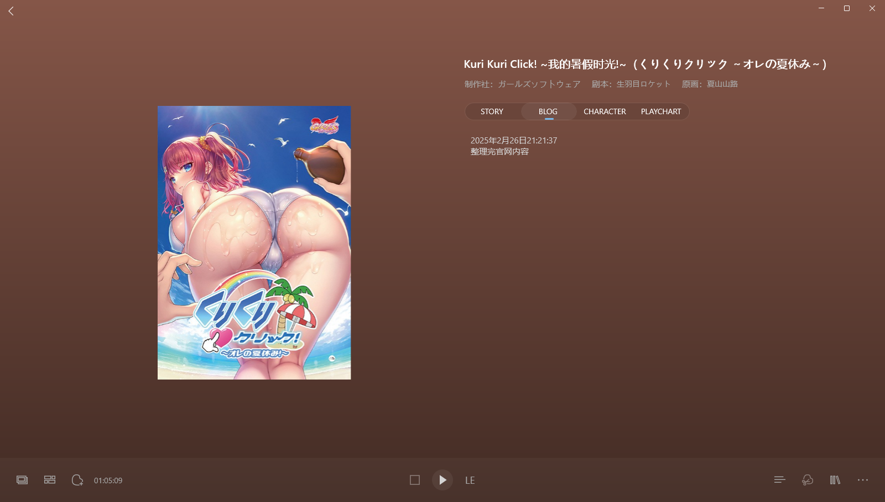
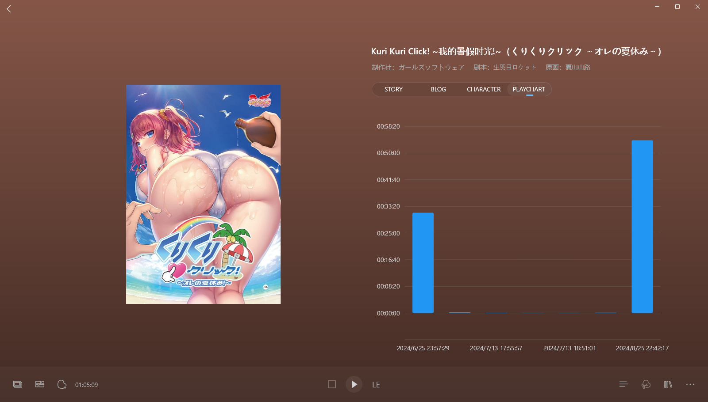
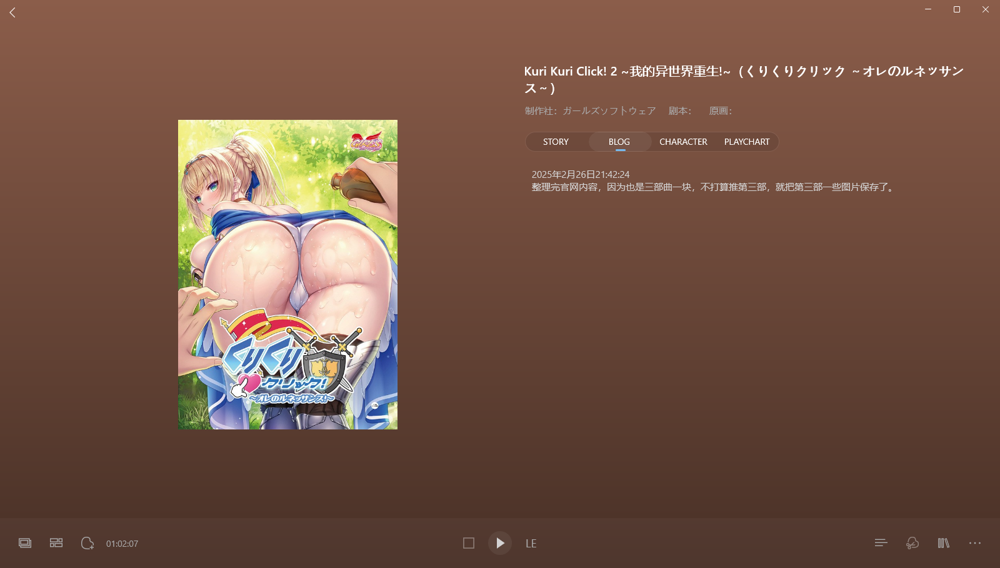
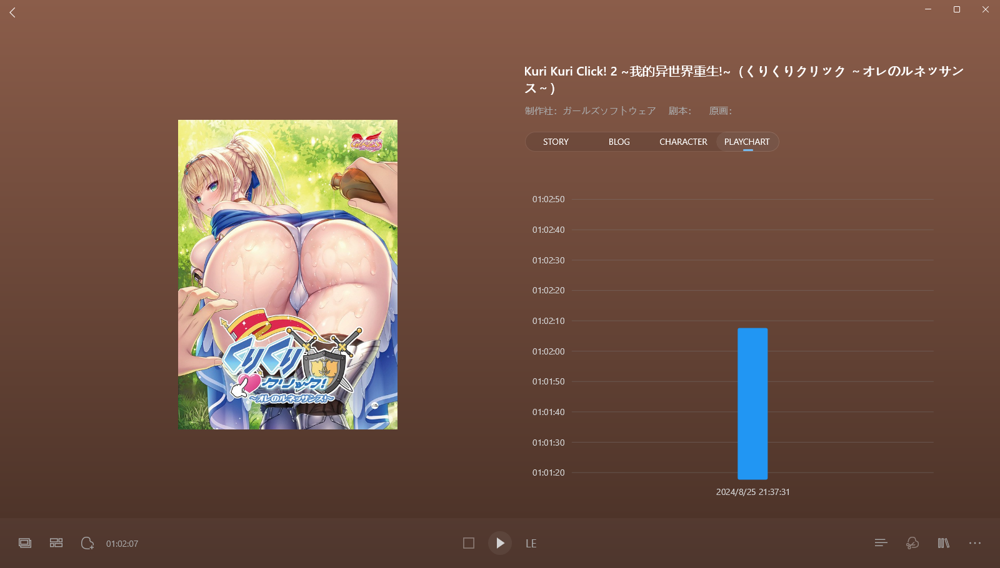

> 更新日志：
>
> 2025年2月26日21:51:37，整理完。 
> 这作就算是小黄油了，unity引擎做的，动态cg的，玩的有点趣味性，就算是搞黄色的。 
> 一共有三部，但是第三部女角我不喜欢，我不喜欢短发的女角，或者短发的女角在我眼里就没几个画的好看的，倒不是没见过好看喜欢的，就是太少了，最起码在gal，好像还没有过我喜欢的短发女角，没印象。 
> 这作也是没blog，这类小黄油我基本没啥感谢，我记得只有少数几部是让我想写点感谢的，像是冥婚和水星兔子，后面如果要整理那些小黄油的时候，我会整理出来的。 
> 不过到时候是不是就不能叫bkgalgame了，毕竟也不知道算不是galgame。 
> 还有的话，昨晚后面整bkgalmgr的图片主色调提取整了很晚，搞得我睡眠不足，准备这周末发个小版本的，我看了提交挺多的了，然后说错了，下个大版本是2.4.0了，自从父亲过世后，我就对4这个数字有些敏感，不是很喜欢，但是也没法避免用到，然后自定义背景的功能虽然实现逻辑大体都理清楚了，但是没开发时间，是准备这周就发个小版本2.3.3，主要就是功能完善和问题修复，就算是稳定版本了，目前是没啥新功能的，我自己都用的没啥太多想法，就是昨晚觉得主色调获取的不对，想完善下实现，结果就又折腾一遍，把这块代码和实现逻辑都做了优化，目前就感觉没啥在需要开发的了，周末把版本发了就行。 
> 现在不知道有多少人用，度盘分享有个两百加访问，github上下载了一百多些，感觉能有个十几二十个人用就好了，github上都没见过issue，都不知道是否有啥问题，不过有问题也被我自己发现了，算了，也不强求啥。 
> 就没啥了，后面还有一部拔作，在后面就不会这么多拔作了，很多都是发过了博客，然后没整理的，或者在2dfan上写了评论的，还有个十几篇吧。 
> 还有昨晚想着整理完这些推完的，要不要把没推完的都推了，在玩新作，但剩的挺多的，还有就是时间不够，兴趣度可能也不够，主要还是我想把时间花的更值得些，花在更好的的作品上，能让自己有更好的游玩体验，所以估计整理完，那么我可能回推新作，而不是没推完的，对于没推完的，我只能说感到抱歉。 
> 昨晚还是今早，我就在想，我写这类更新日志，其实更多的是我心里的所思所想，相比发帖吧和发评论，那些感性而又正常的话，风格和我现在说的差别很大，但实际上两者都是我所想的，区别在于我处在不同的情感状态中，所考虑所思索的内容不同而已，像我现在写的这些，就更偏向于日志，记录我的日常，而帖子和评论，则是我待人接物的一面，需要更为规矩的整理和说出自己的想法，其实就是不同的面具。 
> 我不确定我写的这些是否会有人看到，实际上应该没啥人看到，但又因为开放在这里，我又会假设有人看到，所以写这些，总让我有种紧张和冒险感，像别人揭露自己没啥掩盖的内心想法，那些或恶心，或变态的念头，让别人接触到这些，对自己感到厌恶和远离，并不是什么轻松的事，事实上，我不想自己被别人讨厌，我更希望自己被别人喜欢。 
> 但我不是个讨喜的人，一直以来都是如此。 
> 这段其实放在白日梦里说更好些，但是我短时间内都不会写白日梦了，就放在这里说说了，否则就又忘了。 
> 我也考虑过我这些零散的日志以后该怎么整理出来，但是会有那么一天么？我也不确定，但是目前也不多，到时候一篇篇整理就是了吧。 
> 好了，今晚就到这了，我今晚得早点睡觉了。

