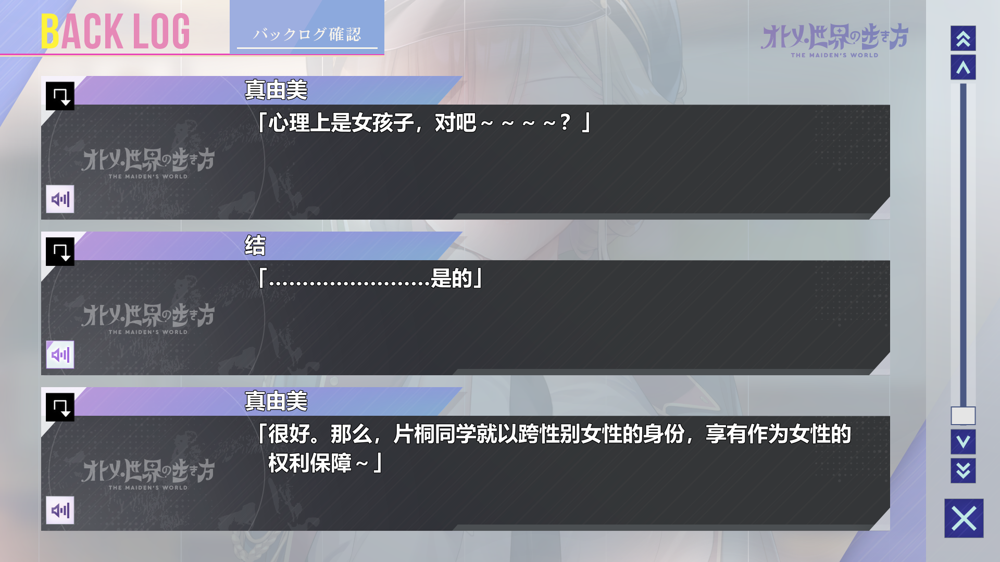
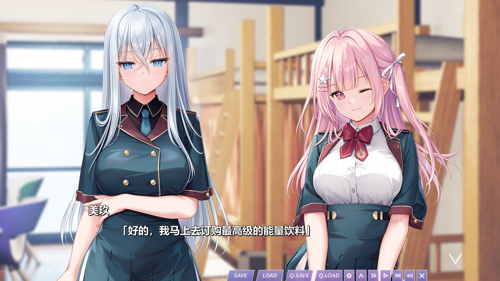
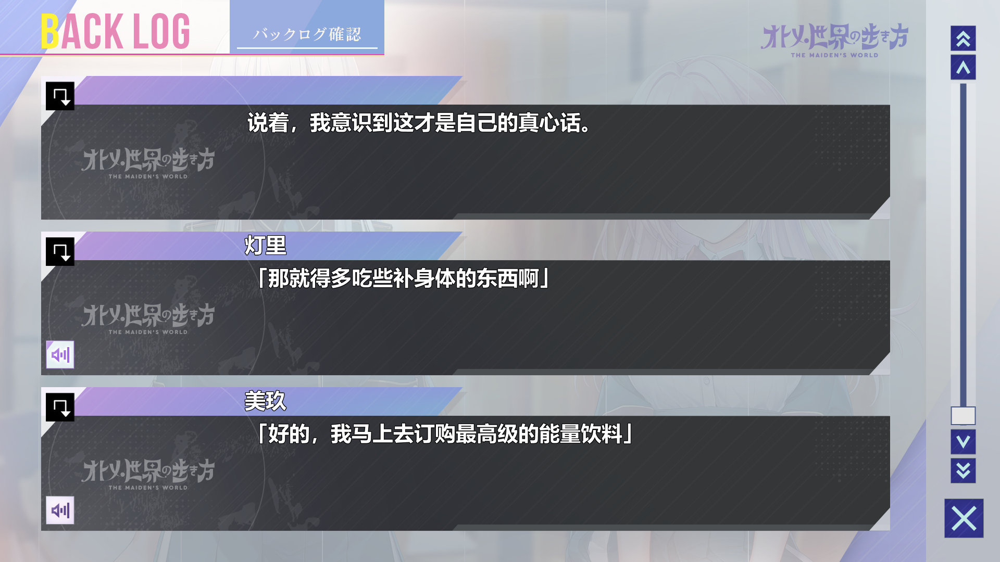
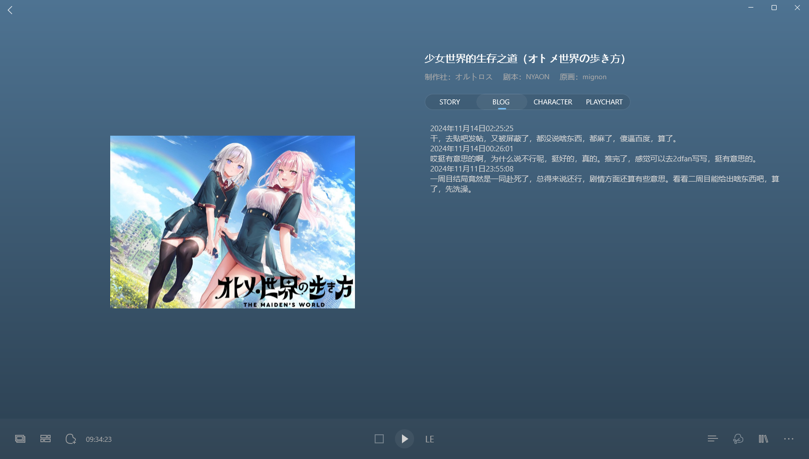
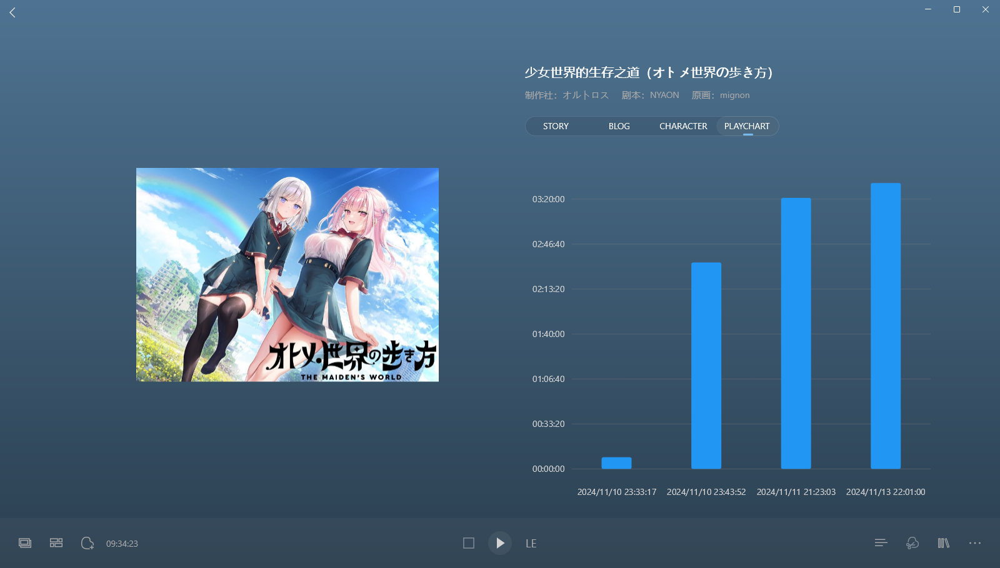
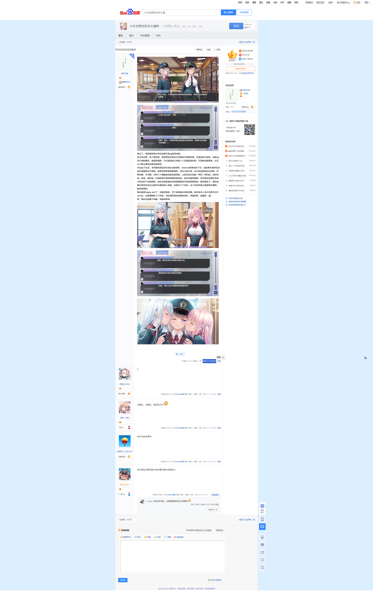

> 更新日志：
>
> 2025年1月12日17:08:47，迁移完。这作一样也挺炸裂的，关于女装和打拳，还有末日要素，不过观感上其实挺不错的，整体质量还是挺好的，虽然很多人可能被误导了，我一开始也是被误导了，然后被色图吸引，然后推了后才发现剧情本身还是挺正常的其实。 
> 这作也是ai的，现在claude3.5sonet的翻译是爱太强了，真的，基本上和汉化差不多，太厉害了。这真的算是ai造福的一大优势了，我是切身受利，而且问些简单的编程问题也挺不错的，现在我就慢慢开始用于编程了。 
> 哦上篇忘记说了，上篇开始，我发现截图就有保存在图片文件夹了，其实看图片的记录，应该是月球开始就保存了，这样我也方便找截图了。

### 2024年11月11日23:55:08

一周目结局竟然是一同赴死了，总得来说还行，剧情方面还算有些意思。看看二周目能给出啥东西吧，算了，先洗澡。

### 2024年11月14日00:26:01

哎挺有意思的啊，为什么说不行呢，挺好的，真的。推完了，感觉可以去2dfan写写，挺有意思的。

### 2024年11月14日02:25:25

干，去贴吧发帖，又被屏蔽了，都没说啥东西，都麻了，傻逼百度，算了。

## 好好好这样活用是吧

推完了，我是被发售后评价劝退又被cg劝回来的。

我之前没推，有个原因是，我觉得有些角色立绘真的不算很好看，总觉得有点别扭，但是cg却又真的漂亮，就挺奇怪的，不过美玖的立绘我个人还是挺喜欢的，灯里的也挺漂亮，反正女主那么漂亮还要求啥是吧。

冲cg玩下去后，发现虽然是这样AI加女q的背景，wochuo的事也讲了些，但故事本身其实还是在提倡男女平等的，我是觉得还算是客观吧，然后主线方面，设计的也算有些内容的，还算有趣，不无聊，日常斗斗嘴啥的也挺有意思的，之前也见过说啥一周目二周目的，但其实就一条线，美玖线一开始的说灯里线是模拟的时候，我其实挺怀疑的，而且我总觉得校舍是不是变旧了些的感觉，但往后推就被诱导着慢慢相信灯里线是模拟的，都快相信了，最后我都在想这样该怎么展开后面的双人线呢，结果来了个反转，这个反转还是让我感到乐趣的，挺有意思的。

最后就是happy end了，也挺好的的，至于故事抛出来的问题，剧本家本人估计也想不出什么办法，也是模糊给了个回答，然后看吧里说好像有续作，希望有吧，就酱纸，溜。

啊，最后在祝福下结酱，保重身体啊。

