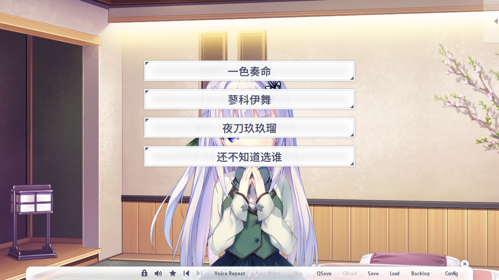
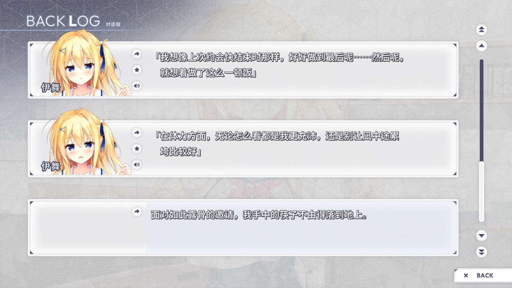
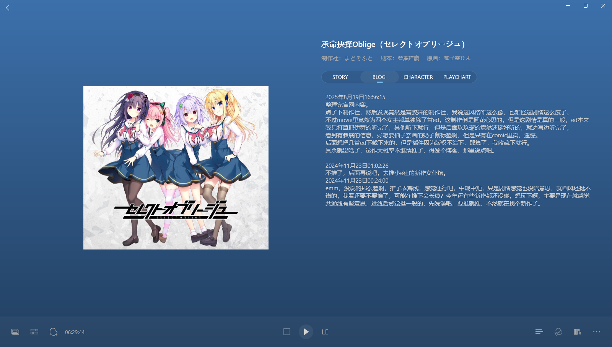
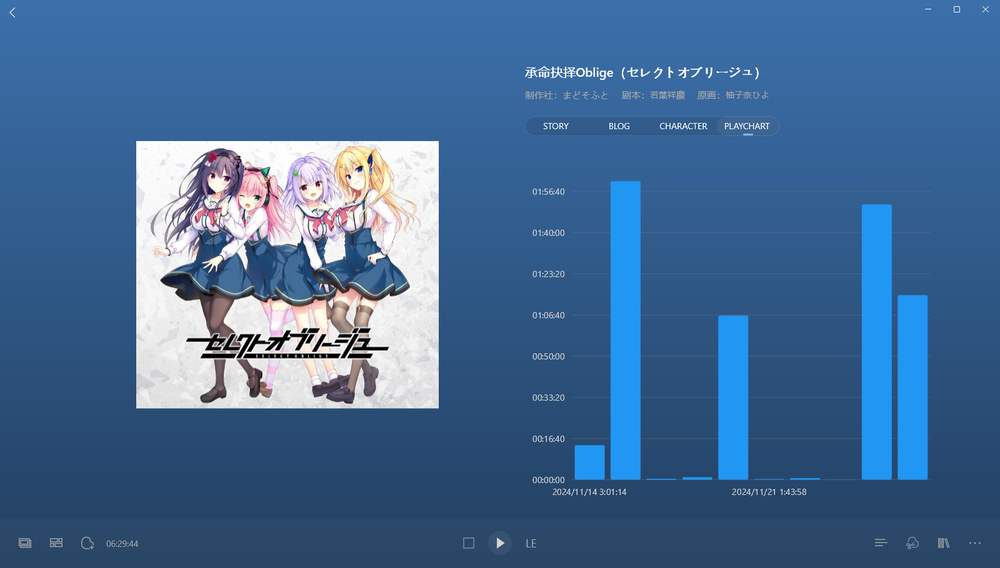

> 更新日志：
>
> 2025年8月19日17:06:24，整理完。 
> 这是我回老家后，开始整理库里的galgame后，发的第八篇博客。 
> 这作其实挺遗憾的，这画风我绝对很喜欢，和前奏诗一个画师，画的很好看，但实际玩下来，确实不咋样，说是无聊都不为过，而且看了很多贴吧的评论，好像妹妹线故事挺差的，虽然我无感，也只玩了伊舞线，不过还是不太想推了，而且总觉得柚子奈这画风，还是在中二社时的好，更戳我。 
> 此外，看记录后面就被悠刻魅惑了，想去玩悠刻了，所以也没耐心玩这作，而且发现最近整理的几篇博客隔得好近，那时候推了好多gal，估计也是对这种无聊的没耐心了，就不推了，搁置了下来。 
> 目前也没啥心情想推，可惜了这原画，挺想看看hs的，应该挺色的，但是又不想只为了hs去碰角色，挺纠结的，这和妈妈累的那作道理一样，青梅胜太多了，几乎就算是单线，但是其他角色的就很色，又想推，哎，真的小头控制了。不过我现在那作也搁了，麻了。 
> 后面再说吧，要推的是在太多了，欠债一样，情债。 
> 还有后面就是悠刻了，唉，悠刻，真的是我浓重的一笔，到时候重新整理后，在悠刻那里说吧。 
> 就这样，也没啥想说的了，期待下柚子奈参与的下一作吧，希望故事好点。2025年8月19日17:16:19

### 2024年11月23日00:24:00
emm，没说的那么差啊，推了衣舞线，感觉还行吧，中规中矩，只是剧情感觉也没啥意思，就画风还挺不错的，我看还要不要推了，可能在推下会长线？今年还有些新作都还没碰，想玩下啊，主要是现在就感觉共通线有些意思，进线后感觉挺一般的，先洗澡吧，要推就推，不然就在找个新作了。

### 2024年11月23日01:02:26
不推了，后面再说吧，去推小e社的新作女仆馆。

