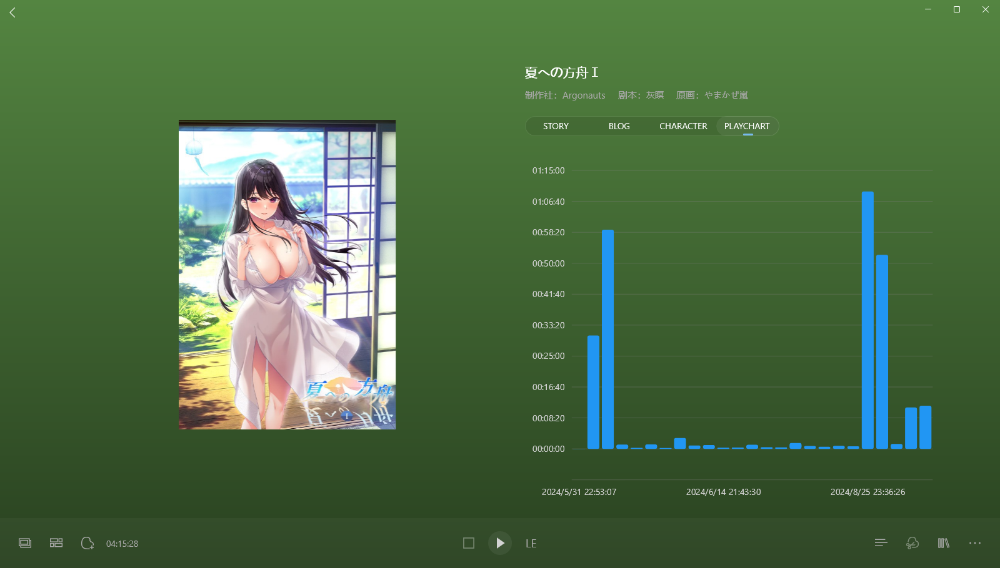

> 更新日志：
>
> 2025年7月31日15:07:47，补充2dfan评论完整截图。
>
> 2025年2月24日22:15:39，整理完。 
> 周末两天啥都没干，看贴吧找到了本网文《普罗之主》，看了两天，躺了两天，难得又找到了看网文的乐趣，但是几天后期感觉还是没意思，就没再看了，后面有兴趣再说吧。 
> 这作我推的其实没多大意思，题材方面没啥好说的，虽然看2df评论说有心里描写好评，但说真的，我不感兴趣，可能剧本设计如此，但看着hs放女主长篇的心理描写，说感情，说心理变化，唉，我都不知道说啥好，主要是这作题材就是乡下肉欲，还是那种俗套的父母强迫联姻和近亲相关的，你说色不色，我承认是色的，而且质量很高，但是你搞这个啥感情的，我真觉得没啥必要，因为就真的也讲不出花来，就是有人吃这套吧，甚至有人觉得比炎孕和万华镜hs好的，这两作都多少年前的了，没啥好比较的，虽然确实听色的，我还冲过一发，就雨中那个hs好像。 
> 之前先移除掉了那些打算推的和春节回去整理的gal的仓库，就剩下笔电上推过的，发现有95部，数了下还有多少没整理，结果超过40多的时候我就不数了，算了，慢慢整理吧。。。 
> 还是有些无聊的，先找些gal推了，或者把没推完的推了，像是这作有个第三部，我挺想推下的，也是因为有第三部，所以这次就整理的很快，因为三部曲都是一个官网，就和恋爱定位一样，就只保存了部分第一部相关的图片，就没整太多，打算第三部时候在全部收集到第三部就行了。 
> 但第三部不知道啥时候了。还有最近虽然也有在考虑梦游记怎么写，甚至把部分见面逻辑敲定了，但是我还是没法确认我该写什么样文字来描述这个故事，我恐怕没啥像轻小说那样细腻，也没法想网文那样靠故事堆积，搞得我挺丧气的，觉得自己没有自信能写好，干脆不写了，就沉迷别人的故事就好了。 
> 但不得不说，遥的那句话是真的好啊，沉迷故事的人和写故事的人，就是不一样的，我想成为写故事的人，所以让我在挣扎下吧，希望能把第一卷写完，先把开头写了吧，还得把大纲写写才行。 
> 二月都快结束了，不知道赶不赶得上。 
> 就没啥了，还有考虑以后要不就不要在2dfan发那种边推边写的评论了，因为想现在事后总觉得有些羞耻啊，而且说的也乱七八糟的，我感觉还是记录在bkgalmgr就行了，但是又想让被人看到，就挺纠结的，算了，倒是看着办吧，想写就写，记得把文本迁移回来就行，像这样整理也行。 
> 就没啥了，今晚就到这了，就一作吧，明晚估计也是一作，看了下基本都是拔作，都得整理发下blog，后面一些就是发过blog，但是没整理官网内容的了，也有很多没推完的就没整理，慢慢来吧。 
> 哦差点忘了，这作也是我写bkgalmgr的牺牲品，这么多启动好像都是为了写截图功能的，还有点测试的截图在，结果因为没啥性趣，到最后才推完，感觉这部才是我24年推得最后一作了，后面好像就到25年了，总之整理完就知道了。

### 2024-12-19 21:56:47

今晚推完后面几个h就结束了...本来以为会有些剧情，但没想到算是拔作，对妹妹和青梅兴趣都不大，后面两部就不怎么想推了。

