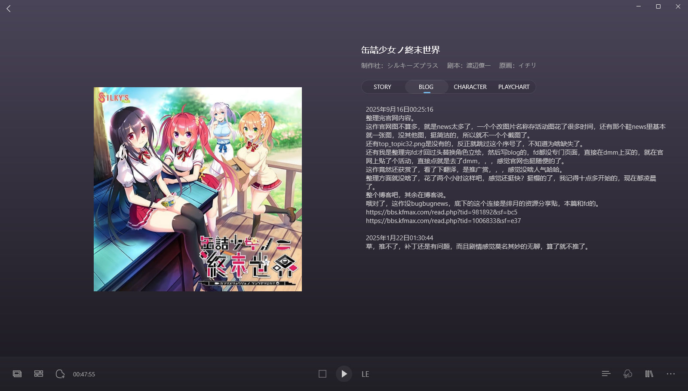
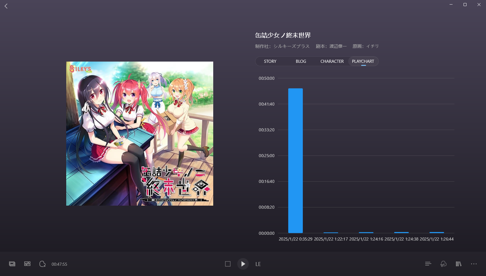

.jpg>)

> 更新日志：
>
> 2025年9月16日00:38:02，整理完。 
> 这是我回老家后，开始整理库里的galgame后，发的第二十一篇博客，2dfan的第十三篇，25年的第十一篇。 
> 这作其实我没推完，我记得当初好像是因为是苍彼的剧本家，所以找到了这部作品，并且看评论好像很跳脱，感觉有意思就找来玩了，tg上没资源，直接在绯月找别人分享的，今天整理前还特定找了下资源，存完后才发现文件夹有重名，一看以前自己就是存的这个资源，真是踏进以前的脚印了。 
> 我找资源，主要是因为我还挺想玩的，因为我都没玩多久，结果就因为ai补丁导致开始没下推下去了，sl整了好几次把兴趣整没了当时，虽然现在看记录说无聊，但现在我觉得可能推的下去的，所以就找了下资源。 
> 而以前翻译补丁是在2dfan上的，我还特定发过评论说补丁的问题，作者还回复了，但是现在没了，因为作者退站了，之前搞得那个时间导致很多作者退站删帖了，我的评论也就没了，否者我还真的想贴过来的，可惜没了。 
> 不过补丁作者现在把补丁重新制作了，发在了moyu，但我看新补丁的备注，还是没解决卡死的问题，，，此外还有另外一个人发了给ds v3的补丁，但是他没做fd的补丁，一开始的那个作者做了，但是新补丁还有问题，emm，就很烦，我其实不想不同的翻译ai来推两作。 
> 反正到时候想推，还是先试试新补丁sl的方法能不能推下去吧，不能在换另外一个人制作的就是了。 
> 至于啥时候能推，不知道，如果知道我就不写这博客了，因为是觉得很长时间都不会玩，所以才想着把博客先写咯。 
> 其余就没啥了，前面看了下2dfan的评论，评分不高，一些评论耐心推完还是写了长评的，或者说啥电波系，嗯你要说电波就不得不提弹珠汽水了，但是弹珠汽水我都能推完，这作以还有点的印象，我觉得我推完的，而且这作画风挺不错的，圆润的奶子深得我心，我喜欢。 
> 哈哈说是这么说，但是真推起来无聊我也没法退，大概一条线结束？像是柚子奈新作那样。 
> 反正再说吧，今晚就是加急整理的，而且这作是比反派英雄那作前面的，玩的，只是没推完而已，下篇是戏画的アイキス系列四部曲，就只推了第一部的开头，没推下去，因为剧情太白开水了，我也就是冲cg和戏画没了才玩了，结果剧情这样难怪没啥汉化和销量，麻了，反正到时候应该也会冲cg推完アイキス，但现在就先整理完不会发博客，所以实际上的下篇博客应该是后面小e社的战巫，但是アイキス四部曲我估计得花挺久整理的，如果能一天内整理完，感觉还行，哦对了想起来了，戏画官网已经没了，我得在存档网翻，握草，那个加载速度，emm，我感觉アイキス我得花两天整理，不过这样官网内容我就不会保存太多，而且以前面眼眸的经验，感觉也不会太复杂，希望能快速整理玩吧。 
> 其余就没啥了，下午把老屋房子草除的七七八八了，还把泥墙拆了部分，明天也得搞搞，按部就班吧，今晚也买了药了，治治肠炎，得注意不熬夜才行，，，哎，任重道远，也很晚了，就酱紫，洗洗澡休息下就上床睡了，再见。2025年9月16日01:01:41 
> 预览后发现少了张blog截图，补下。2025年9月16日01:04:15

### 2025年1月22日01:30:44
草，推不了，补丁还是有问题，而且剧情感觉莫名其妙的无聊，算了就不推了。

