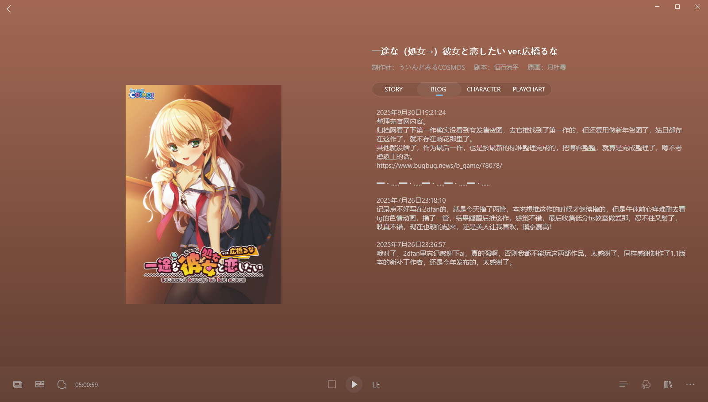
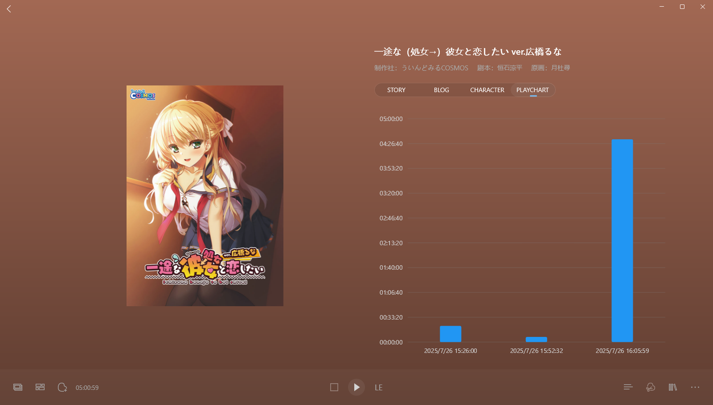
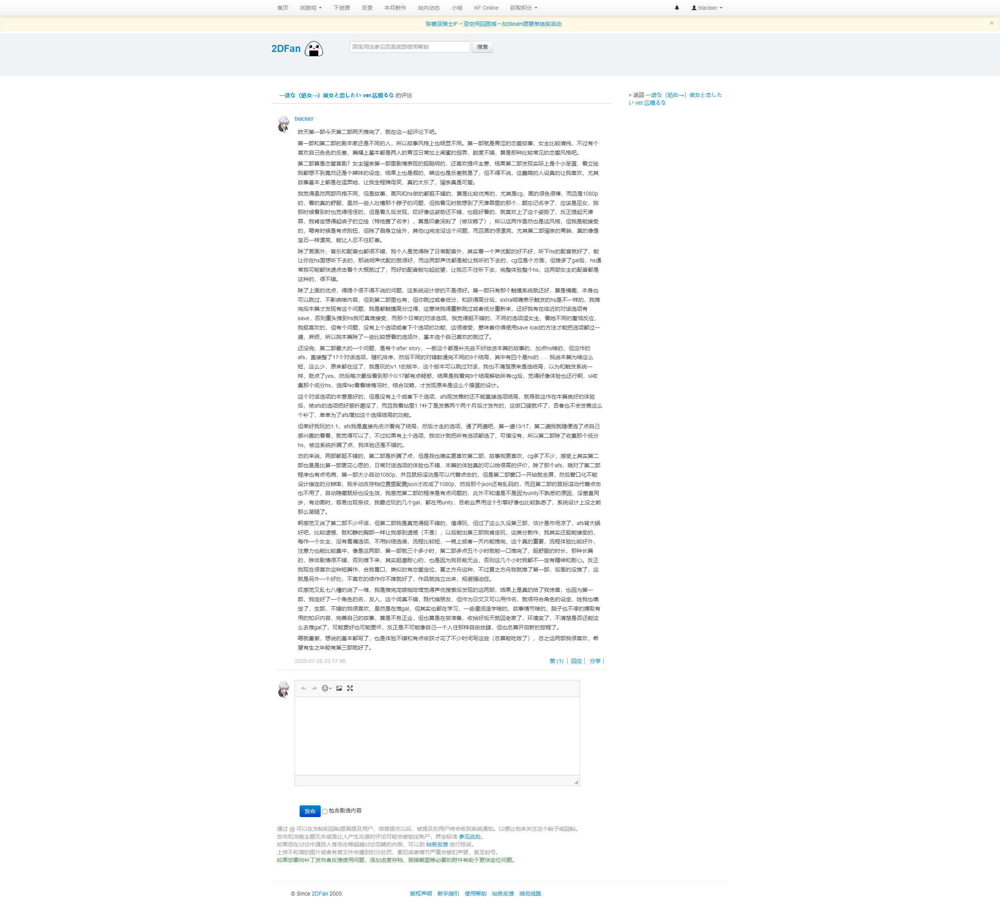

> 更新日志：
> 
> 2025年10月8日21:27:58，返工完。 
> 其实昨天就可以返工完了，只是我想干完点其他事后在一块更新，所以拖到今天。 
> 其实还可以更早的，但是国庆来台风了，大台风，就挨着我们这边海岸过，就5号白天就开始影响，晚上正式登录，大概12点吧，那时候我把光猫用塑料袋包裹号，放到一个倒扣的篮子上，然后用塑料盆再倒扣，放了两块砖在上面压着，就关好门窗下午睡觉了。 
> 那晚上真的风吹的好厉害，吹了一晚上，然后第二天白天也在吹，吹倒晚上六点这样才没啥风雨，握草，真的还挺恐怖的。 
> 麦德姆，这是这个台风的名字，就像我希望的那样，这个台风真的吹爆，但即使这样到我们这边也大概10级风这样，不过还是把虾塘的很多塑料棚吹飞了，可以听到塑料膜在风里被吹的砰砰响。 
> 但没用，玛德，根本没啥影响，人家还是放了下虾下去，机械还是嗡嗡响，棚坏了无所谓，那些埋地下的管道没坏，虾池没坏，依然可以养虾，我今天出去就看到池子里水花翻涌，还是照常。 
> 可惜后面真的没台风了，没雨水下，现在来场台风，下点暴雨把虾塘淹了就可能有点用，可惜没有了，可惜。 
> 不过还是感谢台风这次来尝试吹了一番，虽然用处不打，还给我家也搞了点破坏。 
> 如果没这场台风，我还可以提前返工玩的，5号台风来时，我忙着修树枝，因为几颗龙眼树长得太高够着电线了，然后晚上因为把路由器放到外面了，第二天6号风雨依旧，白天就断网了，用手机热点搞了会，然后晚上才又继续整理，并且快整理完了，只剩下怪盗和red，昨晚把怪盗返工完，今晚才把red整理，才算是返工完。 
> 所以实际上没这场台风，我应该六号就整理完了。 
> 而且不只是因此断网，那网上还把我家鱼塘辨识度额一棵大树吹倒了，倒在了我们虾塘里，，，，握草，这可能就算是因果报应吧，而且那天晚上风雨太大，三楼和二楼的落地窗都被灌水进来渗进地板，天花板都在漏水，今天出了大太阳后，才不再滴水了。 
> 反正正常台风算是一视同仁的带来了不同的灾难，不过我还是觉得这台台风真的算是应我的请求来的，不管是不是凑巧，但是确实像我说的那样爆吹了一番，虽然最后效果不咋样，机器还是嗡嗡响，不过还是感谢吧，下次来的时候希望能来点大暴雨，不只是刮风就好了。 
> 台风的第二天刚好是中秋，因为风雨我妹在市里回不来，我们就在家呆了一天，然后我也在琢磨那颗倒下来的大树该怎么处理，它那树墩直接掀起来了，把塘边给掀起了一大块，外面就是河道，差点就把我们鱼塘给破堤了，也是因为泥泥太少了，所以才到了，不然这棵树倒不了，不过这棵树在很早前就被吹断过顶部了，那时候忘记是不是台风了，后面倒是也长得很好，枝繁叶茂的，但这次就是长得太好了，结果就倒了。 
> 不过如果我们砍了树干，把树桩翻回去，它就还能活，因为它的树根还好好的，实际上也不得不掀回去，因为缺口太大了，没那么多泥巴填窟窿。 
> 想好后，就是该怎么砍，电锯，只能电锯了，我家就有台，不过之前都是大屋，现在都是在五叔那放着，我妈不敢用，就只能我来了。 
> 实际上这是个危险的事情，而且还是像我这种没人教的新手，要自己搞，旁人都不太信任，我自己也清楚，所以我自学，在b站找视频看，怎么伐木，怎么安全使用电锯，怎么保养维护，就反正我真的在努力学着怎么操控电锯。 
> 就努力让自己能成为一个让别人能相信的人，并且能证明自己能真的在家干这些活，我昨天早上起床想好就上去拿了电锯，放五叔房了，我特地问了他拿，自己买了新链条，新的机油，拆了链条预演组装了一番，还调了松紧，最后真的在我手上启动的那一刻，真的既兴奋又紧张，我还为了没经验，特定找了木头做了测试，并且注意安全问题，后面回顾自己那么不安全，哪里做的不对，反正我尽可能的保证自己是安全的能去操作。 
> 昨天还刚好妹妹回来了，我就整理家里的工具，少了很多东西，我爸还在时的很多东西都不在了，我妈说啥自己不用都放到大屋，给五叔用，我们自己用再拿，结果就是也没啥工具在上面了，那大屋也快塌了，漏水，五叔都把很多东西搬到他新的房子了，结果结果就是现在家里少工具，拆电锯的工具还是我找五叔要的，哦那电锯是我爸买的，所以我自己搞电锯是没啥问题的，五叔其实也不放心，还特定跑下来两次叮嘱了些内容，还想自己动手帮更换保养之类的，但我坚持自己搞，毕竟总得自己来的。 
> 反正是少了工具的，电线也没有，然后还少了工作用的解放鞋之类的，所以今天刚好买的链条到了，就顺便出去补齐这些，电线，螺丝刀，钻墙的转头，解放鞋，水鞋，还有桂林帽，那顶桂林帽我妈还想去熟人那买，结果人家没有了，因为旁边开了大超市，现在没啥人在那买东西了，他现在都没摆啥东西出来了，这种小商户还是挺受冲击的，那老板还未给谁的，我妈说给我的，问拿来干嘛，说工作用的，老版还问啥工作，我妈说家里做工，那老板就笑了，家里做啥工，我妈就不多说啥了，说没有卖就去其他店看看，就走了，我在外面骑车，没进店了，所以听得到他们说话，但是不好插话，我能想到回来可能会有这种问题的，但确实当面对时，不好受还是不好受，只是我妈心里可能也不好受就让我更不好受了，但没法，你确实得被一些人这么取笑，我只能尽量忽略他们了。 
> 出了另外一条街，就买到了帽子，实际上刚进街道时我就看到了，但是我妈就想去熟人那买，就听她的了，而且那个熟人我觉得也不咋样，即使跟她买东西，他也帮不到我们啥，反正没啥好处吧，当然可能是我不知道，毕竟我妈好像跟那老板老婆挺好的，我爸还在时好像也挺爱在那里聊会，但我从小到大，都不觉得那家店有啥好的，人也就那样吧，可能帮过一些忙，比如打个电话，帮看着点东西啥的，但我觉得好像也没啥吧，不过他们那辈社交就是这样，我也不好说啥，反正就是换了家另外的店买到了，也算是老店了。还有我以为挺便宜的这种帽子，十块钱这样，但没想到要十五块钱，而且一根布条要两块钱，我妈还觉得正常，还说以前就这个价，握草，真的有时候这种东西价格真的让我想不懂，尤其是那根布条，用作绑带，还不赠送的，我妈还买了根新的，握草，结果才知道竟然两块钱，我还以为一块钱就行，给我惊到了。 
> 后面就取了放在店里的电线，就回家了，当然，钱都是我出的。 
> 回来后，我妈开始做完饭，而我开始换链条，装机油，因为昨天拆装过，倒也熟悉，只是那个机油每太搞明白用途，花了点时间搜索了解，但是网上也没太说明白电锯的机油是不是这种，最后感觉因为没啥问题，才开始倒机油，但是这时候发现没漏斗，倒的有点狼狈，然后昨天就听五叔说那个机油泵里面哪里裂了，不能自己动出机油了，不过我还是加了进去，按了几下，确实没出油了，只好手动上油，又搞了一阵，然后试了下电锯，调整了下，就准备开搞。 
> 那时候有点晚了，但是天还算亮，我就准备试下，看几段树枝，但是我妈就很不愿意，真的，她回来做好饭就自己去砍树枝了，然后我准备砍时，还想自己在弄好明天在让我砍，但我坚持，她也没法了，我想下水，她还说下水干嘛，站在树上不就得了，我就很生气，我说你想让我死是么？ 
> 我妈脸色就难看了，说拿着电锯站水里可能漏电啥的，我说我知道，但是这个没法，你不下水，塘里的树就是砍不了，反正两人还是吵了几句。 
> 我妈的担心，实际上也是我的担心，因为这个确实危险，我实际上把这些危险都想到了，但是有点把握在，因为实际上如果真的漏电，站地面上也是会触电的，站水里你只要抱枕电锯不攒水，电线不过水，应该就没问题，只是心里确实有点坎坷紧张，所以一激动才说了想我死之类的话，实际上不该这么说的，好好说话就行。 
> 还有一个原因就是，直到那会，她都不相信我能做好这件事，回来路上还说让我五叔在旁边看着好点，这说实在让我不舒服，虽然能理解她的担心，但实际上就是我得做这些事情才行，不然就永远没法证明自己现在是个能独当一面的人。 
> 后面就是耐着性子由着她唠唠叨叨的边说边把电线拉到树边，也产生站在树上给她演示真的没法砍，最后得下水，妈才消停了点，然后我就现在水里站着启动了下电锯，没啥问题，我妈就按岸上开着，拉着电线和看着排查开关，我就在想水里试着砍了几段，还失误砍了底下趁着树干的分枝，把电锯链条卡住了，还好不打，用刀劈砍了一整把链条取了出来，我妈就在边上又开始唠叨安全啊，怎么站啊，我修完细枝后你在砍之类的，我也不管她，实在烦了才说了句别吵了，才让她又消停了。 
> 最后链条出来，确认没啥问题，试了下电锯没问题，然后看了下几根，确实可以后，天色也晚了，就上去了，我妈也新的安心很多，毕竟哪个问题都得到了解决，后面说话就融洽了，反正也是吵吵，后面过段时间就消气了，两人都是。 
> 实际上还有很多没讲，不过大概就是这么回事，基本上就是台风吹倒了一棵大树，我怎么开始用电锯处理的前段故事，后端故事还没开始，我也本来想把这段完成后才更新blog的，但是想了下还是整理完，先结束掉这段整理，因为后面我实在想推gal了，好想玩，最近没啥事干，有点无聊了，所以说我可以推完后，在新的博客里说就好了，应该不会隔太久，所以决定就按之前说的，国庆返工完。 
> 此外，还有两件事要提下吧。 
> 一件事之前不是说泥墙倒了么，之后第二天我就把墙角清理出来了，早上搬檩条，傍晚清理瓦片沙石，忙了好久，把墙角清理出来了，也刚好有水道泄水，就刚好赶上这场台风，实际上我不自己弄塌，这场台风应该也行了，后面把树处理好了，就该挖地基，盖房子了。 
> 另外一件事，就是昨天我妹回来，提了下关于申报农村房产证明的，我后面有些在意，就了解了下这块内容，确实还挺重要的，说是要27年完成确权，实际上几年前一些地方就开始搞了，我大舅他们那就已经搞了，但是我们这边还没有，村委也没通知，所以目前好像没法搞，就是不知道最近会不会开始了，然后还发现了关于农村宅基地这块的规定，还有土地使用这类的一些规定，我比较在意的在于宅基地的回收和一户一块的规定，所以我要盖老房子，可能得我自己有户口，并且要申请。我跟我妈确认了下户口的事，她说去年就变更她为户主了，人家还问她要不要一人一本，她没要，说早知道就分出来好了，我还以为她还没变更，没想到已经变更了，省了一步，不过国庆放假，今天去派出所那看了下确实没人值班，就没搞清楚怎么分户口，准备后面找个时间再去。 
> 除了这个宅基地，还有个耕地确认的，也是会发本证书，但我们家有录入，但是没有证给我们，我妈去政府确认过了有录入，但是确实村委没给我们证，还有其他几个也没有得到，我不太确认是不是村委故意的，因为我看那几个没证的好像都是比较势弱的，不过地我们也还在种，系统上也有录入，也就算了，只是以后如果征收，不知道会不会有隐患，也没法，人家政府工作人员好像也没法现在给我们重新办过，过了那段时期，就不好处理了好像，反正就是有这么个糟心事。 
> 此外就没啥了，后面基本就是砍树，独立户口，盖老屋，就这么几个事，只是从电锯这个事里，我还是可能自己还有很多没做好的地方的，只能说涨涨记性，自己多注意点才行。 
> 其余也是些小事，也想不到啥了，哦对了，我妈笑着说我妹抱怨不让她前天回来，不然她早就得在二楼沙发躺了，我妹还带了两盒月饼回来，一盒她老板娘自己做的，那老板娘自己开的点心店，自己做的送人的，剩了几盒就分给她们了，还挺好吃的，另外一盒也是老板娘给的，别人送她不想要就都给员工了，是那种中个月饼的，好像是黄皮味？很奇怪的口味，不过加了叉烧的，还没吃，等吃完那盒再说吧。看着老板是不是很好的？但国庆只给她们放了中秋那天的假，而不是带薪的，第二天的假是调休给的，而且一个月只有一天还是两天，一个月大概就是三千块钱工资，这就是我们这种小城市的薪资，你上班真的赚不到啥钱，只能自己当老板做生意才能赚到钱。 
> 这次我妹回来，我也是没得和她说上多少话，我那天早上拿了电锯就整理那堆工具，然后修链条，也就她刚回来时在外面聊了会，我妈宰鸭子，她帮忙，我整理工具，就那会聊了下，还在一个后备箱里找到了她的出生证明，还说嚷到就是九点出生的，我爸说的对，我妈说的八点半是错的，还说我爸说我妈自己记错了，乐了一整，后面一块吃了个午饭吧，随便聊了聊，然后她们去二楼沙发躺了，我在下面拆电锯。 
> 等我修完已经三四点了吧，想上去一起坐会聊聊时，我妈就下来了切鸭子准备饭菜了，因为当天我妹就得上去了，很遗憾没得坐会一起聊聊，吃下月饼的，我也没上去，也太累了，看了会切鸭子，就躺床上休息了，她们吃了饭就出门了。 
> 上次我妹回来还是丝之歌发售，而当时我刚好沉迷丝之歌，也没咋说过话，玩累了就躺床上休息，然后也是老妈送她出门了，两次都挺遗憾的，一家人都没得坐在沙发一起聊下乐呵过，不过这次就还好，好歹吃了个饭，上次丝之歌是真的精神状态都不好，话都没得说几句，实在不该。 
> 后面她回来估计得元旦了吧，反正也算近，回来还挺快的，就是现在没法假放，不过她现在在一个瓷砖店干销售，平常也不累其实，上班也就上班了，就还好，只是没假放确实没得多少私人时间了。 
> 下次该好好聚在一块聊聊，这几天月亮这么圆，没在一块看看，确实可惜，不过昨晚倒是和我妈看了会，她那衣服上三楼晾晒，我说月亮很圆，你可以看看，结果她真出去天台看了，还说真的十五的月亮十六圆，我赶紧刷完牙上去，还拿了个月饼，想给她吃的，结果她也刷着牙，哈哈，两人就趴着栏杆看了会，比前晚的还亮，因为昨晚没云，不过白云里的月亮也挺好看的，我自己也看了会，昨晚我妹也说当天月亮很圆，也算是千里共嫦娟了。今晚其实月亮也挺亮了 
> 就真的没啥了，后面就干活，首先把树砍了，砍完就啥合适就干啥，当然梦游记也没忘，我最近也在想内容，不过目前我想推gal，真的憋得太久了，这段时间我就只玩了下炎孕，握草，我真的想推点萌作了，我把这两个月想玩的新作都下载好了，就等整理完推的，结果就是隔了这么久，难顶了，我得玩下了。 
> 我刚写的时候就想要玩啥了，想玩的挺多的，不过目前比较想玩下柚子社的新作，是个乐队要素，我没厨过，虽然很多乐队的动画，但是都是纯女生组成，不戳我，所以就平常看些MAD之类看到过，自己是没看过番的，这次柚子社倒是搞上了个热点素材，因为这两年出个两个乐队番还挺火的，有给是mygo，另一个是那个竖中指的少女的，，，，是在想不起名字，反正算是蹭热度吧，而且是伞参与剧本的，加上有夏和小，虽然是个女配，但是也有个线，而且全员这次立绘都还行，没啥幼女贫乳啥的，虽然不算是很顶级的立绘，但是也都顺眼，加上看他们一些评价好像不是那么催眠，就还不错，能玩下，就是希望真的别催眠，因为我上部就说说了下部柚子社作品全推完的，如果真的无聊，我就推的太难受了。 
> 反正，别人国庆都推完了，我国庆结束才开始推，也是没谁了，不多说了，我洗澡去了，回来后整个ai补丁，玩几天也有好处，那就是ai补丁有更新可以用最新的，体验好点，就酱紫，如果没啥，那就是下篇柚子社的博客见了，拜。2025年10月9日00:08:33
>
> 2025年9月30日19:43:16，整理完。 
> 这是我回老家后，开始整理库里的galgame后，发的第三十七篇博客，算是2dfan的第三十篇，25年的第二十六篇。 
> 整完了，真的整完了，还刚好是2dfan的第三十篇，刚好凑个整，挺好的。 
> 这作就是我笔电库里的最后一篇，也是要整理发博客的最后一篇，也是2dfan评论的最后一篇，玛德，恭喜啊，整的搞完了。 
> 两个月，整整两个月，白日梦最新的日记写完后，从8月1号开始整理，到现在9月30号，整整两个月，握草，我都佩服我自己，花了这么长时间整理，玛德真的有成就感。 
> 我记得我整理以前发在贴吧的那些也是，每个周末固定整理两三篇，花了几个月才整理完，握草，真的是坚持就是胜利啊。 
> 这作是我回家前推的最后一作，7月26号推完的，我是28号回老家了，然后折腾收拾几天后，就开始整理了。 
> 我也挺喜欢这作的，否则也不会发这么多的评论，但真的，这作的问题也有，那个系统交互设计的确实有点问题，尤其是第二作，没设计的很好，还不如第一作的体验。 
> 但不得不说，内容还是蛮不错的，直接就恋爱发糖加出色的hs，玩的挺舒服的。 
> 尤其是画风，真的这不得不提下，gal里画风优秀的说实在的很少，比本子的少多了，本子的画师很多画风都很不错的，但是gal的很多画师则真的画的不是很好看。 
> 但这作的画风，我觉得真的算是拔尖的那批了，很漂亮的画风，也是这样，我才贴了这么图，虽然脖子确实点奇怪，但看久了我就喜欢上了，还觉得有点可爱，哈哈，反正我就按时间截得图，选了大部分贴上了，还想编排下把hs的放后面，但看了下也还好，就按时间放了。cg真的画的都很棒，很戳我性癖。 
> 上次在gal里看到这么漂亮的画风，还是甜蜜恶魔，那个画师也是画风很棒，真的画风优秀，可惜故事不行，之后那个画师也没再出过单独的作品，真的挺遗憾的。 
> 这作其实也算是这样，没得出第三部了，主要是那个系统做的真的不够好，而且甜蜜恶魔还有汉化，这作汉化都没有，真的得感谢ai，这块ai真的顶。 
> 第三部估计是没有了，一二部其实就隔了一年，而第二部到现在都快三年多了，制作社倒是还活着，是一个大制作社的子社，就这两部作品，第三部还没出完，估计是新编剧试水啥的吧。 
> 反正，有声之年能玩到第三部就好了，希望吧。 
> 关于评论的话，之前我不是说把其他没发过的2dfan评论也放到这篇么，但我想了下，还是觉得不太好，比价不太相关，而且也不怎么重要，就不放了，但姑且在这里提下那几条评论，其实也没几条，而且都是整理后发的。 
> 第一条，废村的，，，握草，我发贴吧的，没注意在2dfan也发过，我草了，我得补下截图，等我收拾下，2025年9月30日20:04:03，哎补上了，后面应该没漏的了。2025年9月30日20:11:45。 
> 第二条，`俺だけに傅く孕メイドたち ～精子を貪る五人の欲心女～	啊，为啥管理员是配角，最近喜欢上这个声优的配音了，但发现好像很多都是配角啊。	2025-02-19 00:34:51`，这个是当时吐完废村，觉得金松由华配的药师院太有意思了，觉得配的很好，就找作品，结果发现是个老声优了，而新作里的这部画风不行，给新人试水的，也是配角，就挺遗憾的。 
> 第三条，`ウチはもう、延期できないChatGpt-3.5机翻补丁	唉有大佬重新跑一下ai汉化就好了	2025-04-23 22:48:26`，这个是那个我们要延期了的机翻评论，那作我是想推的，而且想过好几次，但是没新的补丁，汉化的还是那个万楼哥整的，我记得我在恋爱成双里说过吧，我不喜欢他，不想玩他的汉化，所以就没玩那作，相等个好点的额补丁，但现在我看了下没有，我这评论还被折叠了，估计是不利于和谐吧，反正估计是没新的补丁了，那天我到可以自己学下制作，不然那作还真的玩不了了。哦对了，万楼哥最近没见啥汉化，现在ai太厉害了，新作当天就能出汉化补丁，握草，真的牛逼，我记得上次见他的汉化也是旧作的了，很久没见他跳脚了。 
> 第四，五，六条，都是这作后面整理的内容是，有些感想发的，第四是前奏诗的，想吐槽下官网上不了，还有发了点感想；第五是弹珠汽水的，也是吐槽官网都没了，还有点感想；第六是炎孕兔女郎学院的，吐槽官网的变迁，还有自己推炎孕的一点感想，写了蛮多变态东西的，炎孕的还有人点赞，嗯都是变态，哈哈。 
> 最后一条是月影的，但是在发月影的时候发过了，其实不算了，但那条我记得最近也有人给我点赞，还是有人愿意看我写的点东西的，挺好。 
> 除了因为作者退站删掉的补丁评论，现在2dfan上一共是105条评论，就是这么多而已，除了上面说的六条评论，我都迁移到博客了，算是个了解了，，，，刚刚把这五条评论截图了，免得以后没了。 
> 我之前怕贴吧删帖，也把没贴吧没迁移的截了图，现在迁移完倒是可以删了，或者留着也行，再说吧。 
> 其他的话，哦今天整理这作的时候，刚好有个人给我点赞了，哈哈，挺高兴的，不过没有新的评论，这两作真的挺冷门的，你不冲画师或者声优找，你还真的不好发现不了这两作，而且评论都很少，当时发售时，估计都没啥人玩吧，不过评分倒是挺高的，很多可能都是玩了给个五星就走了，也是，没啥可说的其实。 
> 我就想说点，就写了这么多了，其实也没注意，一写就写多了。 
> 其他的话，真没啥了，说下以后的计划吧。 
> 今天其实可以更早点整理完的，但昨晚，或者说今凌晨，老屋的泥墙终于塌了，昨天傍晚我还特定去挖了泥砖，就感觉快塌了，没想到今早一看发现塌了，老妈说早上三点左右塌的，她听轰的一声，还以为是上面大屋塌了，结果是泥墙塌了。 
> 塌了后，很多泥砖倒在了邻居的房里，就那堵泥墙是我们的，但是古早是邻居就挨着建了，还用的我们的墙，结果就算是共用我们的墙了，但那堵墙是建立在我们的墙脚下的，是我们的墙，之前老屋塌了，就一直想把那赌钱弄塌，然后重新盖过，我回老家后就开始处理了，除草，挖泥砖好让它塌了，现在赶在最后一天，终于是塌了。 
> 但是泥块落到邻居房子里了，因为那堵墙塌了，他的那边房子也塌了，而且为了排水，他还在及挖了墙脚，整了出出水洞，今天我本来不想管，等后面一点点清理泥砖过我们这边的，结果邻居自己去处理了，因为堵了排水路，所以就在清理，我上午刚好把第一作整理的差不多，去上大的，结果上完看到他在那，索性就下去一块清理。 
> 结论是没清理完，只清理了大部分，他把水道清理出来，我两就在各回家了，那时候十二点多，很累，真的累，搬泥砖，搬木横梁，累得我直冒汗喘气，所以下午吃完饭就洗澡睡觉洗衣服做饭吃饭，就到了晚上了，所以才晚了点。 
> 但我想说的是，邻里关系不好，反正你可以想得到，就是农村这种挨着近的，虽然都算是亲戚，但关系真的不算好，主要是我爸他们一代的关系就不好，我们这代就还行，还能说上几句话，但是和他们是真的没啥好沟通的。 
> 今天是亲戚的老阿叔出来的整理的，我们姑且还是说了几句话的，忙活下，我也是觉得该说几句话，才下去的，然后也说了下两边自己建墙，更好些，他估计也是留意到了，反正更多是些搬东西时的交谈，没聊太多。 
> 还有一点是，这种邻里关系不好，男的其实都不会怎么说闲话，最恶心的其实是那些婆娘，邻居家的就是那种婆娘，大嗓门，啥几把话都说，听我妈说，之前还说过那堵墙是他们的，草，自己没瞎眼都知道是我们的，在我们的墙角下的，反正就是个斤斤计较的。 
> 那老阿姨，自己也想盖房，但是他儿子在市里买房了，自己的老平房就一层，也高盖不了，他们地是有地的，只是不知道有没有钱盖，听说结婚给了8万彩礼吧，加上买房啥的，估计没太多钱了，但是那老阿姨就眼热我们盖了房，就这种人就很恶习，但是没办法。 
> 而且因为两家临近，一些地块分线不是很清楚，就感觉以后干点啥有点不好处理，今天下午那老阿姨去市里带完孩子回来，大嗓门听的我挺烦的。 
> 反正是感觉这些农村屁事不能看不见，处理起来又恶心，就挺烦的。 
> 老妈估计也挺烦的，但是也确实就这么过着了，他们这辈分，真的很多思想都没法转变了，也都是五六十的人了，还计较这些个，心里不舒坦是吧。 
> 没法，后面上露台吹吹风，看着四周，思路想清楚后，舒服些后才下来整理。 
> 这些我在回来前就想到了，但确实只能慢慢处理，还有其他的些问题，我局不多说了，反正在家住不是那么省心的。 
> 后面的话，明天开始，因为还得继续整理下，或者说返工，握草，我前面不是说了返工么，昨天整了，结果勉强把第一个仓库的返工完了，结果返工完，新增的封面分组，让我也想给special分组，又想返工，握草，越想越觉得可以有，结果就是还得返工，不过换个返工只是给图片分类，不会太久就可以把第一个仓库返工完，只是我还得写下代码增加这个功能而已。 
> 所以这个整理结束其实不完美，但是整理完更重要，所以还是发出来了，最起码第一阶段是完成了的。 
> 后面的打算就是，把功能做出来，花个三四天返工完，就ok了，反正这个国庆能完全返工完就是了。 
> 第二个，就是开始准备整理台式机的那个gal了，有挺多，还很多小黄油，国庆后抽时间慢慢整理了。 
> 第三个，就是继续清理老屋了，我准备把邻居横梁清理好，然后把泥块丢回我们自己的地里，看看日子，不下雨就可以开始买水泥砌砖盖房了。 
> 第四个，就是给果树修枝，这个到不花太多时间，主要是我电锯还没买，不过快双十一了，已经选好，看准价格就可以买了。
> 第五个，也是最重要的一个，就是得写梦游记的了，我最近真的想了好多，该怎么写，但是第一卷的故事主线我还是没想好，开头想好了，角色也想的差不多了，但是还是差个主线，实在不行，那我也只能用来铺垫世界观了，然后整点小故事，写写估计二三十万字应该有，也够一卷了。 
> 所以你看，没空，是在没空推gal，握草，就还剩三个月了，不说修枝，盖房子还是很花时间的，姑且一个月，因为我自己盖，不算老师傅，得花时间学，但我觉得一个月不太行，，，估计还得久点。 
> 然后白天干活，晚上就有点时间写小说，说实在的，盖房不是那么花时间，这个小说才是，我觉得我可能会卡文，哎，玛德，如果我的记性还有高中时候那么好就好了，很多内容别写了自己忘了，想想就有点头疼。 
> 实际上，玩gal的时间应该是有的，只是没那么充裕，我还得整理台式的，所以时间上其实有冲突的。 
> 反正先做着吧，事就这么几件，不偷懒还是能完成的，真的别偷懒就行。 
> 所以后面很长时间都不会发博客，我推完ga姑且也是先发在贴吧或者2dfan，然后找个时间再次整理这样。 
> 反正今晚就到这了，总算提早能休息下了，明天就是国庆了，家里也没啥，把代码写写返工几天整理完，再来这里更新了就是了。 
> 好了，不多说了，就酱紫，如果真有人有缘看到这里就祝你身体健康，没烦心事吧，再见。2025年9月30日21:24:41

### 2025-07-26 23:17:48

昨天第一部今天第二部两天推完了，就在这一起评论下吧。

第一部和第二部的剧本家还是不同的人，所以故事风格上也明显不同。第一部就是青涩的恋爱故事，女主比较清纯，不过有个喜欢自己色色的反差，篇幅上基本都是两人的青涩日常加上闺蜜的捉弄，甜度不错，算是那种比较常见的恋爱风格吧。

第二部算是恋爱喜剧？女主瑠奈第一部里剧情表现的挺聪明的，还喜欢提坏主意，结果第二部发现实际上是个小笨蛋，看立绘我都想不到竟然还是个辣妹的设定，结果上也是假的，嘛这也是反差就是了，但不得不说，这蠢萌的人设真的让我喜欢，尤其故事基本上都是在逗弄她，让我全程姨母笑，真的太乐了，瑠奈真是可爱。

我觉得虽然两部风格不同，但是故事，画风和hs做的都挺不错的，算是比较优秀的，尤其是cg，画的很色很棒，而且是1080p的，看的真的舒服，虽然一些人吐槽那个脖子的问题，但我看见时就想到了天津罪里的那个…额忘记名字了，应该是巫女，我那时候看到时也觉得怪怪的，但是看久后发现，哎好像这姿势还不错，也挺好看的，就喜欢上了这个姿势了，反正提起天津罪，我肯定想得起响子的立绘（特地查了名字），算是印象深刻了（被攻略了），所以这两作虽然也是这风格，但我是能接受的，嗯有时候是有点别扭，但除了侧身立绘外，其他cg完全没这个问题，而且画的很漂亮，尤其第二部瑠奈的青眸，真的像是宝石一样漂亮，能让人忍不住盯着。

除了画面外，音乐和配音也都很不错，我个人是觉得除了日常配音外，其实看一个声优配的好不好，听下hs的配音就好了，能让你在hs里想听下去的，那说明声优配的就很好，而这两部声优都是能让我听的下去的，cg涩是个方面，但推多了gal后，hs通常我可能都快速点击看个大概就过了，而好的配音能勾起欲望，让我忍不住听下去，完整体验整个hs，这两部女主的配音都是这种的，很不错。

除了上面的优点，得提个很不得不说的问题，这系统设计做的不是很好。第一部只有那个触摸系统就还好，算是情趣，本身也可以跳过，不影响啥内容，但到第二部里也有，但你跳过或者低分，和获得高分后，extra明确表示触发的hs是不一样的，我推完后本篇才发现有这个问题，我是都触摸高分过得，这意味我得重新跳过或者低分重新来，还好我有在临近的对话选项有save，否则重头推到hs我可真难接受，而那个日常的对话选项，我觉得挺不错的，不同的选项逗女主，看她不同的羞恼反应，我挺喜欢的，但有个问题，没有上个选项或者下个选项的功能，这很难受，意味着你得使用save load的方法才能把选项都过一遍，麻烦，所以我本篇除了一些比较想看的选项外，基本选个自己喜欢的就过了。

还没完，第二部最大的一个问题，是有个after story，一般这个都是补充些不好放进本篇的故事的，加点hs啥的，但这作的afs，直接整了17个对话选项，随机排序，然后不同的对错数通完不同的9个结局，其中有四个是hs的……我说本篇为啥这么短，这么少，原来都在这了，我是玩的v1.1的版本，这个版本可以跳过对话，我也不清楚原来是选结局，以为和触发系统一样，就点了yes，然后每次最后看到那个0/17都有点疑惑，结果是我看完9个结局解锁所有cg后，觉得好像体验也还行啊，sl收集那个低分hs，选择No看看啥情况时，结合攻略，才发现原来是这么个操蛋的设计。

这个对话选项的本意是好的，但是没有上个或者下个选项，afs刚发售时还不能直接选项结局，就导致这作在本篇良好的体验后，被afs的选项把好感折磨没了，而且我看站里1.1补丁是发售两个两个月后才发布的，这做口碑就坏了，否者也不会发售这么个补丁，单单为了afs增加这个选择结局的功能。

但幸好我玩的1.1，afs我是直接先依次看完了结局，然后才走的选项，通了两遍吧，第一遍13/17，第二遍我就随便选了点自己感兴趣的看看，就觉得可以了，不过如果有上个选项，我估计就把所有选项都选了，可惜没有，所以第二部除了收集那个低分hs，被这系统折腾了点，我体验还是不错的。

总的来说，两部都挺不错的，第二部是折腾了点，但是我也确实更喜欢第二部，故事我更喜欢，cg多了不少，感受上其实第二部也是是比第一部更花心思的，日常对话选项的体验也不错，本篇的体验真的可以给很高的评价，除了那个afs，哦对了第二部程序也有点毛病，第一部大小自动1080p，并且鼠标滚动是可以代替点击的，但是第二部窗口一开始就全屏，然后窗口化不能设计指定的分辨率，我手动改存档位置里配置json才改成了1080p，然后那个json还有乱码的，而且第二部的鼠标滚动代替点击也不用了，自动隐藏鼠标也没生效，我感觉第二部的程序是有点问题的，此外不知道是不是因为unity不熟悉的原因，没垂直同步，有动画时，容易出现条纹，我最近玩的几个gal，都在用unity，目前业界用这个引擎好像也比较熟悉了，系统设计上没之前那么简陋了。

啊感觉又说了第二部不少坏话，但第二部我是真觉得挺不错的，值得玩，但过了这么久没第三部，估计是市场凉了，afs背大锅好吧，比较遗憾，就和静的胸部一样让我感到遗憾（不是），以后能出第三部我肯定玩，这类分割作，我其实还挺能接受的，每作一个女主，没有胃痛选项，不用纠结选谁，流程比较短，一晚上或者一天内能推完，这个真的重要，流程体验比较好外，注意力也能比较集中，像是这两部，第一部就三个多小时，第二部多点五个小时就能一口推完了，挺舒服的时长，那种长篇的，除非剧情很不错，否则推下来，其实挺磨耐心的，也是因为我目前无业，否则这几个小时我都不一定有精神和耐心。反正我现在很喜欢这种短篇作，合我胃口，类似的有恋爱定位，夏之方舟这种，不过夏之方舟我就推了第一部，后面的没推了，这就是另外一个好处，不喜欢的续作你不推就好了，作品就独立出来，规避强迫症。

哎感觉又乱七八糟的说了一堆，我是推完龙娘咖啡馆觉得声优搜索后发现的这两部，结果上是真的给了我惊喜，也因为第一部，我定好了一个角色的名，友人，这个词真不错，既代指朋友，但作为日文又可以用作名，就很符合角色的设定，姓我也确定了，生部，不错的我很喜欢，虽然是在推gal，但其实也都在学习，一些遣词造字啥的，故事情节啥的，脑子也不停的摘取有用的知识内容，完善自己的故事，算是不务正业，但也算是在做准备，收拾好后天就回老家了，环境变了，不清楚是否还能这么去推gal了，可能更好也可能更坏，反正是不可能像自己一个人住那样自由放肆，但也总算开启新的旅程了。

嗯就酱紫，想说的基本都写了，也是体验不错和有点收获才花了不少时间写这些（总算能吃饭了），总之这两部我很喜欢，希望有生之年能有第三部就好了。

### 2025年7月26日23:18:10

记录点不好写在2dfan的，就是今天撸了两管，本来想推这作的时候才继续撸的，但是午休前心痒难耐去看tg的色情动画，撸了一管，结果睡醒后推这作，感觉不错，最后收集低分hs教室做爱那，忍不住又射了，哎真不错，现在也硬的起来，还是美人让我喜欢，瑠奈赛高！

### 2025年7月26日23:36:57

哦对了，2dfan里忘记感谢下ai，真的强啊，否则我都不能玩这两部作品，太感谢了，同样感谢制作了1.1版本的新补丁作者，还是今年发布的，太感谢了。

---

