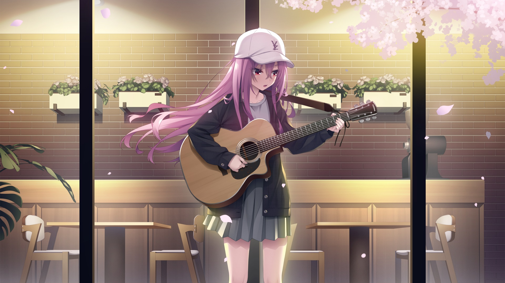
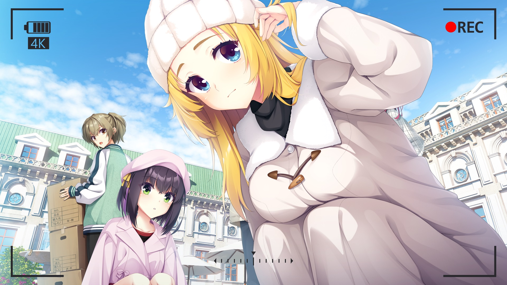
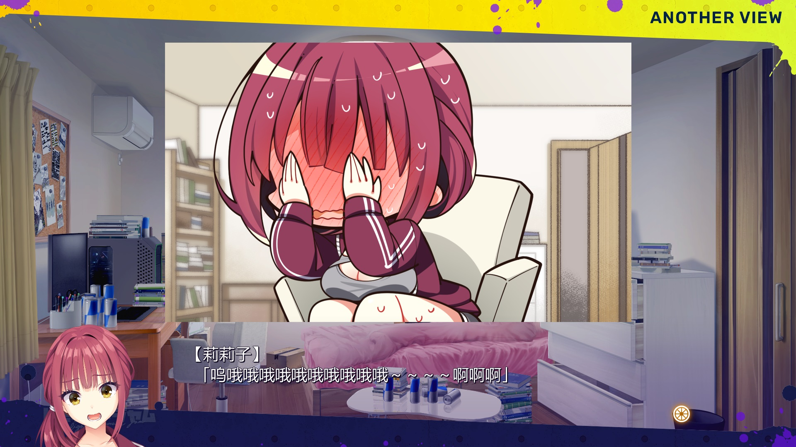


> 更新日志：
>
> 2026年9月19日18:04:22，整理完。 
> 新章，第一篇，发布于贴吧。 
> 哈哈，新章咯。 
> 去年整理完后，虽然有推gal，但是一直都没发博客了，但最近有心思时，才发现不知不觉过了快一年。 
> 我是13号就开始整理游戏内容了，甚至早一天重新更新博客的依赖，熟悉下发布流程，因为隔得太久了，我自己都忘了具体的流程了。 
> 但总之，我整理完时，把很多内容都记录了下来，所以查查看看也都想起了一些，多少算是能接着以前的风格更新下去了。 
> 不过，这次就不搞那么复杂了，因为我发现很多官网内容，尤其是图片，保存些小图好像没啥意义，因为当时考虑说会想看会用到，但事实上根本没这个可能。 
> 所以现在我就按自己喜欢的来保存了，反正流程差不多，只是会挑剔些。 
> 嗯，先说游戏内容吧，因为讲些这一年的经历，所以会很长。 
> 这作就是我整理完后，推的第一部了，看感想，因为还是不错的，但真的我记不清了。 
> 但最近我还有人评论说我写的不错，我很惊讶，因为我都不觉得会有看到，因为贴吧太冷清了，突然有人评论说写的不错，我有点高兴的同时，也有点羞愧，我已经记不得自己写的了。 
> `这算不算是把生命的一天交给这作了` 
> 我又看到末尾的这句话，当时我究竟是怎么想到这句话的啊，苦笑，倒不是不好，而是太好了，好到现在的我可能写不出这种话了吧。 
> ……我也不知道我还能不能写出，因为我现在很少推这种作品，基本都是拔作或者小品作，而且也没出几部这类有剧情的作品，就也不知道自己还能不能体会出什么然后写出来。 
> 总之，一年来的一个变化，就是我个人情感还是思想是发生了些变化的，跟去年可能会有所区别，可能没那么emo？就看后续更新吧。 
> 接着是做些一年的汇报了。 
> 首先，老家的事情算是处理完了，现在是在外面躺，没工作，也不算没工作吧，就是炒股，这个后面聊。 
> 当时定的几个目标基本完成了。 
> 首先是台式机的gal我没像笔电这样整理完，我不记得为啥了，可能是懒了，可能是觉得累，反正我记得只是把内容做了下归类，划分好了而已，还有当时存储不够，所以也没转到移动盘，所以准备过年时候回家在好好重新整理下。 
> 然后是老屋修好了，握草，今年四月份才完全盖好，过程也很漫长，有各种事情，像是啥邻居亲戚的争吵啥的，但总之，盖好了，真的靠我把墙砌好，请人盖了塑料瓦屋顶，自己铺了水泥地面，修了烟通，重新买木头自己做了窗户和门，填了屋后，修了屋前，可以说除了屋顶是请人外，其余都是我自己干的，我都佩服我竟然能坚持做完这些，果然，当时还是有心气，不然像现在这样，真的没啥动力……可能是因为做完了？哈哈，不清楚。 
> 反正老屋算是整完了，真不错，真的。 
> 接着果树也修了，卖了把锂电锯，自己修枝，修完了，后面还买了把大电锯，把老屋前鱼塘角的一棵大树伐了，算是圆了当时台风树的遗憾。 
> 但不得不说，电锯真的时很危险的工具，即便我看了好多视频，也用果树练手，但是实际危险性真的高，真的，伐那颗大树时，我真的有次如果不是反应和幸运，可能直接被树干撞到脑袋，可能就直接住院去了，幸好机缘巧合下我反应快抱住树干没事，真的后怕，真的，然后也有对锂电锯不注意，差点锯到手的，握草，真的很危险。 
> 不过，最后还是安然无恙，属实算是幸运的，真的这种危险工具的时候还是得注意各种情况，不得马虎。 
> 最后一个是梦游记，梦游记我在老家是一直没写，白天工作，晚上或者休息日就懒了，所以一直没写，直到出来到外面住才开始的。 
> 至于为什么出来，一个是，家里住的并不舒服，说过了，噪音，加上在村里实在不自在，而像是五叔，邻居之类的也发生过一些事，我也不想提，反正都是很多杂七杂八的事，最后就在那天，我现在依然记得，应该是清明祭拜完老爸的不久，某天早上，我突然梦里就想到，22号出来吧，心里豁然开朗，然后早上发生了什么事，有点生气的同时，就跟老妈说了，我22号出门，然后当时老屋还差屋后填土和木门吧，反正我就把这两个干完后，休息了几天，22号就出来了。而老妈，哎，反正我感觉她当时也不怎么待见我呆在家了，也没啥好说的，我把家里的自己东西整理收拾好，背了新买的背包和腰包，就这两个包就出门了。 
> 当时我出来，就没打算找工作，想旅游下，然后找个地方躺，当时首先去了广州，为了拔智齿。 
> 这智齿真的折腾我，回老家前每拔，在老家稍微吃上火就又疼了，他妈的，所以首次出来，就是去广州用医保拔了智齿，然后还发现大齿有两个小洞，就补了下，但感觉就是黑心，两个洞跟补一颗牙一个价格，太他妈贵了。 
> 拔了牙后，在广州呆了几天，本来想去重庆看看，然后武汉，再到长沙的，但发现这样子会撞上五一，还有花钱比较多，所以我直接去了长沙，把湖南大学重新逛了一遍，回忆当时的上学时光。 
> 真的，大学时光真的是颓废，如果，唉，直到现在，我偶尔还会做梦，如果老爸还在多好啊，那很多事情都会不一样，如果我当时能多思考下就好了，唉。 
> 反正就在长沙呆了两天吧，然后早在广州就在地图上瞄准了南京，因为位置不错，加上看b站附近挺多地方躺的，所以五一前两三天吧，就到了南京，最后五一那天在附近找到了现在住这个小区，在这里当天就住下。 
> 握草，当时真的跑累了，不想跑了，真的背的包重的要死，每天住酒店也都是便宜的，且临近五一，贵了好多，所以当时找到这价格还不错的就住下了。 
> 但且不说是不是真的安静，我犯了个大错，当时因为有个同事出来没找到工作，加上他住他同学家也吵，也经常在小群聊天，当我也想合租房租就便宜点，就忘了我不该和别人合租这件超级重要的事情，结果就是看这房子时就聊好一起合租，结果就是五一期间我就感到后悔了，五一后他过来住后，我直接后悔死了。 
> 反正合租的一点不让我舒服顺心，一开始一个月我甚至都逐渐没有好脸色了，第二个月想通了自己干脆走了算了，但因为第二个月开始放暑假，楼上吵了少，那同事受不了，而他同学也刚好换了新租房，还不错，所以七月一号他就去他同学那了，我退了他一个月房租，告诉他别回来了，不过如果他真的回来我也没法拦，我提前走就是了，但不清楚他也是感到我烦他还是怎么，他就在他同学那住下了，没回来。 
> 唉操，反正那两个月真的超级难受，他本身的生活习惯，或者说我的生活习惯就很难和别人同调，他可能过得不错，但我可受罪了，反正他走了后，即便那些死小孩搞得动静，我也多少能忍受。 
> 不，实际上还是很难忍受的，应该就是楼上隔壁的死小孩，有时间就跑来跑去的，楼层隔音还差，导致七八月份我住的挺难受的，但是好在九月份开始开学后就没那么多动静了，白天下午也安静的能睡个午觉，真的好上不少，算是能住下来了，只是周末和节假日还是被恶心的。 
> 而开始在这住后，倒也不是没干啥，一个是，我确实写了梦游记，应该是五六月份写的，当时还合租，也没怎么推gal，白天也被烦，所以索性想通了就开始写了梦游记，但到六月份，就有点卡住了，都没写几篇，加上当时觉得自己是不是得找工作呢？要挣钱。 
> 结果六月份就突然想起了在老家三月份时就突然想到的炒股，就开始炒股。 
> 不归路啊不归路，炒股确实让我生活不怎么无聊，但从那时候开始我生活中心都围绕炒股了，甚至因为还赚了点，天真的以为炒股很简单，六月底转了大半的存款进去，结果七月时长下跌了一个月，亏损惨重，知道现在也还在回本的路上，麻了。 
> 也因此好久没写梦游记了，然后经历七八月的股市后，现在才回了部分本，有了余裕，有了经验，就能有心思做其他事。 
> 现在的话，一个是梦游记没忘，又在构思后续剧情，多少想好了后面的剧情了。 
> 第二个就是整理博客吧，因为隔了太久，要整理下了，不然就忘记了，总是搁着，心里也有个疙瘩一样，不如处理掉舒服。 
> 然后就是工作日按时盯盘炒股了，正确今年能回本，哈哈，哎，我真服了，还差大概二十五六个点吧，这个月看能不能再回个十个点，嗯，但概率不大，节前估计没啥机会了。 
> 就没啥了，我也不想些太多琐碎的内容，而一些烦心事也不想写，因为不重要，想忘记的，就没必要记录下来，所以以后风格大概会简略很多，可能都不会有什么内容。 
> 就酱紫，如果真有人，或者ai看到，还是感谢能看完吧，毕竟这种内容看了也不会感到什么快乐，但如果觉得有点意思的话，那我还是觉得挺高兴的，就酱紫，做晚饭去了，拜。2026年9月19日19:32:05 
> 哦，忘记说了，为什么13号整理，然后今天才发，一个是更新bkgalmgr花了时间，一个是盯盘加上这几天没睡好还是啥的，心情很差很烦躁，还被个恶心内容一直忘不掉恶心，所以就没啥动力写，拖到今天睡了午觉后，觉得不错，也不能拖了就写了。 
> blog里有记录，啊，游戏的blog我也不贴了，有贴吧的内容足够了吧，虽然blog会有我更多点推gal的心路历程，但太多太杂，没啥必要吧。可能也有趣？ 
> 反正就不贴了全部，有个截图而已，想看可以看看，也写了我重新整理时的一些内容。 
> 最后就真的没啥了，拜。2026年9月19日19:37:18 

### 2025-11-17 00:52

推完了

断断续续花了好几天总算全部推完了，说下感想吧。

首先是慧凪，因为我是按角色顺序推的，所以共通线后接着的就是慧凪，慧凪线可能更偏向于音乐所能带给人的意义和作用，就像是小说漫画之类的创作一样，能让别人收到激励鼓舞，心态发生改变，进而做出某些正向行为，改变故事走向，从而有个好结局这样，故事算是常见的那种吧，没太多新意，但不算白开水无聊吧，普普通通的那种。

实际上我觉得共通线的故事更有味道些，情节也更起伏有趣，推完后就希望其他人的个线能更有意思点吧，或者你多发糖也行。

接着是月望，月望线整体观感好很多，包括最后的困难，也比较能引起思考，并不是说慧凪的无意义，只是那种故事情节算是常见的，并且套路基本就那些，所以下意识的就能想到结局是如何的，没太多意外的地方。而月望的虽然也是常见的类型，但选择和冲突是比较多样的，如何处理才比较好其实挺看水平的，所以就比较期待，而结果也挺圆满的，或者说算是比较完美的解决方法了，虽然过于理想化，但确实有这种可能性（实际上慧凪那我是想过是可以有个奇迹的，但遗憾），加上一开始男主的作曲瓶颈和抄袭这种比较现实的问题，和后面两人自然而然的情投意合，尤其是作曲后心意相通的互相接吻，太浪漫太美妙了！

到杏珠，杏珠线故事也还行，虽然一开始感觉故事展开是不是有点奇怪，但推完后意外发现挺紧凑节奏挺好的，故事算是中规中矩吧，不过也不算无聊，笑点是有的，就是比较遗憾的时，没太多共通线那种坏笑的故事情节，发糖也不算多吧，感觉如果多点月望线那种众人起哄调侃的内容就有意思多点，感觉没逗够杏珠啊！

个线基本都是对于每个人面临的问题展开的，杏珠的这边就轻松很多吧，没那么严肃，男主看下来也都是能发挥作用的，观感还不错，基本都是围绕作曲来展开，然后帮助女主解决问题，共同成长，嗯，还行。

就是杏珠和月望真不是反过来么？我还以为月望是很多h的那个，结果是杏珠这样，不过突然想到，这样才是柚子社传统啊，个线都欲求不满似地哈哈。估计是为了反差吧。

我还是想说，慧凪最后别扯母亲那块就好了，我以为会跟转学有关，还想着该是什么原因转学，结果是轻描淡的给个原因跳过了，反而把母亲为啥离开的故事拉进来，这说实在的跟音乐真的没啥关系，你最后扯粉丝，扯音乐能在这种情况发挥的作用，我也觉得不咋样，人最后也没救回来，相比月望和杏珠的故事，我还是觉得慧凪最后这段是拉胯的，而且个线前面故事发展也算是普通的，现在回过头在看，真觉得慧凪作为主位，个线真的不算很让人满意，诶是真的不服啊，再好点就好了。

莉莉子真是个好女人啊，这次有别于讲女主的故事，反而讲的是男主遇到的问题，莉莉子则是作为帮助的那方，尤其是去找大先生和gro商谈的那波，自己努力思考付出行动真的很有魅力，而且两人间都很有默契，真的是互相支撑走下去的感觉，很棒！

不过说实话，刚进线时，我还觉得这开头是不是有点进展太快了，感觉是四人里最快的了吧，但是后面故事发展真的把观感拉上来了，加上因为多了很多新cg，都感觉是制作偏心了哈哈。

不过实际上莉莉子的cg还算偏少的那个，只是因为共通线很少有莉莉子的，所以很多都是在进线后才看到的，新的场景就有新的cg，单独定制，体验就很好。

此外我还是第一次听完新编的歌曲，之前也想听完，但是你点多了对话，就停掉了，错过了几次，这次索性就听的差不多再点，不过这次新编曲还多了很多文本，都聚焦在了莉莉子，还有张单独的cg，所以我感到莉莉子是不是制作组真偏心了。不过故事上也差不多是这么个意思吧，钱花在刀刃上，确实配得上cg。

此外莉莉子的短篇还不错的啊，不，应该是四个人的短篇都挺不错的，我都是要进个线后再推小短篇的，这样能多少回忆点共通线的剧情，能更好切换关注点。

还有的话，就是男主真是个作曲仙人了，四个人里慧凪是作曲一起听歌，月望是学弹琴作曲，杏珠不太一样是杏珠自己想找自信，没让男主碰上作曲瓶颈了，而莉莉子线就加剧了，前端和后端都是男主作曲碰到的问题，哈哈，我不得不说，贝斯是乐趣，作曲才是本职。

此外就没啥了，莉莉子线，观感上我觉得能和月望的并肩，月望在于那段月下恋曲很浪漫，而莉莉子则更多是个人魅力，真是个好女人啊，当然，月望主见和行动力也是很不错的，也都是好女人，，，四个人都是好女人，好吧不偏心哈哈。

![](ライムライト・レモネードジャム/BKGalMgr_2025-10-22_21-40-23.jpg

后面就是副角色的了。

美玖线果然还会短啊，虽然预想到了，但还是觉得有点可惜，我还挺喜欢美玖的，尤其是她第一次像是怒气冲冲的大喊名字后，接着一副迷妹的样子在夸赞，就觉得好可爱好有意思，哈哈，我还真挺喜欢这种有点犟脾气但是又认真不耍性子的女孩子，嘛这作里，初见的话，杏珠其实我也很喜欢，反正这种感觉逗起来有意思的，我都挺喜欢的就是了。

故事上其实就没啥了，普普通通，不过这次男主不作曲，结果贝斯也弹不了，我服了，多给男主弹贝斯点存在感吧。

那优花线感觉还不错吧，也是个小故事，但是感情线过渡的流程，情节也都很自然，算是不错的。

男主还是作曲仙人啊，不过那优花也是作曲家，不是作曲还能是啥联系起来，但贝斯是真的没多点作用啊，就没一条线是从贝斯切入将贝斯的，美玖算是勉强相关，但，，真的服了，算了。

还有之前就想提了，情侣酒店看了六个人都是一样的房间，是在有点难绷住啊哈哈，哦对了，今天还看到有人做了张图，就是吐槽这个的，笑到我了。

此外，夏和小的配音还是那个音色吧，或许是因为听多了过于熟悉了，就感觉这作也没那么动听，但还是很出色，尤其是后日谈里，最好带耳机，她语调间切换的转音和换气声真的挺让我喜欢的，想多听点，我感觉如果有个撒娇类型的让她试下，感觉能出暴击哈哈。

最后就是毕业回了，，，让我们组一辈子的乐队吧！

哈哈，最后总算是如愿在学院里办上演出了，恭喜恭喜，只是实际毕业后还真的能不能继续搞乐队，我也只能祝福了。

而后日谈，不愧是后日，基本上都是卖个hs的，故事上还是月望的小剧场更胜一筹啊（听说月望是伞负责的，伞还是实力强也负责啊），好歹有点小故事，美玖的进路选择也还行，其他基本都是为了hs的，就不多说啥了。

后面还有点吐槽。

这作画风因为多位画师参与吧，其实不是很统一，显示男主真的一条线一张脸，就就设定相同，脸是真的没怎么相似，还有我也看到过吐槽月望画风的，是有点奇怪，但我发现我还挺喜欢的，可能是因为本身就喜欢月望，所以看她有点奇怪的姿势也觉得挺可爱的。

还有才发现在路线图，点了选项后是可以在右边预览会走到那个结局的，而且可以直接在里面选了后，知道会进哪条个线，握草，之前柚子社我是知道有路线图，但是没想到还可以这样直接到个线，我都是从第一个选项进去后，快进到下个选项的，我还是第一次发现有这个功能，这能省不少时间，真挺好的。

但这免不了我一开始就进单身结局，玩到后面时就隐约感觉到了，结果还真是。说起来我柚子社的作品加上没完全推完的，也有个四五部了，但是我记得，我每部自己第一次推都是进的单身线，握草，虽然我明白只要固定一个人选基本上不会单身，但选项有时候真的不清楚导向哪个人的，像是这作，一些真的不咋明确的，而且共通线很多情况下我可能还没决定好，所以就当个暖男，啥都关心下，结果就单身了，，，哈哈。

还有柚子社的这次选材算是有点蹭热度吧，虽然有点过气，但实际效果还是蛮不错的，整部作品故事还算不错，加上很多的小细节，像是首个live曲目就是op，背景人声的交谈，完整的乐曲，sd小人这次也上了动画，演出效果多了不少的，推下来挺有趣的，总体质量挺高的，喜欢萌作的真的推荐试下。

哦还有，这作真的有新年祝福，握草，我去年就被骗过，以为过年打开真的有新年祝福，因为看了好多那种截图，以为真的，结果去年过年打开根本没有，服了真的。

最后就没啥了，我挺喜欢这作的，除了故事还算有意思外，剧本本身也引发了我的一点思考和借鉴，所以我耐心推完了全部，实际上，这是我第一次把柚子社所有角色推完，在上上作咖啡馆的贴里因为一些原因我说过，柚子社的下一部作品我一定完整推完，结果上作天使出了后，我一直没动，翻译是一个原因，此外就是上作一些角色不是很戳我，加上看评论也不是很有趣，所以一直没推，拖到了这作出来，一看发现挺不错的，所以想完成约定推完去，嗯，最新作就行，吧，反正算是了结了，以后能更随心点推gal了。
其实上面很多都是我边推边记整理后的，有些想着留到现在说的也忘了，但基本就这些吧，感谢看完的各位，就酱紫，拜。（看了下时长23小时多，算上漏记的一个小时，这算不算是把生命的一天交给这作了）

---

