这个教程只介绍最短的使用流程，主要是为了让你可以快速上手BKGalMgr，软件的下载地址在左边。

## 1、添加仓库

解压下载好的压缩包后，直接双击BKGalMgr.exe启动就行，因为把框架都打包进去了，所以会比较大。这里我是先在设置页面切了主题。

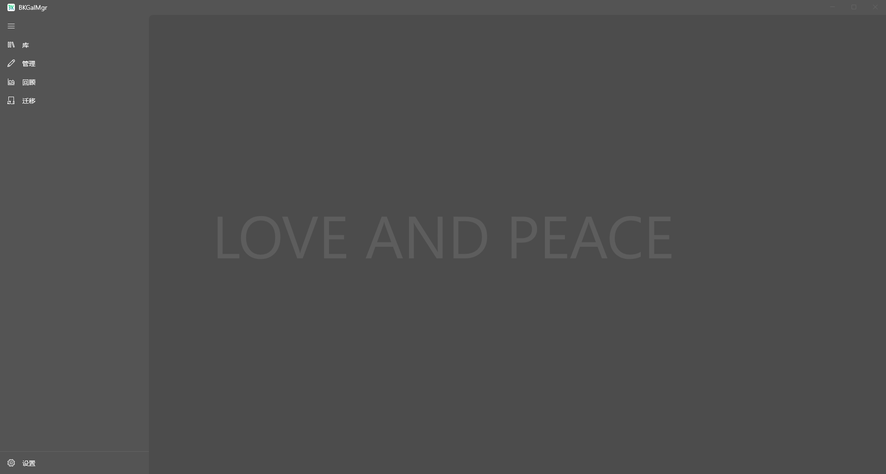

切换到管理页面，选择添加仓库，这里选择你本地的一个文件夹专门用来作为仓库，最好选择磁盘大点的，移动硬盘也可以。

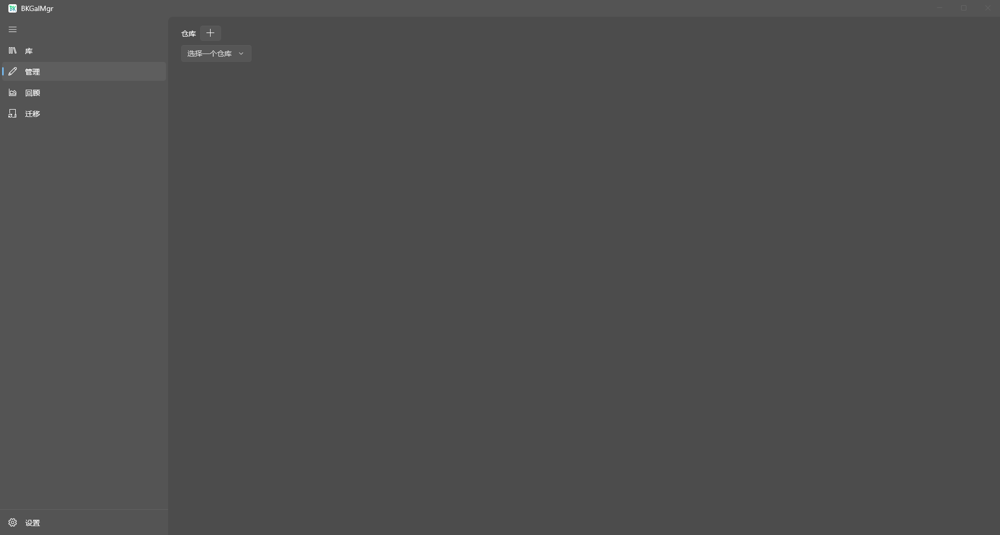

在弹窗里设置好仓库名称，点击确定，然后在选择你添加的仓库，就算是添加好了。

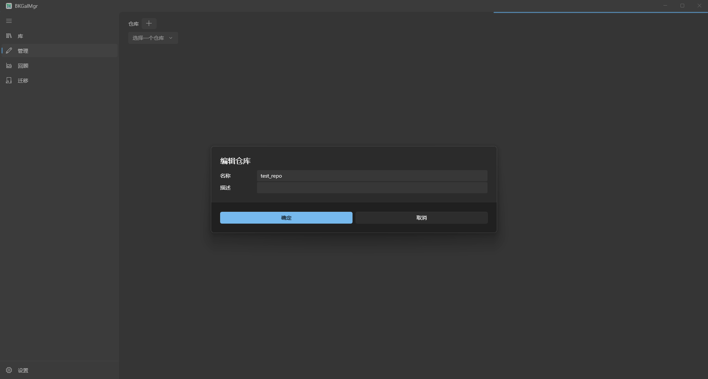

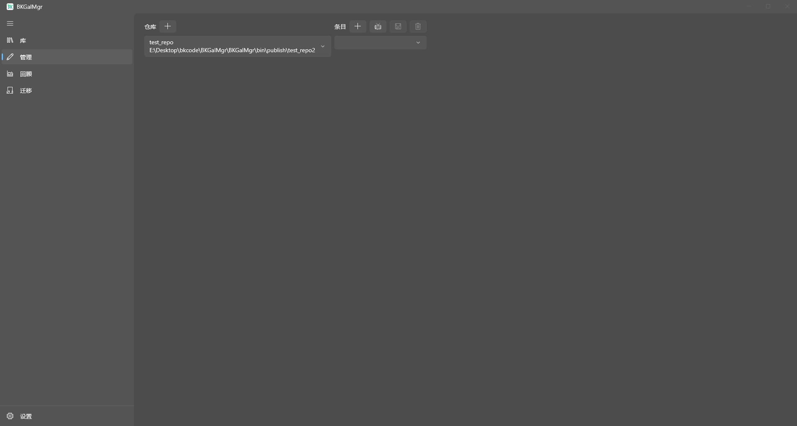

你可以选择已有的仓库添加，也就是你如果觉得仓库名称不对或者目录不对，可以先移除，然后重新添加。

## 2、添加游戏

条目就是游戏的意思，有两种方式添加游戏：

1、直接点击添加，接着填入游戏名称，其他都是可选的，保存下就算添加好了。

2、通过Bangumi Api添加，点击Bangumi的图标，选择添加新游戏，弹窗里提示填入Bangumi的Access Token，和Bangumi上游戏对应的条目地址。

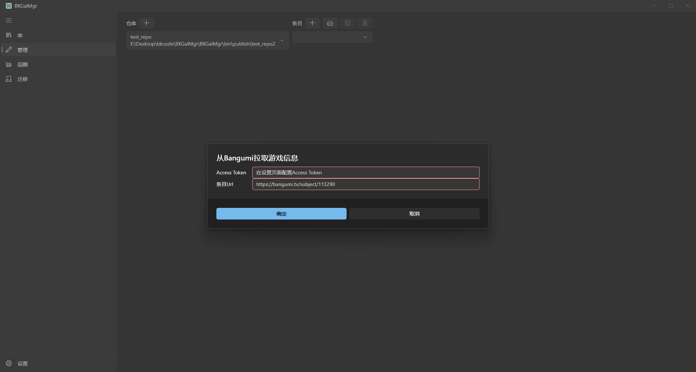

Access Token在设置页面里找到Bangumi的设置，按教程生成就可以了，条目地址我们在Bangumi上搜索游戏，复制网址过来填入即可，你也可以只填入ID，点击确定，会自动拉取游戏信息。

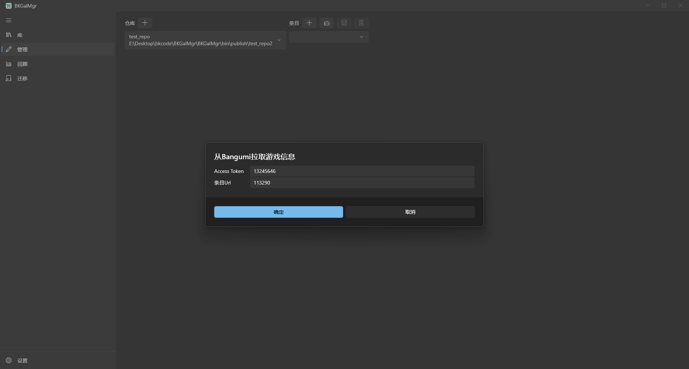

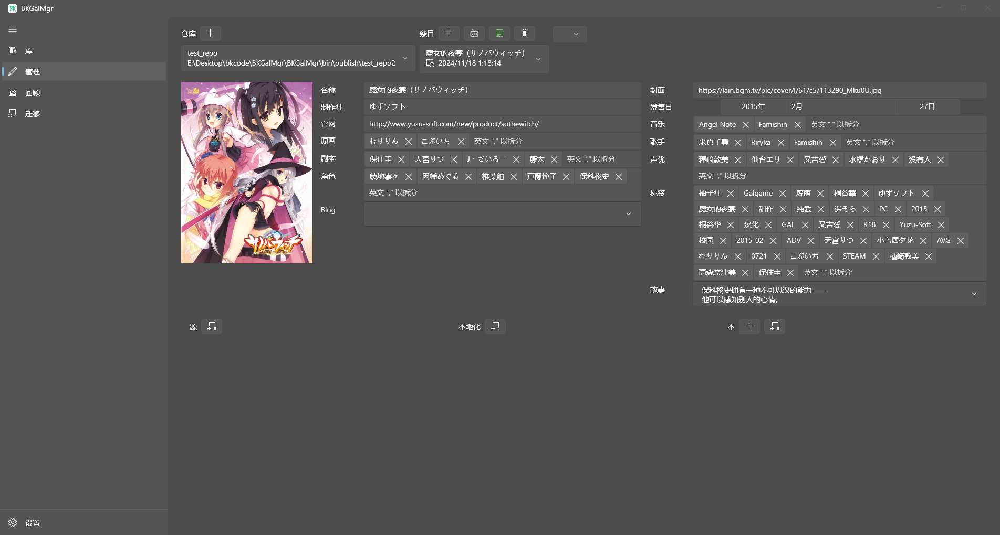

稍微做些修改，点击保存，游戏就添加好了。封面会自动下载到本地。

## 3、添加版本

添加好游戏后，你会看到底下有三个功能区：

源，本地化，本

这三个说人话就是：生肉硬盘版，汉化补丁，汉化硬盘版。

生肉和汉化需要从解压好的文件夹添加，会压缩复制到游戏目录下。

汉硬则有3种方式:

1、点击本旁边的第一个按钮，通过已有的生肉和汉化组合生成，方便你用不同的汉化补丁构建汉硬。

2、点击本旁边的第二个按钮，我个人最常用的，选择从本地解压好的汉硬添加，最好解压时，选择在仓库的同个磁盘下，这样可以直接移动到仓库，避免二次复制。

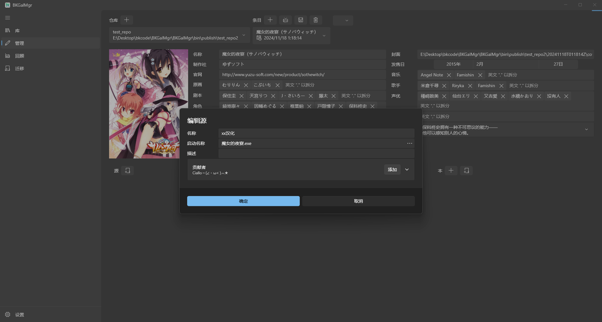

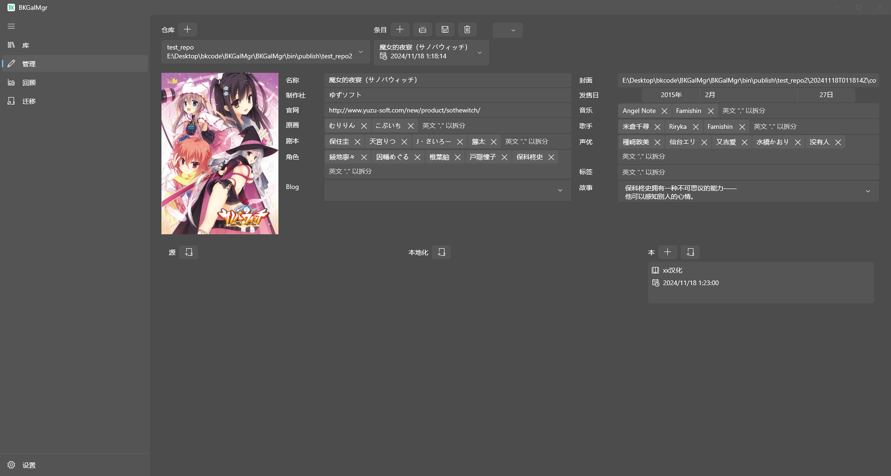

3、点击本旁边的第三个按钮，直接支持选择游戏的快捷方式或者运行程序来添加，这种方式也不用拷贝游戏，比较适合推生肉，或者不想动游戏本体的。

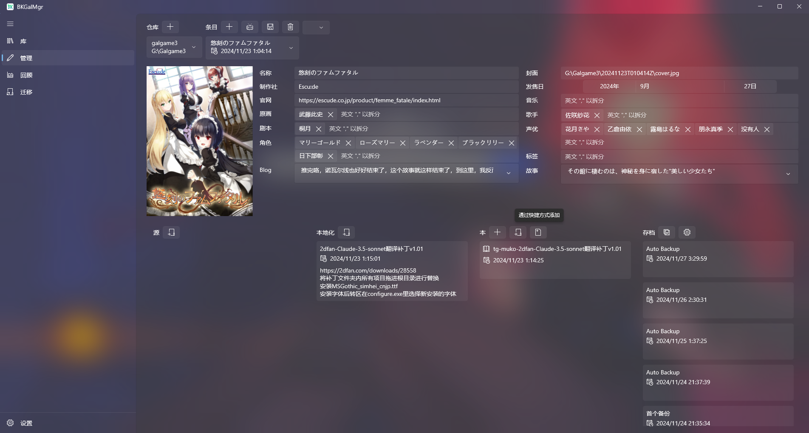

## 4、开始游戏

本添加好后，切换到库页面，就可以看到你添加的游戏，再选择你刚添加的本，点击运行，就可以启动游戏，并开始计时了。

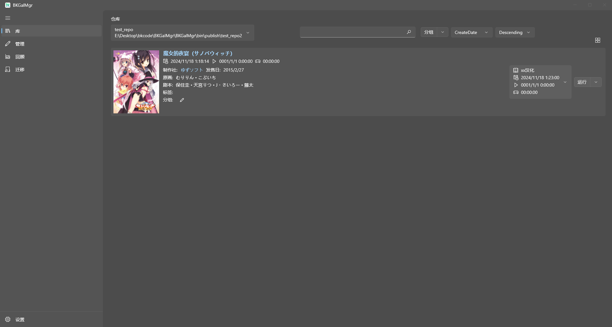

## 5、废话

这就是最短的流程了，其他的功能可以自己探索下，都比较简单。

你们比较难察觉的功能点应该是源，本地化，本的添加，这三个在设计的时候其实是有考虑分享的，也就是你可以把你添加好的源和本地化的文件夹压缩分享给别人，然后别人解压后，可以直接添加，会保留一些原本的分享信息，而本的导出成源，也是为了分享设计的，甚至，你直接把游戏文件夹压缩分享，然后别人解压到他的仓库里，再次启动，就可以识别出来，但我估计应该没啥人这样分享就是了。

更多的一些设计和使用，可以查看其他文档，有问题可以去GitHub上反馈，如果能给我个Star就更好了。

最后，再提醒下，BKGalMgr只是个本地管理软件，没啥联网功能，资源更没有，这软件我是希望大家能更好的去玩Galgame，即使退坑后的某天，突然回过头，你打开时，也能浏览下，翻翻记忆，想起过去那段独处的时光。

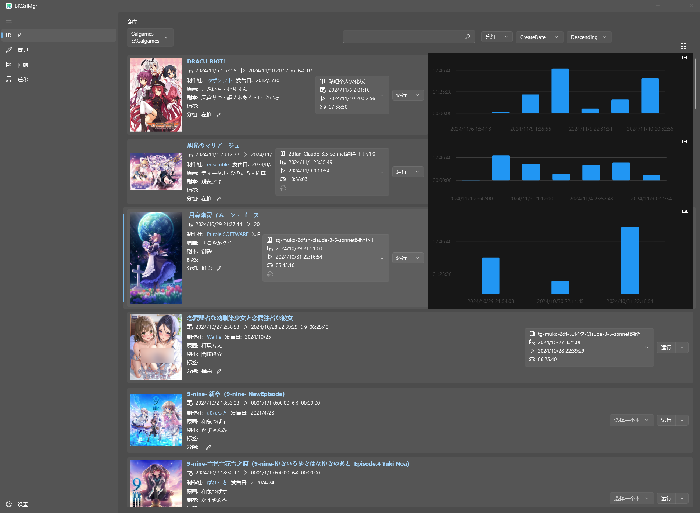

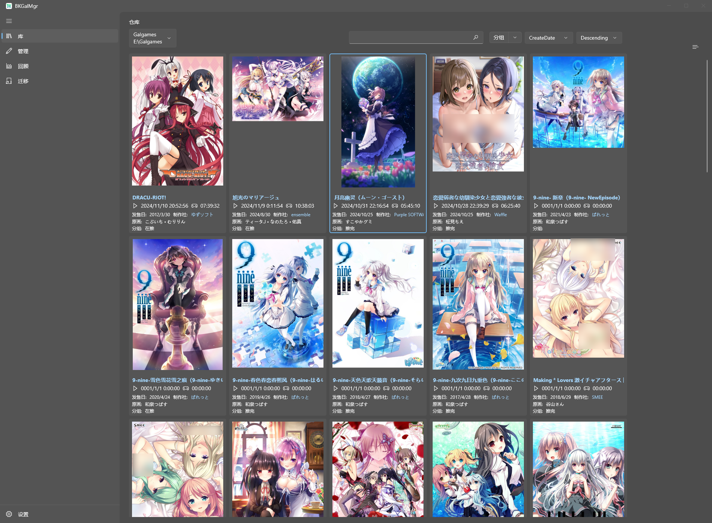

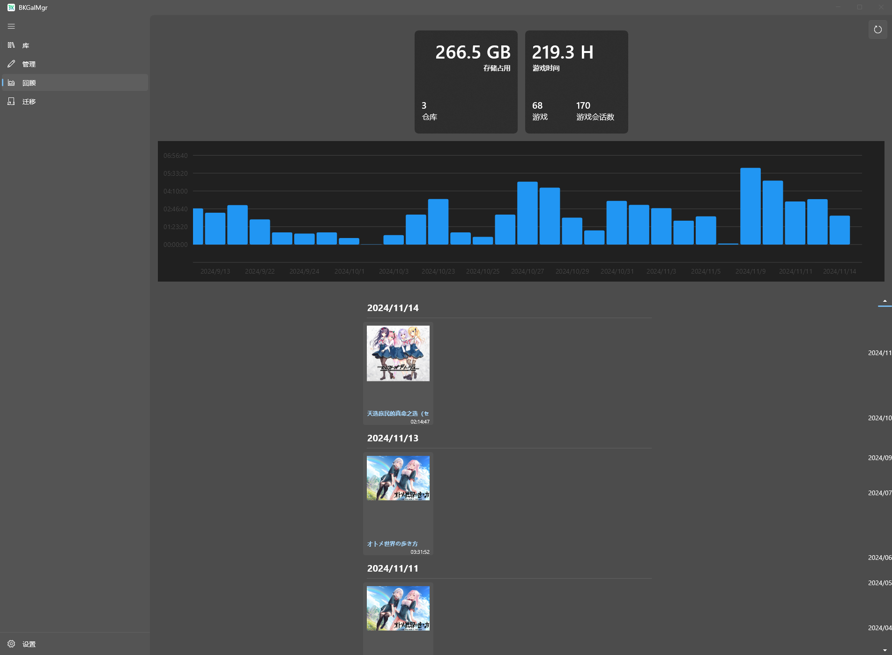
