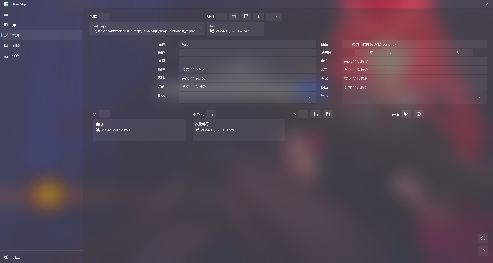

推荐先看入门教程和仓库结构后，再看这篇。

## 游戏信息

点击条目旁边的加号按钮，就可以新增一个游戏。

名称是固定要的，其余你都可以不填。我推荐加下封面，你可以填入可直接访问的网络图片地址，或者是本地图片的绝对路径，点击保存后，会下载或者复制到仓库的游戏目录下。记得添加完后点击保存。

如果你懒得填这些信息，那么你可以通过Bangumi添加。在设置页面按指引生成AccessToken后，在Bangumi找到你要添加的游戏页面，复制对应的网址，点击Bangumi的图标，选择添加新游戏，粘贴网址后点击确定，就可以自动拉取游戏信息了。对于已有的不是通过Bangumi添加的游戏，选择更新当前游戏，会重新拉取下游戏信息和当前的进行合并，不会直接覆盖。

Bangumi挺方便的，我现在基本这么添加。

## 源 & 本地化

这两个设计上分别代表生肉和汉化补丁，但存储结构基本上是一样的，只是源的启动程序不能为空，本地化的可以为空。

构建时，选择解压好的文件夹，编辑好信息确定后就会把文件夹重新用zip格式压缩存储到游戏目录下。

> 无用小技巧：假如，别人分享了一个源或者本地化的文件夹的压缩包，你解压这个文件夹后，可以直接选择添加这个文件夹。或者你可以把这个文件夹复制到源或者本地化的目录下，重启后也可以看到这个新增的源或者本地化。前提是这个文件夹符合源或者本地化的文件结构，详见仓库结构。

## 本

当你有了一个源，或者一个本地化后，那么你可以构建本了，换句话说就是汉硬。

点击本旁边的加号按钮，组合源和本地化来构建，确认好启动程序名称没问题，确定后就会先后解压源和本地化，生成本。

这个就是一开始设计的流程，目前来说，即使我自己也很少这么用，因为没必要。就像入门教程里教的那样，你可以直接选择解压好的游戏文件夹来构建，完全可以不通过源和本地化来组合。

但也不是完全没用，比如每个月新作出了生肉，然后有很多不同的ai翻译补丁或者迭代版本，为了避免生肉被不同的补丁污染，你可能得保存一个原生的，这时候源和本地化就派上用场了。

对于这种生肉，我一般都是直接作为本添加，然后找个汉化补丁生成本地化，在编辑本，选择这个本地化，就会解压到本里，简单来说就是给生肉打汉化补丁。

当然，你可以自己打完补丁后再生成本也行。

 - 导出成源：把当前本导出压缩成源的文件夹格式，会删除敏感信息。
 - 归档：把当前本重新压缩成zip保存，不会直接删除当前的本。
 - 解归档：把归档的zip重新解压成本，如果当前本还存在会直接覆盖。
 - 仅删除文件夹：归档后，就可以把当前本的零散文件删除，仅保留归档。

归档功能就是推完Galgame后，保留最后的一个版本留作保存，其余的源，本地化其实都可以删掉，比较方便迁移推完的游戏。

> 无用小技巧：像源和本地化一样，本也可以直接添加别人分享的。

## 存档

详见存档介绍。

## 封面

如果你游戏信息里添加了封面，那么除了在游戏信息左边有封面，底下也会出现封面展示。

这个封面是可以显示多张的，右键点击封面图，打开文件夹，把想添加的图片都往里面复制，回来刷新一下，就可以看到了。

双击图片，可以浏览大图。

## GALLERY

就和这个`GALLERY`名字一样，就是存放游戏CG的，点击`GALLERY`几个大字，就会打开文件夹，然后往里面保存游戏的`GALLERY`，刷新一下就会出现列表。

单击图片，可以浏览大图。

## SPECIAL

和`GALLERY`操作一样，只是`SPECIAL`用于存放一些游戏杂图。

## SCREENSHOT

和`GALLERY` `SPECIAL`类似，但这个是游戏截图，库页面激活游戏的截图功能后，截取保存的图片都会展示在这里。

你自己往里加也行。

## STORY

游戏故事介绍，你可以在这里编辑，也可以在游戏信息那里。

## BLOG

你自己的游玩记录，过程中有些啥想法都可以往里面写，我比较常记录些感想，免得自己忘了，还有就是记录自己推到哪了，后面好回过头继续推。

同样可以在游戏信息那里编辑。

## CHARACTER

这个就是角色的展示，包括立绘，名称，CV，生日，BWH等常见的角色信息。

你需要先在游戏信息那里添加角色名字，然后这里才会出现对应的角色，右键选择编辑，就可以编辑角色信息了。

如果通过Bangumi来添加游戏，那么角色信息可以直接生成，图里演示的就是直接通过Bangumi拉取后生成。不过有时候一些角色信息可能会变，像是由乃在FD里的一些数据就是变了，但是拉取还是本篇的，你可能得官网去看下数据对不对。

嗯？你问我咋知道数据变了的？因为我爱由乃爱的深沉🥰。
