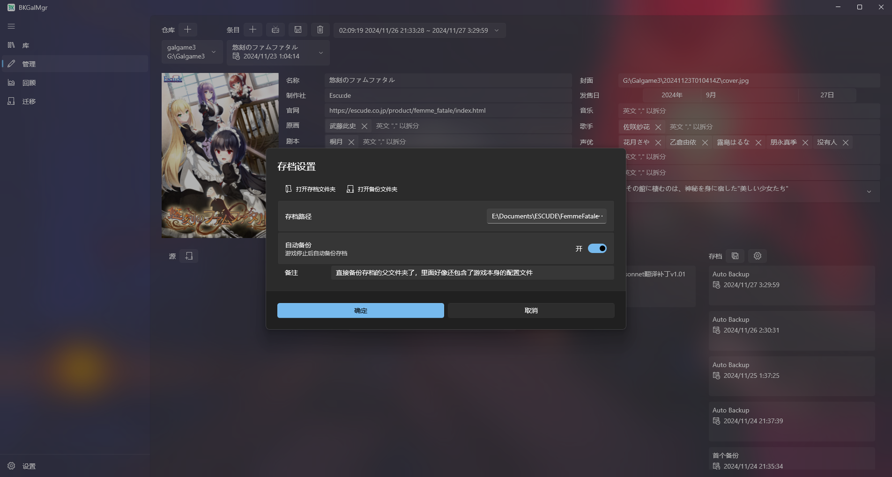

这个是本地存档，不是云存档，备份的存档会保存在仓库的游戏目录下，存档结构可以看仓库结构了解。

点击存档旁边的设置按钮，配置好游戏的存档路径后，就可以备份了。备份数据就保存在本地仓库的游戏目录下，想读档的时候，选择备份的存档右键还原就行。

实际用处上，可能就是那些存档不在游戏目录下的，或者就是推完后想删除本体的才备份下。

当然，玩的花的话，存档也可以是广义的，你把那个存档路径改成任何一个目录，都可以进行备份，记得添加备注，别到时候还原错位置。
