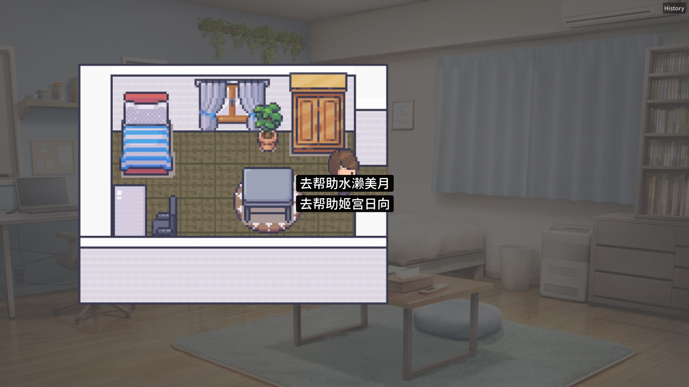
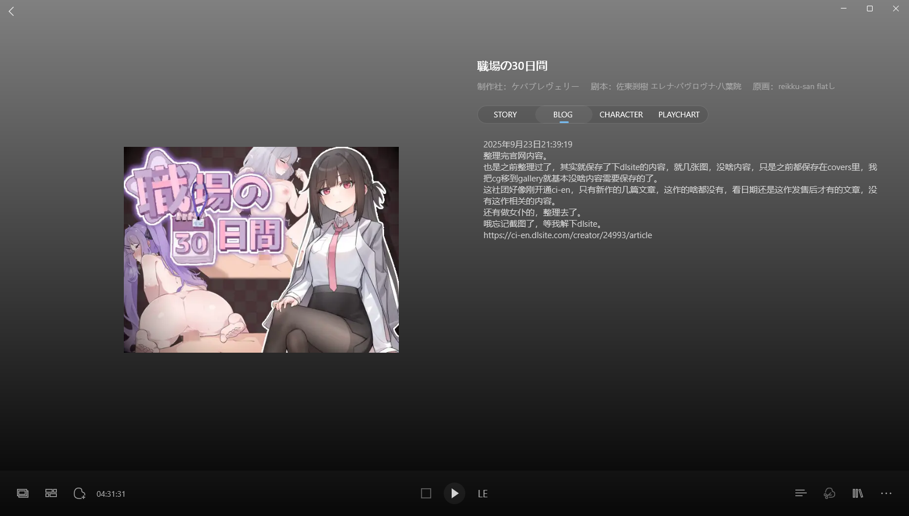
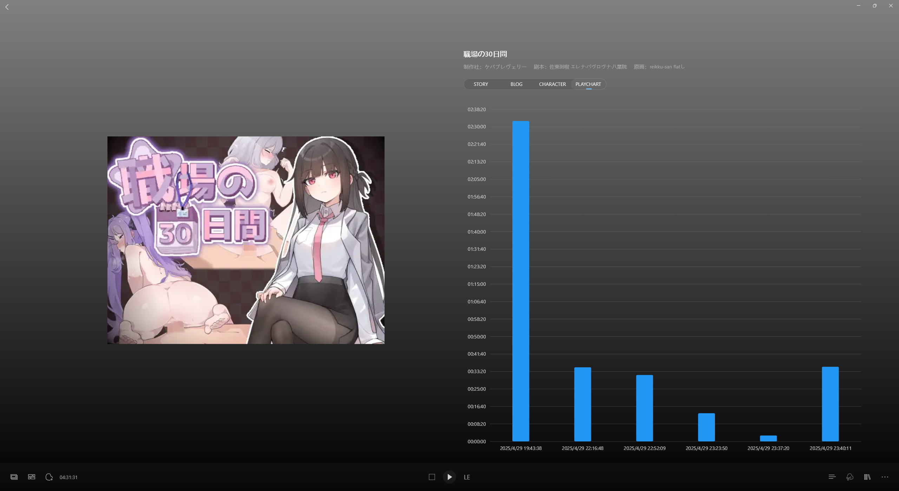
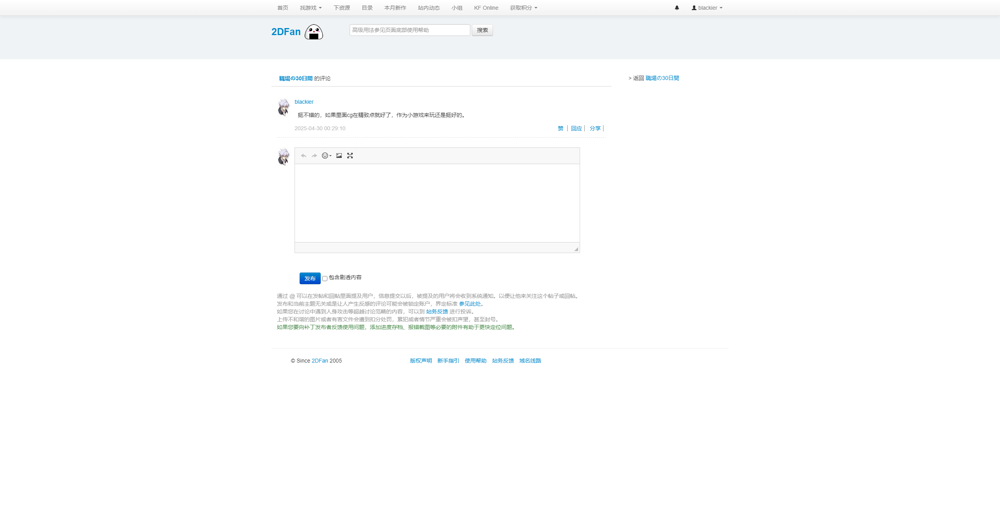

> 更新日志：
>
> 2025年9月23日23:12:45，整理完。 
> 这是我回老家后，开始整理库里的galgame后，发的第三十篇博客，算是2dfan的第二十三篇，25年的第十九篇，hgames的第二篇。 
> 这应该算是今天的第三篇博客了，我没想到竟然这么顺利把这三部小黄油整理完了，我吃完饭加消食和做游戏日常，是九点多？开始整理的，不过这几部我之前推完的时候有整理过一些，所以这次都没啥要改的，就按新的整理逻辑理了理而已，主要会都是在dlsite上卖的，也没啥内容可整理，官网都没有，dlsite上的游戏页内容也是少的可怜，所以都没话一个小时就整理完三部了。 
> 说回本作，这种我挺喜欢的，我玩这种黄油，最喜欢的就是这种有小游戏过渡，画风又好的，尤其是slg的就更好了，不过可惜这种算是rpg，我还特定看了下Bangumi的分类，确实是rpg的，所以我现在就觉得这种有小人移动游玩的就是rpg的，而只靠选项的，就算是slg，比如后面没推完的的那种女仆life，就属于slg，那种我本来想推的，但是推完这两作后，有点没兴致继续推了，所以就搁了，一直搁到现在都没动了，后面找个时间玩下吧，，，，哈哈，麻了，好多要玩的啊，没空，真没空。 
> 说回正题，看立绘，三个女主我都挺喜欢的，但是推下来，我更喜欢水濑美月，美月那个淋雨垂泣的身影，是在惹人怜爱了，我真的挺喜欢这种被人骗的的傻女孩的，拥抱她真的能感受到给予彼此的那份温暖。 
> 看个人吧，其实三个我都挺舍不得的，可惜没有都在一起的路线，最多只有个双人线而，还得是美月不介意才成立的，不然哪有那么好的事情。 
> 就没啥了，今晚晚了点才整理，也是因为旁边住的亲戚来了那些钓鱼友聚餐，在大声说话，很吵，所以就没啥心情整理，天台散步消食了很久才下来吃药，然后开始整理的。 
> 唉，想有个安静的环境真的难啊，好难有小时候那个安静的夏夜了，有时候我总幻想，如果我有啥超能力，能一巴掌把他们都拍死就好了，就像拍苍蝇一样，把他们都拍死，这样周围就清净了，可惜现实总和我作对，没得法啊。 
> 就这样吧，今天难得算早的整理完，我准备洗澡去，早点休息好点，到明天再继续了，下篇是重量级的夏日口袋，我记得我也是发了长评，并且说了很多难为情的话，还有些负面情绪的话，啊，想想直面这些真真麻烦，苦笑。2025年9月23日23:34:34

### bilibili 2025-04-30 00:23

哎呦总算开攻略把浅仓和姬宫的双人解锁了，看着攻略试了好多次，怎么也进不来，一看原来是需要周末找姬宫而不是水濑，我读的存档就是水濑和姬宫都可以选而选了水濑后的存档，是想着姬宫生病也能自己好，但不能丢下无助的水濑，结果没想到就差这个，感觉对水濑很有恶意啊，如果选了水濑，其实到最后三人都可以好感max的，但就是没有四人一起的结局，有点难受。

小游戏我觉得挺好玩的，霰弹枪确实是神，我后面24级了，就差一级，还想着为啥少女仆，衣服都买了，没想到是小游戏满级。

我现在其实还差一个解决，就是水濑调教的，这游戏一周目好像是锁调教的，姬宫也是，所以一开始就走了两人调教的结局，反而缺少了单独水濑，我还疑惑为啥水濑的是双人的，是否有什么坏结局，还以为是去找水濑的时候丢下她的结局这样，结果不是，单纯就是我错过了，不过算了，就少着吧，也不算什么好结局。

最后感谢攻略，这游戏我觉得还是挺好玩的，就是价格我觉得偏贵了，dl上七十多块，如果cg好看些就还好，但是体量小，就四张封面和立绘算是好看些，里面的cg其实有点不咋样，我建议还是等打折吧。

### 2dfan 2025-04-30 00:29:10

挺不错的，如果里面cg在精致点就好了，作为小游戏来玩还是挺好的。

---

 - 哔哩哔哩 (1).png>)

 - 哔哩哔哩.png>)

